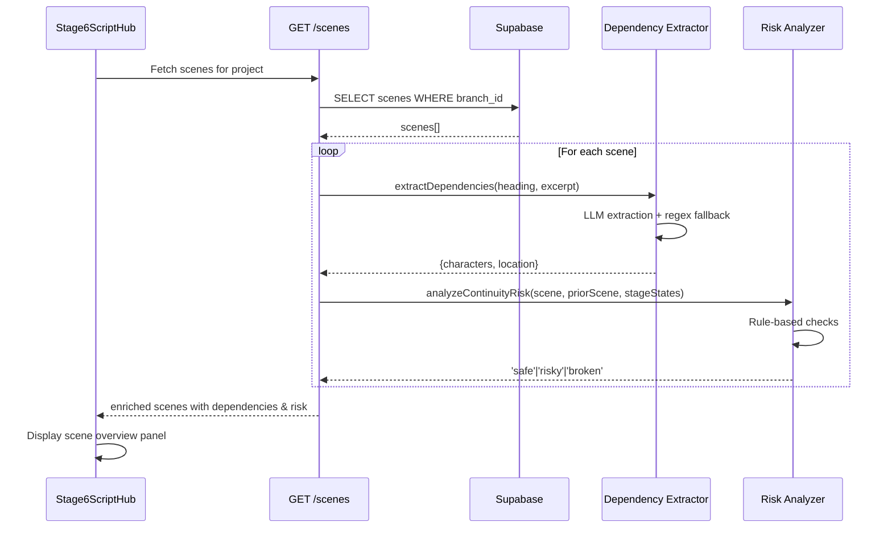

# Feature 4.2: Stage 6 - Script Hub Implementation Plan

## Current State Analysis

The Script Hub UI is already fully implemented in [`src/components/pipeline/Stage6ScriptHub.tsx`](src/components/pipeline/Stage6ScriptHub.tsx) (476 lines) with:

- ✅ Scene list panel with status indicators and thumbnails
- ✅ Scene selection and navigation logic
- ✅ Scene overview panel displaying header, opening action, dependencies
- ✅ Outdated scene warning modal
- ✅ "Enter Scene Pipeline" action integrated with [`src/pages/ProjectView.tsx`](src/pages/ProjectView.tsx)
- ✅ Real scene data fetching via [`src/lib/services/sceneService.ts`](src/lib/services/sceneService.ts)

**Missing functionality:**

1. Scene dependency fields (`expectedCharacters`, `expectedLocation`) are populated as empty arrays/strings
2. Continuity risk analysis (`continuityRisk`) is not calculated
3. Prior scene end state (`priorSceneEndState`) displays placeholder but field is undefined

## Architecture Overview

```mermaid
graph TD
    Stage4[Stage 4: Master Script] -->|persists scenes| Database[(scenes table)]
    Database -->|GET /api/projects/:id/scenes| Backend[Backend API]
    Backend -->|enrichSceneWithDependencies| Extractor[Scene Dependency Extractor]
    Backend -->|analyzeContinuityRisk| Analyzer[Continuity Risk Analyzer]
    Backend -->|returns Scene[]| Frontend[Stage 6 Script Hub]
    
    Extractor -->|LLM extraction| Characters[expectedCharacters]
    Extractor -->|regex parsing| Location[expectedLocation]
    
    Analyzer -->|rule-based check| PriorScene[Prior Scene Status]
    Analyzer -->|sets continuityRisk| RiskLevel[safe/risky/broken]
```

## Implementation Tasks

### Task 1: Create Scene Dependency Extraction Service

**File:** `backend/src/services/sceneDependencyExtraction.ts` (new)

Create a lightweight LLM-based extraction service to populate `expectedCharacters` and `expectedLocation` from scene `script_excerpt`.

**Key design decisions:**

- **Single-pass extraction** (not two-pass like asset extraction) since we're extracting from one scene only
- **Reuse existing LLM infrastructure** from [`backend/src/services/llm-client.ts`](backend/src/services/llm-client.ts)
- **Fallback to regex parsing** for location (parse from scene heading like "INT. KITCHEN - DAY")
- **Character extraction** identifies names in action lines and dialogue

**Implementation pattern** (based on [`backend/src/services/assetExtractionService.ts`](backend/src/services/assetExtractionService.ts)):

```typescript
interface SceneDependencies {
  expectedCharacters: string[];
  expectedLocation: string;
}

export class SceneDependencyExtractionService {
  async extractDependencies(
    sceneHeading: string, 
    scriptExcerpt: string
  ): Promise<SceneDependencies>
}
```

**Prompt template structure:**

- System prompt: Extract character names and location from this single scene
- User prompt: Scene heading + first 15-20 lines of script_excerpt (opening action)
- Output: JSON with `{ characters: string[], location: string }`
- Token optimization: Only analyze opening portion, not full scene (reduces cost)

**Location extraction strategy:**

1. Try regex parse from heading first (e.g., "INT. KITCHEN - DAY" → "KITCHEN")
2. If ambiguous, use LLM to extract specific location
3. Fallback to heading text if extraction fails

### Task 2: Create Continuity Risk Analyzer Service

**File:** `backend/src/services/continuityRiskAnalyzer.ts` (new)

Implement **rule-based** continuity risk analysis (not LLM-powered) for MVP.

**Risk calculation logic** (per user requirements):

```typescript
type ContinuityRisk = 'safe' | 'risky' | 'broken';

interface ContinuityAnalysisInput {
  scene: Scene;
  priorScene: Scene | null;
  upstreamStageStates: StageState[]; // Stage 1-4 states
}

function analyzeContinuityRisk(input: ContinuityAnalysisInput): ContinuityRisk {
  // Rule 1: If no prior scene (Scene 1), always safe
  if (!priorScene) return 'safe';
  
  // Rule 2: If prior scene status is not 'video_complete', mark as 'risky'
  if (priorScene.status !== 'video_complete') {
    return 'risky';
  }
  
  // Rule 3: Check if upstream artifacts (Stage 1-4) changed since scene was last modified
  // Compare scene.updated_at with max(stage_states.updated_at) for stages 1-4
  if (upstreamArtifactsChangedSinceSceneModified(scene, upstreamStageStates)) {
    return 'broken';
  }
  
  // Rule 4: If scene status is 'continuity_broken' or 'outdated', mark as 'broken'
  if (scene.status === 'continuity_broken' || scene.status === 'outdated') {
    return 'broken';
  }
  
  return 'safe';
}
```

**Key references:**

- Database schema: [`backend/migrations/003_add_scenes_table.sql`](backend/migrations/003_add_scenes_table.sql) (lines 17-22 show status enum)
- State transition matrix: [`._docs/database-schema-state-transition-matrix.md`](._docs/database-schema-state-transition-matrix.md) (lines 855-863)

### Task 3: Enhance Backend Scene Fetching Endpoint

**File:** [`backend/src/routes/projects.ts`](backend/src/routes/projects.ts) (lines 427-505)

Enhance the existing `GET /api/projects/:id/scenes` endpoint to:

1. **Enrich scenes with dependencies** after fetching from database
2. **Calculate continuity risk** for each scene
3. **Fetch prior scene end state** from `end_state_summary` field (if exists)

**Implementation approach:**

```typescript
// Current implementation (lines 427-505) needs these additions:

// After fetching scenes from database (line 462):
const { data: scenes, error: scenesError } = await supabase
  .from('scenes')
  .select('id, scene_number, slug, status, script_excerpt, end_state_summary, updated_at')
  .eq('branch_id', project.active_branch_id)
  .order('scene_number', { ascending: true });

// Add after line 494 (before returning):
const sceneDependencyService = new SceneDependencyExtractionService();
const continuityAnalyzer = new ContinuityRiskAnalyzer();

// Fetch upstream stage states for continuity analysis
const { data: stageStates } = await supabase
  .from('stage_states')
  .select('stage_number, updated_at')
  .eq('branch_id', project.active_branch_id)
  .in('stage_number', [1, 2, 3, 4]);

// Enrich each scene
const enrichedScenes = await Promise.all(
  transformedScenes.map(async (scene, index) => {
    // Extract dependencies (character names, location)
    const dependencies = await sceneDependencyService.extractDependencies(
      scene.header, 
      scene.scriptExcerpt
    );
    
    // Analyze continuity risk
    const priorScene = index > 0 ? scenes[index - 1] : null;
    const continuityRisk = continuityAnalyzer.analyzeContinuityRisk({
      scene: scenes[index], // raw DB scene with updated_at
      priorScene,
      upstreamStageStates: stageStates || []
    });
    
    return {
      ...scene,
      expectedCharacters: dependencies.expectedCharacters,
      expectedLocation: dependencies.expectedLocation,
      priorSceneEndState: priorScene?.end_state_summary || undefined,
      continuityRisk
    };
  })
);
```

**Performance considerations:**

- Dependency extraction is **async and LLM-powered** - may take 2-3 seconds per scene
- For MVP, extract sequentially (use `Promise.all` for parallel extraction in future)
- Consider caching extracted dependencies in database (future enhancement)

### Task 4: Add Database Columns for Cached Dependencies

**File:** `backend/migrations/004_add_scene_dependencies.sql` (new)

Add columns to cache extracted dependencies and avoid re-extraction on every fetch:

```sql
-- Migration 004: Add scene dependency caching columns

ALTER TABLE scenes 
ADD COLUMN expected_characters TEXT[], -- Array of character names
ADD COLUMN expected_location TEXT,     -- Specific location extracted
ADD COLUMN dependencies_extracted_at TIMESTAMPTZ; -- Track when last extracted

-- Add index for efficient queries
CREATE INDEX idx_scenes_dependencies_extracted ON scenes(dependencies_extracted_at);
```

**Migration strategy:**

1. Existing scenes will have `NULL` values after migration
2. Endpoint should check `dependencies_extracted_at`:

   - If `NULL` or older than `script_excerpt` update: re-extract
   - Otherwise: return cached values

3. Update cache after extraction

### Task 5: Handle Prior Scene End State Display

**File:** [`src/components/pipeline/Stage6ScriptHub.tsx`](src/components/pipeline/Stage6ScriptHub.tsx) (lines 355-365)

The UI already displays `priorSceneEndState` if present. No changes needed to frontend.

**Backend changes** (Task 3 already handles this):

- Fetch `end_state_summary` from database (added in migration 003, line 27)
- Pass as `priorSceneEndState` in API response
- Display placeholder text if undefined (already implemented in UI line 356)

**Future note:** `end_state_summary` will be populated when scenes complete Stage 12 (out of scope for Feature 4.2)

### Task 6: Update Frontend Type Expectations

**File:** [`src/lib/services/sceneService.ts`](src/lib/services/sceneService.ts) (lines 36-50)

Update the scene transformation to expect non-empty dependency fields:

```typescript
// Line 44-45: Remove fallback to empty array/string since backend now populates them
expectedCharacters: scene.expectedCharacters || [], // Keep fallback for safety
expectedLocation: scene.expectedLocation || '',     // Keep fallback for safety
continuityRisk: scene.continuityRisk || 'safe'      // Add safe fallback
```

The existing code already handles these fields correctly with fallbacks.

### Task 7: Add Error Handling for Extraction Failures

**Files:**

- `backend/src/services/sceneDependencyExtraction.ts`
- `backend/src/routes/projects.ts`

**Scenarios to handle:**

1. **LLM extraction fails** → Fallback to empty arrays/strings, log warning
2. **Timeout** → Set 10-second timeout, return partial results
3. **Rate limiting** → Return cached values if available, otherwise empty

**Implementation:**

```typescript
// In sceneDependencyExtraction.ts
async extractDependencies(heading: string, excerpt: string): Promise<SceneDependencies> {
  try {
    const result = await Promise.race([
      this.performExtraction(heading, excerpt),
      this.timeout(10000) // 10 second timeout
    ]);
    return result;
  } catch (error) {
    console.warn(`[SceneDependency] Extraction failed: ${error.message}`);
    // Fallback to regex-based location extraction
    return {
      expectedCharacters: [],
      expectedLocation: this.parseLocationFromHeading(heading),
    };
  }
}
```

### Task 8: Testing & Validation

**Test scenarios:**

1. **Scene list display** (already working):

   - Navigate to Stage 6 for a project with scenes
   - Verify all scenes load with status indicators
   - Check thumbnails display (or placeholder)

2. **Dependency extraction**:

   - Create scene with characters "ALICE" and "BOB" in dialogue
   - Verify `expectedCharacters: ["ALICE", "BOB"]` appears in Scene Overview panel
   - Create scene with heading "INT. COFFEE SHOP - DAY"
   - Verify `expectedLocation: "Coffee Shop"` appears

3. **Continuity risk display**:

   - Scene 1 (no prior) → should show no risk warning
   - Scene 2 where Scene 1 is `draft` → should show "Risky" warning (amber)
   - Scene 3 where upstream Stage 4 changed → should show "Broken" warning (red)

4. **Error handling**:

   - Simulate LLM timeout → verify fallback behavior
   - Check empty scenes → verify graceful handling

## Data Flow Diagram



## Acceptance Criteria

✅ **Task 1-2 Complete When:**

- [ ] Scene list UI displays with status indicators (already working)
- [ ] Scene selection updates overview panel (already working)

✅ **Task 3-4 Complete When:**

- [ ] `expectedCharacters` array is populated from script excerpt
- [ ] `expectedLocation` is extracted from scene heading
- [ ] Scene Overview panel displays character badges and location text
- [ ] "Not yet extracted" placeholder no longer appears

✅ **Task 5-6 Complete When:**

- [ ] Continuity risk is calculated for each scene
- [ ] "Safe" scenes show no warning
- [ ] "Risky" scenes (prior incomplete) show amber warning
- [ ] "Broken" scenes (upstream changes) show red warning
- [ ] Continuity warning messages are accurate and helpful

✅ **Task 7 Complete When:**

- [ ] Prior scene end state displays when Scene N-1 is complete (or placeholder)
- [ ] "Awaiting Scene N-1 Completion" text appears for Scene 1

✅ **Task 8 Complete When:**

- [ ] "Enter Scene Pipeline" button navigates to Stage 7
- [ ] Scene workflow sidebar appears with correct scene context
- [ ] Outdated warning modal works correctly (already implemented)

## Technical Notes

### Performance Optimization

**Current approach (MVP):** Extract dependencies on-demand during scene fetch

- **Pros:** Simple, no background jobs
- **Cons:** 2-3 second latency per scene on first load

**Future optimization:** Background extraction job

- Extract dependencies when scenes are persisted (Stage 4→5 transition)
- Store in `expected_characters` and `expected_location` columns
- Scene fetch becomes instant

### LLM Cost Estimates

**Per scene dependency extraction:**

- Input tokens: ~300 (heading + 15 lines of action)
- Output tokens: ~50 (JSON with characters/location)
- Cost with Gemini Flash: ~$0.0001 per scene
- 10 scenes = $0.001 per project load

**Total cost impact:** Negligible for MVP (<$0.01 per project)

### Database Schema Alignment

The `scenes` table already has:

- ✅ `end_state_summary TEXT` (line 27 of migration 003)
- ✅ `end_frame_id UUID` (line 28)
- ✅ `status` with all required enum values (lines 17-22)
- ✅ `updated_at` timestamp (line 31)

**New columns needed:**

- `expected_characters TEXT[]` (caching)
- `expected_location TEXT` (caching)
- `dependencies_extracted_at TIMESTAMPTZ` (cache invalidation)

## Files to Create

1. `backend/src/services/sceneDependencyExtraction.ts` - LLM-based extraction service
2. `backend/src/services/continuityRiskAnalyzer.ts` - Rule-based risk calculator
3. `backend/migrations/004_add_scene_dependencies.sql` - Cache columns
4. `backend/src/tests/sceneDependencyExtraction.test.ts` - Unit tests (optional)

## Files to Modify

1. `backend/src/routes/projects.ts` - Enhance GET /scenes endpoint (lines 427-505)
2. `src/lib/services/sceneService.ts` - Update type handling (lines 44-49, add continuityRisk fallback)

## Implementation Order

1. **Task 1** - Scene dependency extraction service (backend foundation)
2. **Task 2** - Continuity risk analyzer (backend logic)
3. **Task 4** - Database migration (schema changes)
4. **Task 3** - Backend endpoint enhancement (integration)
5. **Task 6** - Frontend type updates (minor cleanup)
6. **Task 7** - Error handling (robustness)
7. **Task 8** - Testing & validation (verification)

Total estimated implementation time: 4-6 hours for MVP functionality.