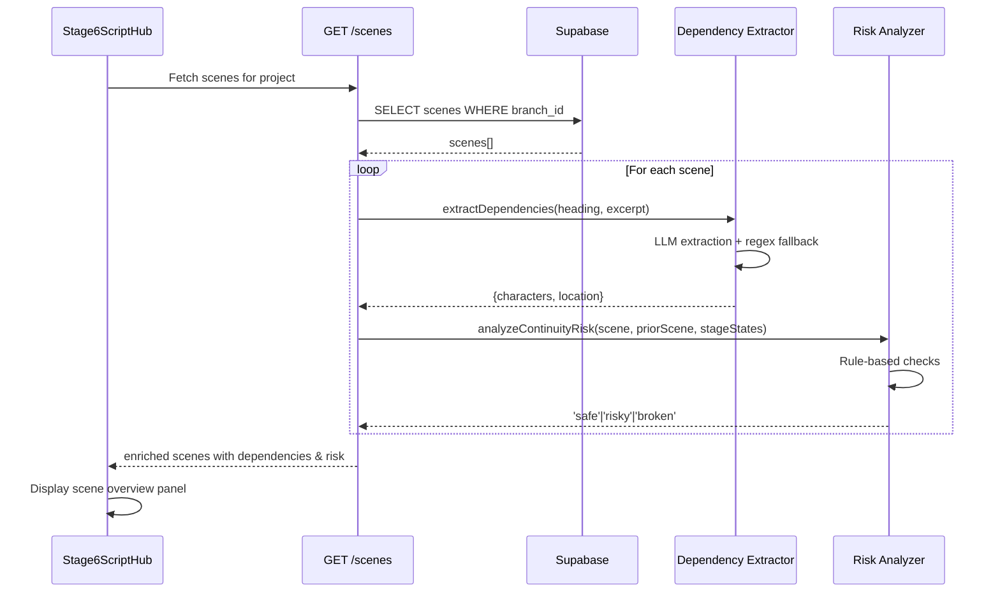

# Feature 4.2: Stage 6 - Script Hub Implementation Plan

## Current State Analysis

The Script Hub UI is already fully implemented in [`src/components/pipeline/Stage6ScriptHub.tsx`](src/components/pipeline/Stage6ScriptHub.tsx) (476 lines) with:

- ✅ Scene list panel with status indicators and thumbnails
- ✅ Scene selection and navigation logic
- ✅ Scene overview panel displaying header, opening action, dependencies
- ✅ Outdated scene warning modal
- ✅ "Enter Scene Pipeline" action integrated with [`src/pages/ProjectView.tsx`](src/pages/ProjectView.tsx)
- ✅ Real scene data fetching via [`src/lib/services/sceneService.ts`](src/lib/services/sceneService.ts)

**Missing functionality:**

1. Scene dependency fields (`expectedCharacters`, `expectedLocation`) are populated as empty arrays/strings
2. Continuity risk analysis (`continuityRisk`) is not calculated
3. Prior scene end state (`priorSceneEndState`) displays placeholder but field is undefined

## Architecture Overview

```mermaid
graph TD
    Stage4[Stage 4: Master Script] -->|persists scenes| Database[(scenes table)]
    Database -->|GET /api/projects/:id/scenes| Backend[Backend API]
    Backend -->|enrichSceneWithDependencies| Extractor[Scene Dependency Extractor]
    Backend -->|analyzeContinuityRisk| Analyzer[Continuity Risk Analyzer]
    Backend -->|returns Scene[]| Frontend[Stage 6 Script Hub]
    
    Extractor -->|LLM extraction| Characters[expectedCharacters]
    Extractor -->|regex parsing| Location[expectedLocation]
    
    Analyzer -->|rule-based check| PriorScene[Prior Scene Status]
    Analyzer -->|sets continuityRisk| RiskLevel[safe/risky/broken]
```

## Implementation Tasks

### Task 1: Database Migration - Add Scene Dependency Cache Columns

**File:** `backend/migrations/004_add_scene_dependencies.sql` (new)

**⚠️ MOVED TO FIRST - Critical for Performance:** This migration must be completed first to enable cache checking before attempting expensive LLM extractions.

Add columns to cache extracted dependencies and avoid re-extraction on every fetch:

```sql
-- Migration 004: Add scene dependency caching columns

ALTER TABLE scenes 
ADD COLUMN expected_characters TEXT[], -- Array of character names
ADD COLUMN expected_location TEXT,     -- Specific location extracted
ADD COLUMN dependencies_extracted_at TIMESTAMPTZ; -- Track when last extracted

-- Add index for efficient queries
CREATE INDEX idx_scenes_dependencies_extracted ON scenes(dependencies_extracted_at);
```

**Migration strategy:**

1. Existing scenes will have `NULL` values after migration
2. Endpoint should check `dependencies_extracted_at`:
   - If `NULL` or older than `script_excerpt` update: re-extract
   - Otherwise: return cached values
3. Update cache after extraction

**Cache Invalidation Logic:**

When the user edits the script in Stage 4:
- The `scenes.updated_at` timestamp is updated automatically (trigger from migration 003)
- Endpoint compares `dependencies_extracted_at < updated_at` to detect stale cache
- If stale, re-extraction is triggered; otherwise cached values are returned

### Task 2: Create Scene Dependency Extraction Service

**File:** `backend/src/services/sceneDependencyExtraction.ts` (new)

Create a lightweight LLM-based extraction service to populate `expectedCharacters` and `expectedLocation` from scene `script_excerpt`.

**Key design decisions:**

- **Single-pass extraction** (not two-pass like asset extraction) since we're extracting from one scene only
- **Reuse existing LLM infrastructure** from [`backend/src/services/llm-client.ts`](backend/src/services/llm-client.ts)
- **Fallback to regex parsing** for location (parse from scene heading like "INT. KITCHEN - DAY")
- **Character extraction** identifies names in action lines and dialogue
- **⚠️ NEW: Fuzzy matching against Stage 5 master assets** - extracted character names should be matched against existing `global_assets` (type='character') to ensure consistency with visual profiles

**Implementation pattern** (based on [`backend/src/services/assetExtractionService.ts`](backend/src/services/assetExtractionService.ts)):

```typescript
interface SceneDependencies {
  expectedCharacters: string[]; // matched against master_assets where possible
  expectedLocation: string;
}

export class SceneDependencyExtractionService {
  async extractDependencies(
    sceneHeading: string, 
    scriptExcerpt: string,
    projectId: string // NEW: needed for asset matching
  ): Promise<SceneDependencies>
  
  // NEW: Fuzzy match extracted names against project assets
  private async matchCharactersToAssets(
    extractedNames: string[],
    projectId: string
  ): Promise<string[]>
}
```

**Prompt template structure:**

- System prompt: Extract character names and location from this single scene
- User prompt: Scene heading + first 15-20 lines of script_excerpt (opening action)
- Output: JSON with `{ characters: string[], location: string }`
- Token optimization: Only analyze opening portion, not full scene (reduces cost)

**Location extraction strategy:**

1. Try regex parse from heading first (e.g., "INT. KITCHEN - DAY" → "KITCHEN")
2. If ambiguous, use LLM to extract specific location
3. Fallback to heading text if extraction fails

**Character Matching Strategy (NEW):**

1. Extract raw character names from script excerpt (e.g., "ALICE", "BOB")
2. Query `global_assets` table for assets of type 'character' linked to this project
3. Use fuzzy string matching (Levenshtein distance or simple lowercase comparison) to map:
   - "ALICE" → "Alice Smith" (if "Alice Smith" exists in global_assets)
   - "BOB" → "Bob" (exact match)
4. Return matched asset names when possible, fallback to extracted names if no match

### Task 3: Create Continuity Risk Analyzer Service

**File:** `backend/src/services/continuityRiskAnalyzer.ts` (new)

Implement **rule-based** continuity risk analysis (not LLM-powered) for MVP.

**Risk calculation logic** (per user requirements):

```typescript
type ContinuityRisk = 'safe' | 'risky' | 'broken';

interface ContinuityAnalysisInput {
  scene: Scene;
  priorScene: Scene | null;
  upstreamStageStates: StageState[]; // Stage 1-4 states
}

function analyzeContinuityRisk(input: ContinuityAnalysisInput): ContinuityRisk {
  // Rule 1: If no prior scene (Scene 1), always safe
  if (!priorScene) return 'safe';
  
  // Rule 2: If prior scene status is not 'video_complete', mark as 'risky'
  if (priorScene.status !== 'video_complete') {
    return 'risky';
  }
  
  // Rule 3: Check if upstream artifacts (Stage 1-4) changed since scene was last modified
  // Compare scene.updated_at with max(stage_states.updated_at) for stages 1-4
  if (upstreamArtifactsChangedSinceSceneModified(scene, upstreamStageStates)) {
    return 'broken';
  }
  
  // Rule 4: If scene status is 'continuity_broken' or 'outdated', mark as 'broken'
  if (scene.status === 'continuity_broken' || scene.status === 'outdated') {
    return 'broken';
  }
  
  return 'safe';
}
```

**Key references:**

- Database schema: [`backend/migrations/003_add_scenes_table.sql`](backend/migrations/003_add_scenes_table.sql) (lines 17-22 show status enum)
- State transition matrix: [`._docs/database-schema-state-transition-matrix.md`](._docs/database-schema-state-transition-matrix.md) (lines 855-863)

### Task 4: Enhance Backend Scene Fetching Endpoint with Smart Caching

**File:** [`backend/src/routes/projects.ts`](backend/src/routes/projects.ts) (lines 427-505)

Enhance the existing `GET /api/projects/:id/scenes` endpoint to:

1. **Check cache first** - only extract if `dependencies_extracted_at` is NULL or stale
2. **Use parallel extraction with concurrency limits** to avoid 40+ second page loads
3. **Calculate continuity risk** for each scene
4. **Fetch prior scene end state** from `end_state_summary` field (if exists)

**⚠️ CRITICAL PERFORMANCE FIX:** The original plan suggested sequential extraction, which would cause 40-second page loads for 20 scenes and likely trigger 504 Gateway Timeouts on Fly.io.

**Implementation approach:**

```typescript
// Current implementation (lines 427-505) needs these additions:

// After fetching scenes from database (line 453), UPDATE the SELECT:
const { data: scenes, error: scenesError } = await supabase
  .from('scenes')
  .select('id, scene_number, slug, status, script_excerpt, end_state_summary, updated_at, expected_characters, expected_location, dependencies_extracted_at') // NEW: fetch cache columns
  .eq('branch_id', project.active_branch_id)
  .order('scene_number', { ascending: true });

// Add after line 494 (before returning):
const sceneDependencyService = new SceneDependencyExtractionService();
const continuityAnalyzer = new ContinuityRiskAnalyzer();

// Fetch upstream stage states for continuity analysis
const { data: stageStates } = await supabase
  .from('stage_states')
  .select('stage_number, updated_at')
  .eq('branch_id', project.active_branch_id)
  .in('stage_number', [1, 2, 3, 4]);

// NEW: Parallel extraction with concurrency limit (max 5 concurrent LLM calls)
const CONCURRENCY_LIMIT = 5;
const scenesToExtract: number[] = [];

// Identify scenes needing extraction
scenes.forEach((scene, index) => {
  const needsExtraction = !scene.dependencies_extracted_at || 
                          scene.dependencies_extracted_at < scene.updated_at;
  if (needsExtraction) {
    scenesToExtract.push(index);
  }
});

// Process extractions in batches
for (let i = 0; i < scenesToExtract.length; i += CONCURRENCY_LIMIT) {
  const batch = scenesToExtract.slice(i, i + CONCURRENCY_LIMIT);
  await Promise.all(
    batch.map(async (sceneIndex) => {
      const scene = scenes[sceneIndex];
      try {
        const dependencies = await sceneDependencyService.extractDependencies(
          transformedScenes[sceneIndex].header,
          scene.script_excerpt,
          id // project ID for asset matching
        );
        
        // Update database cache
        await supabase
          .from('scenes')
          .update({
            expected_characters: dependencies.expectedCharacters,
            expected_location: dependencies.expectedLocation,
            dependencies_extracted_at: new Date().toISOString()
          })
          .eq('id', scene.id);
        
        // Update in-memory scene
        scene.expected_characters = dependencies.expectedCharacters;
        scene.expected_location = dependencies.expectedLocation;
      } catch (error) {
        console.warn(`[SceneDependency] Extraction failed for scene ${scene.scene_number}:`, error);
        // Use cached values or empty fallback
        scene.expected_characters = scene.expected_characters || [];
        scene.expected_location = scene.expected_location || '';
      }
    })
  );
}

// Enrich each scene (synchronous operations only)
const enrichedScenes = transformedScenes.map((scene, index) => {
  const dbScene = scenes[index];
  
  // Analyze continuity risk (rule-based, fast)
  const priorScene = index > 0 ? scenes[index - 1] : null;
  const continuityRisk = continuityAnalyzer.analyzeContinuityRisk({
    scene: dbScene, // raw DB scene with updated_at
    priorScene,
    upstreamStageStates: stageStates || []
  });
  
  return {
    ...scene,
    expectedCharacters: dbScene.expected_characters || [],
    expectedLocation: dbScene.expected_location || '',
    priorSceneEndState: priorScene?.end_state_summary || undefined,
    continuityRisk
  };
});
```

**Performance improvements:**

- **Cache-first approach**: Only extract if data is missing or stale (compares `dependencies_extracted_at < updated_at`)
- **Parallel extraction**: Process up to 5 scenes simultaneously (reduces 40s to ~8s for 20 scenes)
- **Database persistence**: Cache results immediately so subsequent loads are instant
- **Graceful degradation**: Failed extractions fall back to cached or empty values without blocking the response

**Estimated page load times:**
- First load (20 scenes, all need extraction): ~8-10 seconds (5 concurrent batches)
- Subsequent loads (cached): <500ms (database query only)
- After Stage 4 edit (partial cache invalidation): ~2-4 seconds (only modified scenes re-extracted)

### Task 5: Update "Enter Scene Pipeline" Navigation to Persist Scene Context

**File:** [`src/components/pipeline/Stage6ScriptHub.tsx`](src/components/pipeline/Stage6ScriptHub.tsx) (line 119, `handleEnterPipeline` function)

**⚠️ NEW REQUIREMENT:** Ensure that when the user clicks "Enter Scene Pipeline", the selected scene is persisted in the URL so that refreshing Stage 7 doesn't lose the active scene context.

**Current implementation (line 119):**
```typescript
const handleEnterPipeline = () => {
  if (!selectedScene) return;
  onNavigateToStage(7, { sceneId: selectedScene.id });
};
```

**Required change:**
Verify that `ProjectView.tsx` properly handles the `sceneId` parameter and updates the URL:

```typescript
// In ProjectView.tsx navigation handler
const handleNavigateToStage = (stageNumber: number, params?: { sceneId?: string }) => {
  setCurrentStage(stageNumber);
  
  // NEW: Update URL with scene context
  if (params?.sceneId) {
    navigate(`/projects/${projectId}/stage/${stageNumber}?sceneId=${params.sceneId}`);
  } else {
    navigate(`/projects/${projectId}/stage/${stageNumber}`);
  }
};
```

**Validation:**
- Test clicking "Enter Scene Pipeline" from Stage 6
- Verify URL shows `/projects/:id/stage/7?sceneId=:sceneId`
- Refresh the page and confirm Stage 7 maintains the correct scene context

### Task 6: Handle Prior Scene End State Display

**File:** [`src/components/pipeline/Stage6ScriptHub.tsx`](src/components/pipeline/Stage6ScriptHub.tsx) (lines 355-365)

The UI already displays `priorSceneEndState` if present. No changes needed to frontend.

**Backend changes** (Task 4 already handles this):

- Fetch `end_state_summary` from database (added in migration 003, line 27)
- Pass as `priorSceneEndState` in API response
- Display placeholder text if undefined (already implemented in UI line 356)

**Future note:** `end_state_summary` will be populated when scenes complete Stage 12 (out of scope for Feature 4.2)

### Task 7: Update Frontend Type Expectations

**File:** [`src/lib/services/sceneService.ts`](src/lib/services/sceneService.ts) (lines 36-50)

Update the scene transformation to expect non-empty dependency fields:

```typescript
// Line 44-45: Remove fallback to empty array/string since backend now populates them
expectedCharacters: scene.expectedCharacters || [], // Keep fallback for safety
expectedLocation: scene.expectedLocation || '',     // Keep fallback for safety
continuityRisk: scene.continuityRisk || 'safe'      // Add safe fallback
```

The existing code already handles these fields correctly with fallbacks.

### Task 8: Add Error Handling for Extraction Failures

**Files:**

- `backend/src/services/sceneDependencyExtraction.ts`
- `backend/src/routes/projects.ts`

**Scenarios to handle:**

1. **LLM extraction fails** → Fallback to empty arrays/strings, log warning
2. **Timeout** → Set 10-second timeout, return partial results
3. **Rate limiting** → Return cached values if available, otherwise empty

**Implementation:**

```typescript
// In sceneDependencyExtraction.ts
async extractDependencies(heading: string, excerpt: string, projectId: string): Promise<SceneDependencies> {
  try {
    const result = await Promise.race([
      this.performExtraction(heading, excerpt, projectId),
      this.timeout(10000) // 10 second timeout
    ]);
    return result;
  } catch (error) {
    console.warn(`[SceneDependency] Extraction failed: ${error.message}`);
    // Fallback to regex-based location extraction
    return {
      expectedCharacters: [],
      expectedLocation: this.parseLocationFromHeading(heading),
    };
  }
}
```

### Task 9: Testing & Validation

**Test scenarios:**

1. **Scene list display** (already working):

   - Navigate to Stage 6 for a project with scenes
   - Verify all scenes load with status indicators
   - Check thumbnails display (or placeholder)

2. **Dependency extraction**:

   - Create scene with characters "ALICE" and "BOB" in dialogue
   - Verify `expectedCharacters: ["ALICE", "BOB"]` appears in Scene Overview panel
   - Create scene with heading "INT. COFFEE SHOP - DAY"
   - Verify `expectedLocation: "Coffee Shop"` appears

3. **Continuity risk display**:

   - Scene 1 (no prior) → should show no risk warning
   - Scene 2 where Scene 1 is `draft` → should show "Risky" warning (amber)
   - Scene 3 where upstream Stage 4 changed → should show "Broken" warning (red)

4. **Error handling**:

   - Simulate LLM timeout → verify fallback behavior
   - Check empty scenes → verify graceful handling

## Data Flow Diagram



## Acceptance Criteria

✅ **Phase 1 (Database) Complete When:**

- [ ] Migration 004 runs successfully
- [ ] `scenes` table has `expected_characters`, `expected_location`, `dependencies_extracted_at` columns
- [ ] Existing scenes have `NULL` values in new columns
- [ ] Index on `dependencies_extracted_at` exists

✅ **Phase 2 (Backend Services) Complete When:**

- [ ] `SceneDependencyExtractionService` successfully extracts characters and location from test scene
- [ ] Character names are fuzzy-matched against `global_assets` when possible
- [ ] Regex fallback correctly parses location from heading "INT. KITCHEN - DAY" → "KITCHEN"
- [ ] `ContinuityRiskAnalyzer` returns correct risk levels for all test scenarios:
  - Scene 1 (no prior) → 'safe'
  - Scene 2 (prior incomplete) → 'risky'
  - Scene 3 (upstream changed) → 'broken'
  - Scene with status 'continuity_broken' → 'broken'

✅ **Phase 3 (API Integration) Complete When:**

- [ ] `GET /api/projects/:id/scenes` returns enriched scenes with all new fields
- [ ] Cache-checking logic works: Only extracts if `dependencies_extracted_at` is NULL or stale
- [ ] Parallel extraction processes up to 5 scenes concurrently
- [ ] Extraction results are cached to database immediately
- [ ] Page loads with 20 scenes complete in <10 seconds (first load), <500ms (cached)
- [ ] Failed extractions fall back gracefully without breaking response

✅ **Phase 4 (Frontend Integration) Complete When:**

- [ ] Scene list UI displays with status indicators (already working)
- [ ] Scene selection updates overview panel (already working)
- [ ] `expectedCharacters` array is populated and displayed as character badges
- [ ] `expectedLocation` is displayed in Scene Overview panel
- [ ] "Not yet extracted" placeholder no longer appears (unless extraction failed)
- [ ] Continuity risk warnings appear correctly:
  - "Safe" scenes show no warning
  - "Risky" scenes show amber warning with helpful message
  - "Broken" scenes show red warning with helpful message
- [ ] Prior scene end state displays when Scene N-1 is complete (or placeholder)
- [ ] "Enter Scene Pipeline" navigates to Stage 7 with `?sceneId=...` in URL
- [ ] Refreshing Stage 7 maintains scene context from URL

✅ **Phase 5 (Robustness & Testing) Complete When:**

- [ ] LLM timeout (>10s) triggers fallback to regex/empty values
- [ ] Rate limiting errors don't break page load
- [ ] Empty scenes are handled gracefully
- [ ] All 9 testing scenarios from Task 9 pass successfully
- [ ] Scene workflow sidebar appears with correct scene context in Stage 7
- [ ] Outdated warning modal works correctly (already implemented)

## Technical Notes

### Performance Optimization

**Current approach (MVP):** Extract dependencies on-demand during scene fetch

- **Pros:** Simple, no background jobs
- **Cons:** 2-3 second latency per scene on first load

**Future optimization:** Background extraction job

- Extract dependencies when scenes are persisted (Stage 4→5 transition)
- Store in `expected_characters` and `expected_location` columns
- Scene fetch becomes instant

### LLM Cost Estimates

**Per scene dependency extraction:**

- Input tokens: ~300 (heading + 15 lines of action)
- Output tokens: ~50 (JSON with characters/location)
- Cost with Gemini Flash: ~$0.0001 per scene
- 10 scenes = $0.001 per project load

**Total cost impact:** Negligible for MVP (<$0.01 per project)

### Database Schema Alignment

The `scenes` table already has:

- ✅ `end_state_summary TEXT` (line 27 of migration 003)
- ✅ `end_frame_id UUID` (line 28)
- ✅ `status` with all required enum values (lines 17-22)
- ✅ `updated_at` timestamp (line 31)

**New columns needed:**

- `expected_characters TEXT[]` (caching)
- `expected_location TEXT` (caching)
- `dependencies_extracted_at TIMESTAMPTZ` (cache invalidation)

## Files to Create

1. `backend/migrations/004_add_scene_dependencies.sql` - **Priority 1** - Cache columns for performance
2. `backend/src/services/sceneDependencyExtraction.ts` - **Priority 2** - LLM extraction service with fuzzy asset matching
3. `backend/src/services/continuityRiskAnalyzer.ts` - **Priority 2** - Rule-based risk calculator
4. `backend/src/tests/sceneDependencyExtraction.test.ts` - **Priority 4** - Unit tests (optional but recommended)

## Files to Modify

1. `backend/src/routes/projects.ts` - **Priority 3** - Enhance GET /scenes endpoint (lines 427-505) with cache-first parallel extraction
2. `src/lib/services/sceneService.ts` - **Priority 4** - Update type handling (lines 44-49, add continuityRisk fallback)
3. `src/pages/ProjectView.tsx` - **Priority 4** - Ensure URL persistence for scene context in navigation handler
4. `src/components/pipeline/Stage6ScriptHub.tsx` - **Priority 4** - Verify "Enter Scene Pipeline" passes sceneId correctly (line 119)

## Revised Implementation Order (Based on Dependency Analysis & Performance Optimization)

The tasks have been reordered to address the critical performance bottleneck identified in the improvement recommendations. The database migration must be completed first to enable cache-checking before expensive LLM extractions.

### Phase 1: Database Foundation (Sequential - Must Complete Before Phase 2)

**Group 1A: Schema Changes**
- ✅ **Task 1: Database Migration** - Add cache columns (`expected_characters`, `expected_location`, `dependencies_extracted_at`)
  - **Why first:** Required by all subsequent tasks; enables cache-checking logic
  - **Testing:** Verify migration runs cleanly; check columns exist with `NULL` values for existing scenes

### Phase 2: Backend Services (Can be done in parallel)

**Group 2A: Extraction Service (Independent)**
- ✅ **Task 2: Scene Dependency Extraction Service** - Build LLM extraction with fuzzy asset matching
  - **Dependencies:** None (can use test data)
  - **Testing:** Unit test with sample scene text; verify character matching against mock assets

**Group 2B: Risk Analysis Service (Independent)**
- ✅ **Task 3: Continuity Risk Analyzer** - Rule-based risk calculation
  - **Dependencies:** None (pure logic, no external dependencies)
  - **Testing:** Unit test with various scene status combinations

### Phase 3: API Integration (Sequential - Requires Phase 2 Complete)

**Group 3A: Endpoint Enhancement**
- ✅ **Task 4: Backend Endpoint Enhancement** - Smart caching + parallel extraction with concurrency limits
  - **Dependencies:** Task 1 (database columns), Task 2 (extraction service), Task 3 (risk analyzer)
  - **Critical:** Implements the performance fix (cache-first, parallel batches)
  - **Testing:** Test with 20+ scenes; verify extraction only happens once; check response times <10s on first load, <500ms on cached load

### Phase 4: Frontend Integration (Sequential - Requires Phase 3 Complete)

**Group 4A: Frontend Updates (Can be done in parallel)**
- ✅ **Task 5: URL Navigation Enhancement** - Persist scene context in URL
  - **Dependencies:** None (frontend-only change)
  - **Testing:** Click "Enter Scene Pipeline"; verify URL contains `?sceneId=...`; refresh and confirm scene context preserved

- ✅ **Task 6: Prior Scene End State Display** - Already implemented, verify functionality
  - **Dependencies:** Task 4 (backend returns `priorSceneEndState`)
  - **Testing:** Check UI displays placeholder or actual end state

- ✅ **Task 7: Frontend Type Updates** - Add `continuityRisk` fallback
  - **Dependencies:** Task 4 (backend returns `continuityRisk`)
  - **Testing:** Verify no type errors; check Scene Overview panel displays risk warnings

### Phase 5: Robustness & Validation (Sequential - Requires All Prior Phases)

**Group 5A: Error Handling & Testing (Done together)**
- ✅ **Task 8: Error Handling** - Timeout, rate limiting, LLM failure fallbacks
  - **Dependencies:** Task 2 (extraction service), Task 4 (endpoint)
  - **Testing:** Simulate LLM timeout; verify graceful fallback to regex/empty values

- ✅ **Task 9: End-to-End Testing** - Full workflow validation
  - **Dependencies:** All prior tasks
  - **Testing Checklist:**
    - ✅ Scene list displays with status indicators
    - ✅ `expectedCharacters` array populated from script
    - ✅ `expectedLocation` extracted from heading
    - ✅ Scene Overview panel displays character badges and location
    - ✅ Continuity risk warnings (safe/risky/broken) appear correctly
    - ✅ Prior scene end state displays (or placeholder)
    - ✅ "Enter Scene Pipeline" navigates to Stage 7 with scene context
    - ✅ Performance: 20 scenes load in <10s (first time), <500ms (cached)
    - ✅ Error scenario: LLM timeout doesn't break page load

## Implementation Timeline Estimate

- **Phase 1 (Database):** 30 minutes
- **Phase 2 (Services):** 2-3 hours (can parallelize if multiple developers)
- **Phase 3 (API Integration):** 1-2 hours
- **Phase 4 (Frontend):** 1 hour
- **Phase 5 (Testing & Robustness):** 1-2 hours

**Total estimated time:** 5-8 hours for fully functional, performance-optimized MVP

## Key Differences from Original Plan

1. **Database migration moved to FIRST** (was Task 4, now Task 1) - enables cache-checking
2. **Parallel extraction with concurrency limits** (was sequential) - prevents 40s page loads and 504 timeouts
3. **Cache-first approach** in endpoint - only extract if NULL or stale
4. **URL persistence for scene context** (new requirement from improvements) - prevents losing scene on refresh
5. **Character matching against Stage 5 assets** (new requirement) - ensures consistency with visual profiles