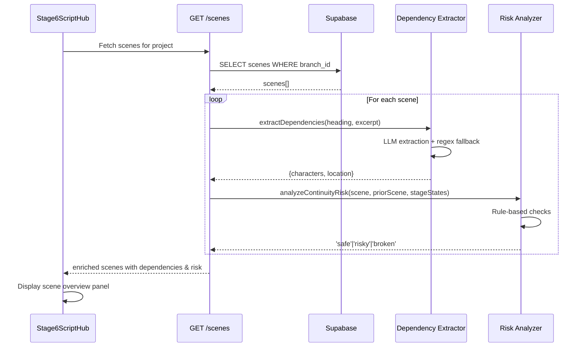

# Feature 4.2: Stage 6 - Script Hub Implementation Plan

## ⚠️ Architectural Decision: Option B - Extract at Scene Parsing Time

**Context:** Originally, scene dependencies (characters, locations, props) were planned to be extracted at Stage 6 when viewing the Script Hub. However, this created duplicate work:
- Stage 5 already extracts assets from the full master script
- Stage 6 would re-extract dependencies per scene
- Two separate extractions covering the same data

**Decision:** Extract dependencies once at Stage 4 during scene parsing, then reuse in both Stage 5 and Stage 6.

**Implementation Flow:**
```
Stage 4: Extract Scenes
  ↓
  For each scene:
    - Parse scene heading and content
    - Extract dependencies (characters, props, location) via LLM
    - Store in scenes table (expected_characters, expected_props, expected_location)
  ↓
Stage 5: Asset Extraction
  ↓
  Aggregate unique dependencies from all scenes
  ↓
  For each unique asset:
    - Create visual description (Pass 2 - unchanged)
    - Store in project_assets
  ↓
Stage 6: Script Hub
  ↓
  Read pre-computed dependencies from scenes table (instant)
```

**Benefits:**
- 50% reduction in LLM calls (extract once, use twice)
- Stage 6 loads in <500ms (no LLM calls)
- Single source of truth for dependencies
- No cache invalidation complexity

**Trade-offs:**
- Stage 4 scene extraction takes longer (~10-20s for 20 scenes instead of instant)
- One-time cost is acceptable (only happens at Stage 4→5 transition)

## Current State Analysis

The Script Hub UI is already fully implemented in [`src/components/pipeline/Stage6ScriptHub.tsx`](src/components/pipeline/Stage6ScriptHub.tsx) (476 lines) with:

- ✅ Scene list panel with status indicators and thumbnails
- ✅ Scene selection and navigation logic
- ✅ Scene overview panel displaying header, opening action, dependencies
- ✅ Outdated scene warning modal
- ✅ "Enter Scene Pipeline" action integrated with [`src/pages/ProjectView.tsx`](src/pages/ProjectView.tsx)
- ✅ Real scene data fetching via [`src/lib/services/sceneService.ts`](src/lib/services/sceneService.ts)

**Missing functionality:**

1. Scene dependency fields (`expectedCharacters`, `expectedLocation`, `expectedProps`) are populated as empty arrays/strings
   - **⚠️ ARCHITECTURAL CHANGE:** Dependencies should be extracted during Stage 4 scene extraction, not Stage 6
2. Continuity risk analysis (`continuityRisk`) is not calculated
3. Prior scene end state (`priorSceneEndState`) displays placeholder but field is undefined
4. **⚠️ NEW REQUIREMENT:** Stage 5 asset extraction must be updated to use scene dependencies instead of re-extracting from full script

## Architecture Overview

**⚠️ CRITICAL ARCHITECTURAL CHANGE - Option B: Extract at Scene Extraction Time**

Dependencies are now extracted **once** during Stage 4 scene extraction, then reused in Stage 5 (asset aggregation) and Stage 6 (scene display). This eliminates duplicate LLM calls and ensures consistency.

```mermaid
graph TD
    Stage4[Stage 4: Master Script] -->|extracts scenes + dependencies| ScriptService[scriptService.extractScenes]
    ScriptService -->|for each scene| DepExtractor[Scene Dependency Extractor]
    DepExtractor -->|LLM extraction| Characters[expectedCharacters]
    DepExtractor -->|LLM extraction| Props[expectedProps]
    DepExtractor -->|regex parsing| Location[expectedLocation]
    ScriptService -->|persists scenes with deps| Database[(scenes table)]
    
    Database -->|Stage 5: aggregate deps| AssetExtraction[Asset Extraction Service]
    AssetExtraction -->|builds master list| ProjectAssets[(project_assets)]
    
    Database -->|Stage 6: read cached deps| Backend[GET /scenes endpoint]
    Backend -->|analyzeContinuityRisk| Analyzer[Continuity Risk Analyzer]
    Backend -->|returns Scene[]| Frontend[Stage 6 Script Hub]
    
    Analyzer -->|rule-based check| PriorScene[Prior Scene Status]
    Analyzer -->|sets continuityRisk| RiskLevel[safe/risky/broken]
```

**Key Benefits:**
- Extract once, use twice (Stage 5 + Stage 6)
- No cache invalidation complexity (dependencies extracted with scenes)
- Stage 6 becomes instant (reads pre-computed dependencies)
- Stage 5 uses scene dependencies as input for aggregation

## Implementation Tasks

### Task 1: Database Migration - Add Scene Dependency Cache Columns

**File:** `backend/migrations/011_add_scene_dependencies.sql` (already created with expected_props)

**⚠️ MOVED TO FIRST - Foundation for Stage 4 Extraction:** This migration must be completed first to add columns for storing dependencies extracted during scene parsing.

Add columns to store extracted dependencies from Stage 4 scene parsing:

```sql
-- Migration 011: Add scene dependency columns

ALTER TABLE scenes 
ADD COLUMN expected_characters TEXT[], -- Array of character names extracted at Stage 4
ADD COLUMN expected_location TEXT,     -- Location extracted from scene heading
ADD COLUMN expected_props TEXT[],      -- Array of prop names extracted at Stage 4
ADD COLUMN dependencies_extracted_at TIMESTAMPTZ; -- Timestamp when dependencies were extracted

-- Add index for efficient queries (useful for finding scenes missing dependencies)
CREATE INDEX idx_scenes_dependencies_extracted ON scenes(dependencies_extracted_at);
```

**Migration strategy:**

1. Existing scenes will have `NULL` values after migration
2. **No cache invalidation needed** - dependencies extracted once at scene creation (Stage 4)
3. If dependencies are NULL, it means the scene was created before this feature (legacy data)

**Dependency Update Logic:**

When scenes are re-extracted at Stage 4 (script edited):
- Scene records are deleted and re-inserted (see Feature 4.1 implementation)
- New scene records include fresh dependency extraction
- No need for cache invalidation - scenes are replaced entirely

### Task 2: Create Scene Dependency Extraction Service (STAGE 4 INTEGRATION)

**File:** `backend/src/services/sceneDependencyExtraction.ts` (new)

**⚠️ CRITICAL CHANGE - Extract at Scene Parsing Time:**
This service is now called during Stage 4 scene extraction (when master script is parsed into scenes), NOT during Stage 6 scene fetching. This eliminates duplicate extraction and ensures dependencies are available for both Stage 5 (asset aggregation) and Stage 6 (scene display).

Create a lightweight LLM-based extraction service to populate `expectedCharacters`, `expectedLocation`, and `expectedProps` from scene `script_excerpt`.

**Key design decisions:**

- **Single-pass extraction** (not two-pass like asset extraction) since we're extracting from one scene only
- **Reuse existing LLM infrastructure** from [`backend/src/services/llm-client.ts`](backend/src/services/llm-client.ts)
- **Fallback to regex parsing** for location (parse from scene heading like "INT. KITCHEN - DAY")
- **Character extraction** identifies names in action lines and dialogue
- **Prop extraction** identifies key props mentioned in action lines and dialogue
- **⚠️ NO FUZZY MATCHING YET** - At Stage 4, project_assets don't exist yet. Raw extracted names are stored. Fuzzy matching happens in Stage 5 when assets are created.

**Implementation pattern** (simplified - no fuzzy matching at extraction time):

```typescript
interface SceneDependencies {
  expectedCharacters: string[]; // Raw extracted names (not yet matched)
  expectedLocation: string;      // Parsed from heading or extracted
  expectedProps: string[];       // Raw extracted props (not yet matched)
}

export class SceneDependencyExtractionService {
  /**
   * Extract raw dependencies from a single scene
   * Called during Stage 4 scene parsing (scriptService.extractScenes)
   * No fuzzy matching - that happens in Stage 5 asset aggregation
   */
  async extractDependencies(
    sceneHeading: string, 
    scriptExcerpt: string
  ): Promise<SceneDependencies>
  
  /**
   * Fallback regex parser for location
   * Extracts location from scene heading (e.g., "INT. KITCHEN - DAY" → "KITCHEN")
   */
  private parseLocationFromHeading(heading: string): string
}
```

**Prompt template structure:**

- System prompt: Extract character names, location, and key props from this single scene
- User prompt: Scene heading + first 15-20 lines of script_excerpt (opening action)
- Output: JSON with `{ characters: string[], location: string, props: string[] }`
- Token optimization: Only analyze opening portion, not full scene (reduces cost)
- **Note:** Extracts raw names only; no asset matching at this stage

**Location extraction strategy:**

1. Try regex parse from heading first (e.g., "INT. KITCHEN - DAY" → "KITCHEN")
2. If ambiguous, use LLM to extract specific location
3. Fallback to heading text if extraction fails

**Extraction Strategy (NO FUZZY MATCHING AT STAGE 4):**

1. Extract raw character names from script excerpt (e.g., "ALICE", "BOB", "JONATHAN")
2. Extract raw prop names from action lines (e.g., "a gun", "the letter", "his watch")
3. Extract location from scene heading using regex, fallback to LLM if ambiguous
4. Store raw extracted values in scenes table
5. **No matching against assets** - project_assets don't exist yet at Stage 4

**Rationale for deferring fuzzy matching:**
- At Stage 4, no assets have been defined yet (Stage 5 creates them)
- Raw dependencies serve as input for Stage 5 asset aggregation
- Fuzzy matching happens later when comparing extracted names to created assets
- Simplifies extraction logic and reduces dependencies

### Task 2B: Integrate Dependency Extraction into Stage 4 Scene Parsing

**Files to modify:**
- `src/lib/services/scriptService.ts` (lines 298-369, `extractScenes` method)
- `backend/src/routes/projects.ts` (lines 507-689, `PUT /api/projects/:id/scenes` endpoint)

**⚠️ CRITICAL INTEGRATION POINT:** Dependency extraction must happen during scene parsing, not scene fetching. This ensures dependencies are stored with scenes immediately.

**Frontend changes (scriptService.ts):**

```typescript
// In extractScenes method (around line 301)
import { sceneDependencyExtractionService } from './sceneDependencyExtraction';

async extractScenes(formattedScript: string): Promise<Scene[]> {
  const scenes: Scene[] = [];
  const lines = formattedScript.split('\n');
  
  // ... existing parsing logic ...
  
  // NEW: After parsing each scene, extract dependencies
  for (const scene of scenes) {
    try {
      const dependencies = await sceneDependencyExtractionService.extractDependencies(
        scene.heading,
        scene.scriptExcerpt.split('\n').slice(0, 20).join('\n') // First 20 lines
      );
      
      scene.expectedCharacters = dependencies.expectedCharacters;
      scene.expectedLocation = dependencies.expectedLocation;
      scene.expectedProps = dependencies.expectedProps;
    } catch (error) {
      console.warn(`Failed to extract dependencies for scene ${scene.sceneNumber}:`, error);
      // Continue with empty dependencies rather than blocking
      scene.expectedCharacters = [];
      scene.expectedLocation = scene.heading; // Fallback to heading
      scene.expectedProps = [];
    }
  }
  
  return scenes;
}
```

**Backend changes (projects.ts):**

Ensure the `PUT /api/projects/:id/scenes` endpoint persists the new dependency fields:

```typescript
// Around line 670, in scene insertion logic
const scenesToInsert = scenes.map(scene => ({
  branch_id: project.active_branch_id,
  scene_number: scene.sceneNumber,
  slug: scene.slug,
  script_excerpt: scene.scriptExcerpt,
  status: 'draft',
  // NEW: Include dependency fields
  expected_characters: scene.expectedCharacters || [],
  expected_location: scene.expectedLocation || '',
  expected_props: scene.expectedProps || [],
  dependencies_extracted_at: scene.expectedCharacters ? new Date().toISOString() : null
}));
```

**Performance optimization:**

Since dependency extraction adds ~0.5-1s per scene (LLM call), consider:
- **Option A (MVP):** Extract sequentially during scene parsing (adds ~10-20s for 20 scenes)
- **Option B (Future):** Extract in background after persisting scenes (add loading state in UI)

For MVP, Option A is acceptable since scene extraction only happens once (Stage 4 → Stage 5 transition).

### Task 3: Create Continuity Risk Analyzer Service

**File:** `backend/src/services/continuityRiskAnalyzer.ts` (new)

Implement **rule-based** continuity risk analysis (not LLM-powered) for MVP.

**Risk calculation logic** (per user requirements):

```typescript
type ContinuityRisk = 'safe' | 'risky' | 'broken';

interface ContinuityAnalysisInput {
  scene: Scene;
  priorScene: Scene | null;
  upstreamStageStates: StageState[]; // Stage 1-4 states
}

function analyzeContinuityRisk(input: ContinuityAnalysisInput): ContinuityRisk {
  // Rule 1: If no prior scene (Scene 1), always safe
  if (!priorScene) return 'safe';
  
  // Rule 2: If prior scene status is not 'video_complete', mark as 'risky'
  if (priorScene.status !== 'video_complete') {
    return 'risky';
  }
  
  // Rule 3: Check if upstream artifacts (Stage 1-4) changed since scene was last modified
  // Compare scene.updated_at with max(stage_states.updated_at) for stages 1-4
  if (upstreamArtifactsChangedSinceSceneModified(scene, upstreamStageStates)) {
    return 'broken';
  }
  
  // Rule 4: If scene status is 'continuity_broken' or 'outdated', mark as 'broken'
  if (scene.status === 'continuity_broken' || scene.status === 'outdated') {
    return 'broken';
  }
  
  return 'safe';
}
```

**Key references:**

- Database schema: [`backend/migrations/003_add_scenes_table.sql`](backend/migrations/003_add_scenes_table.sql) (lines 17-22 show status enum)
- State transition matrix: [`._docs/database-schema-state-transition-matrix.md`](._docs/database-schema-state-transition-matrix.md) (lines 855-863)

### Task 3B: Update Stage 5 Asset Extraction to Use Scene Dependencies

**File:** `backend/src/services/assetExtractionService.ts`

**⚠️ BREAKING CHANGE - Stage 5 Refactor Required:** Stage 5 asset extraction must be refactored to aggregate scene dependencies instead of re-extracting from the full master script. This eliminates duplicate work and ensures consistency between Stage 4 and Stage 5.

**Impact on existing Stage 5 implementation:**
- Stage 5 was recently implemented in Feature 3.3 with two-pass extraction from full script
- This change modifies Pass 1 to use scene aggregation instead
- Pass 2 (distillation) remains unchanged
- Existing projects that completed Stage 5 will continue to work (assets already created)
- New projects will use the more efficient aggregation approach

**Current behavior (to be replaced):**
- Pass 1: Extracts all entities from full master script with scene references
- Pass 2: Distills each entity's mentions into visual summary

**New behavior (Option B):**
- **Pass 0 (NEW):** Aggregate dependencies from all scenes in database
- **Pass 1 (MODIFIED):** Deduplicate aggregated entities (e.g., "ALICE" + "Alice" → "Alice")
- **Pass 2 (UNCHANGED):** Distill each entity's mentions into visual summary

**Implementation:**

```typescript
// NEW method to aggregate scene dependencies
private async aggregateSceneDependencies(branchId: string): Promise<RawEntity[]> {
  // Fetch all scenes for this branch
  const { data: scenes } = await supabase
    .from('scenes')
    .select('scene_number, script_excerpt, expected_characters, expected_location, expected_props')
    .eq('branch_id', branchId)
    .order('scene_number', { ascending: true });
  
  if (!scenes) return [];
  
  const entityMap = new Map<string, RawEntity>();
  
  // Aggregate characters
  scenes.forEach(scene => {
    (scene.expected_characters || []).forEach(char => {
      const key = char.toLowerCase().trim();
      if (!entityMap.has(key)) {
        entityMap.set(key, {
          name: char,
          aliases: [char],
          type: 'character',
          mentions: []
        });
      }
      
      // Add scene mention with context
      entityMap.get(key)!.mentions.push({
        sceneNumber: scene.scene_number,
        text: `Character appears in scene ${scene.scene_number}`,
        context: scene.script_excerpt.split('\n').slice(0, 3).join(' ')
      });
    });
  });
  
  // Aggregate props
  scenes.forEach(scene => {
    (scene.expected_props || []).forEach(prop => {
      const key = prop.toLowerCase().trim();
      if (!entityMap.has(key)) {
        entityMap.set(key, {
          name: prop,
          aliases: [prop],
          type: 'prop',
          mentions: []
        });
      }
      
      entityMap.get(key)!.mentions.push({
        sceneNumber: scene.scene_number,
        text: `Prop appears in scene ${scene.scene_number}`,
        context: scene.script_excerpt.split('\n').slice(0, 3).join(' ')
      });
    });
  });
  
  // Aggregate locations
  scenes.forEach(scene => {
    if (!scene.expected_location) return;
    
    const key = scene.expected_location.toLowerCase().trim();
    if (!entityMap.has(key)) {
      entityMap.set(key, {
        name: scene.expected_location,
        aliases: [scene.expected_location],
        type: 'location',
        mentions: []
      });
    }
    
    entityMap.get(key)!.mentions.push({
      sceneNumber: scene.scene_number,
      text: `Location: ${scene.expected_location}`,
      context: scene.script_excerpt.split('\n').slice(0, 3).join(' ')
    });
  });
  
  return Array.from(entityMap.values());
}

// MODIFY extractAssets method
async extractAssets(
  masterScript: string, // DEPRECATED - not used in new approach
  branchId: string,
  visualStyleId: string
): Promise<ExtractedAsset[]> {
  console.log('[AssetExtraction] Starting aggregation-based extraction...');
  
  // NEW: Aggregate dependencies from scenes instead of parsing full script
  const rawEntities = await this.aggregateSceneDependencies(branchId);
  console.log(`[AssetExtraction] Aggregated ${rawEntities.length} entities from scenes`);
  
  // Pass 2: Distill each entity (UNCHANGED)
  const distilledAssets: ExtractedAsset[] = [];
  for (const entity of rawEntities) {
    const asset = await this.distillVisualSummary(entity, visualStyleId);
    distilledAssets.push(asset);
  }
  
  console.log(`[AssetExtraction] Pass 2 complete: ${distilledAssets.length} assets distilled`);
  
  return distilledAssets.sort((a, b) =>
    (b.isPriority ? 1 : 0) - (a.isPriority ? 1 : 0)
  );
}
```

**Backend route changes (projectAssets.ts):**

```typescript
// Around line 107, in POST /api/projects/:projectId/assets/extract
// CHANGE: Don't pass masterScript, use branch_id for scene aggregation
const extractedAssets = await extractionService.extractAssets(
  '', // Empty string - no longer used
  project.active_branch_id,
  visualStyleId
);
```

**Benefits of this approach:**
- Eliminates duplicate extraction (Stage 4 + Stage 5 now share same data)
- Scene dependencies serve as single source of truth
- Stage 5 focuses on asset refinement (visual descriptions), not entity discovery
- Ensures consistency between what users see in Stage 6 and what's defined in Stage 5

**Backwards Compatibility:**

**For existing projects (created before this feature):**

1. **Scenes without dependencies:**
   - Existing scenes will have `NULL` for dependency columns
   - Stage 6 will display empty dependencies (graceful degradation)
   - User can re-extract scenes at Stage 4 to populate dependencies

2. **Assets created with old extraction:**
   - Existing project_assets remain valid (no data loss)
   - Assets were created from full script, not scene aggregation
   - No need to re-extract assets (they work fine)
   - Future asset extraction will use new aggregation method

3. **Migration path:**
   - Option A: User re-extracts scenes at Stage 4 (deletes and re-parses with dependencies)
   - Option B: User continues with existing project (empty dependencies in Stage 6, assets still work)
   - Recommended: Add banner in Stage 6 if dependencies missing: "Re-extract scenes in Stage 4 to populate scene dependencies"

4. **No breaking changes:**
   - All existing functionality continues to work
   - Stage 5 aggregation gracefully handles scenes without dependencies (falls back to empty arrays)
   - Stage 6 displays "Not yet extracted" for empty dependencies

### Task 4: Simplify Backend Scene Fetching Endpoint (No More Extraction)

**File:** [`backend/src/routes/projects.ts`](backend/src/routes/projects.ts) (lines 427-505)

**⚠️ SIMPLIFIED - No Extraction at Stage 6:** Dependencies are now pre-computed at Stage 4, so this endpoint only needs to read and enrich scenes with continuity analysis.

Enhance the existing `GET /api/projects/:id/scenes` endpoint to:

1. **Fetch scenes with dependencies** - dependencies already in database from Stage 4
2. **Calculate continuity risk** for each scene (rule-based, fast)
3. **Fetch prior scene end state** from `end_state_summary` field (if exists)

**Implementation approach:**

```typescript
// Current implementation (lines 427-505) needs these changes:

// After fetching scenes from database (line 453), UPDATE the SELECT:
const { data: scenes, error: scenesError } = await supabase
  .from('scenes')
  .select('id, scene_number, slug, status, script_excerpt, end_state_summary, updated_at, expected_characters, expected_location, expected_props, dependencies_extracted_at')
  .eq('branch_id', project.active_branch_id)
  .order('scene_number', { ascending: true });

// Add after line 494 (before returning):
const continuityAnalyzer = new ContinuityRiskAnalyzer();

// Fetch upstream stage states for continuity analysis
const { data: stageStates } = await supabase
  .from('stage_states')
  .select('stage_number, updated_at')
  .eq('branch_id', project.active_branch_id)
  .in('stage_number', [1, 2, 3, 4]);

// NO MORE EXTRACTION LOGIC - dependencies already in database from Stage 4
// Just enrich scenes with continuity risk analysis

// Enrich each scene (synchronous operations only)
const enrichedScenes = transformedScenes.map((scene, index) => {
  const dbScene = scenes[index];
  
  // Analyze continuity risk (rule-based, fast)
  const priorScene = index > 0 ? scenes[index - 1] : null;
  const continuityRisk = continuityAnalyzer.analyzeContinuityRisk({
    scene: dbScene,
    priorScene,
    upstreamStageStates: stageStates || []
  });
  
  return {
    ...scene,
    expectedCharacters: dbScene.expected_characters || [],
    expectedLocation: dbScene.expected_location || '',
    expectedProps: dbScene.expected_props || [],
    priorSceneEndState: priorScene?.end_state_summary || undefined,
    continuityRisk
  };
});
```

**Performance improvements:**

- **No LLM calls** - dependencies pre-computed at Stage 4
- **Instant page loads** - <500ms for any number of scenes (database query + rule-based analysis only)
- **No cache invalidation complexity** - dependencies updated when scenes are re-extracted at Stage 4
- **Graceful fallback** - Empty arrays/strings if dependencies missing (for legacy projects)

**Estimated page load times:**
- All loads: <500ms (database query + continuity analysis only)
- No distinction between first load and cached loads - always fast

### Task 5: Update "Enter Scene Pipeline" Navigation to Persist Scene Context

**File:** [`src/components/pipeline/Stage6ScriptHub.tsx`](src/components/pipeline/Stage6ScriptHub.tsx) (line 119, `handleEnterPipeline` function)

**⚠️ NEW REQUIREMENT:** Ensure that when the user clicks "Enter Scene Pipeline", the selected scene is persisted in the URL so that refreshing Stage 7 doesn't lose the active scene context.

**Current implementation (line 119):**
```typescript
const handleEnterPipeline = () => {
  if (!selectedScene) return;
  onNavigateToStage(7, { sceneId: selectedScene.id });
};
```

**Required change:**
Verify that `ProjectView.tsx` properly handles the `sceneId` parameter and updates the URL:

```typescript
// In ProjectView.tsx navigation handler
const handleNavigateToStage = (stageNumber: number, params?: { sceneId?: string }) => {
  setCurrentStage(stageNumber);
  
  // NEW: Update URL with scene context
  if (params?.sceneId) {
    navigate(`/projects/${projectId}/stage/${stageNumber}?sceneId=${params.sceneId}`);
  } else {
    navigate(`/projects/${projectId}/stage/${stageNumber}`);
  }
};
```

**Validation:**
- Test clicking "Enter Scene Pipeline" from Stage 6
- Verify URL shows `/projects/:id/stage/7?sceneId=:sceneId`
- Refresh the page and confirm Stage 7 maintains the correct scene context

### Task 6: Handle Prior Scene End State Display

**File:** [`src/components/pipeline/Stage6ScriptHub.tsx`](src/components/pipeline/Stage6ScriptHub.tsx) (lines 355-365)

The UI already displays `priorSceneEndState` if present. No changes needed to frontend.

**Backend changes** (Task 4 already handles this):

- Fetch `end_state_summary` from database (added in migration 003, line 27)
- Pass as `priorSceneEndState` in API response
- Display placeholder text if undefined (already implemented in UI line 356)

**Future note:** `end_state_summary` will be populated when scenes complete Stage 12 (out of scope for Feature 4.2)

### Task 7: Update Frontend Type Expectations

**File:** [`src/lib/services/sceneService.ts`](src/lib/services/sceneService.ts) (lines 36-50)

Update the scene transformation to expect non-empty dependency fields:

```typescript
// Line 44-45: Remove fallback to empty array/string since backend now populates them
expectedCharacters: scene.expectedCharacters || [], // Keep fallback for safety
expectedLocation: scene.expectedLocation || '',     // Keep fallback for safety
expectedProps: scene.expectedProps || [],           // Keep fallback for safety
continuityRisk: scene.continuityRisk || 'safe'      // Add safe fallback
```

The existing code already handles these fields correctly with fallbacks.

### Task 8: Add Error Handling for Extraction Failures

**Files:**

- `backend/src/services/sceneDependencyExtraction.ts`
- `backend/src/routes/projects.ts`

**Scenarios to handle:**

1. **LLM extraction fails** → Fallback to empty arrays/strings, log warning
2. **Timeout** → Set 10-second timeout, return partial results
3. **Rate limiting** → Return cached values if available, otherwise empty

**Implementation:**

```typescript
// In sceneDependencyExtraction.ts
async extractDependencies(heading: string, excerpt: string, projectId: string): Promise<SceneDependencies> {
  try {
    const result = await Promise.race([
      this.performExtraction(heading, excerpt, projectId),
      this.timeout(10000) // 10 second timeout
    ]);
    return result;
  } catch (error) {
    console.warn(`[SceneDependency] Extraction failed: ${error.message}`);
    // Fallback to regex-based location extraction
    return {
      expectedCharacters: [],
      expectedLocation: this.parseLocationFromHeading(heading),
      expectedProps: [],
    };
  }
}
```

### Task 9: Testing & Validation

**Test scenarios:**

1. **Scene list display** (already working):

   - Navigate to Stage 6 for a project with scenes
   - Verify all scenes load with status indicators
   - Check thumbnails display (or placeholder)

2. **Dependency extraction**:

   - Create scene with characters "ALICE" and "BOB" in dialogue
   - Verify `expectedCharacters: ["ALICE", "BOB"]` appears in Scene Overview panel
   - Create scene with heading "INT. COFFEE SHOP - DAY"
   - Verify `expectedLocation: "Coffee Shop"` appears
   - Create scene with props "a gun" and "the letter" in action lines
   - Verify `expectedProps: ["a gun", "the letter"]` appears (or matched asset names if fuzzy match succeeds)

3. **Continuity risk display**:

   - Scene 1 (no prior) → should show no risk warning
   - Scene 2 where Scene 1 is `draft` → should show "Risky" warning (amber)
   - Scene 3 where upstream Stage 4 changed → should show "Broken" warning (red)

4. **Error handling**:

   - Simulate LLM timeout → verify fallback behavior
   - Check empty scenes → verify graceful handling

## Data Flow Diagram



## Acceptance Criteria

✅ **Phase 1 (Database) Complete When:**

- [ ] Migration 004 runs successfully
- [ ] `scenes` table has `expected_characters`, `expected_location`, `dependencies_extracted_at` columns
- [ ] Existing scenes have `NULL` values in new columns
- [ ] Index on `dependencies_extracted_at` exists

✅ **Phase 2 (Backend Services) Complete When:**

- [ ] `SceneDependencyExtractionService` successfully extracts characters, props, and location from test scene
- [ ] **No fuzzy matching at Stage 4** - raw names are stored as extracted
- [ ] Regex fallback correctly parses location from heading "INT. KITCHEN - DAY" → "KITCHEN"
- [ ] Extraction integrates into `scriptService.extractScenes()` without blocking
- [ ] `ContinuityRiskAnalyzer` returns correct risk levels for all test scenarios:
  - Scene 1 (no prior) → 'safe'
  - Scene 2 (prior incomplete) → 'risky'
  - Scene 3 (upstream changed) → 'broken'
  - Scene with status 'continuity_broken' → 'broken'

✅ **Phase 3 (API Integration) Complete When:**

- [ ] `PUT /api/projects/:id/scenes` persists dependencies from Stage 4 extraction
- [ ] `GET /api/projects/:id/scenes` returns scenes with pre-computed dependencies
- [ ] **No extraction at Stage 6** - dependencies already in database
- [ ] Continuity risk analysis works correctly for all scenes
- [ ] Page loads with 20 scenes complete in <500ms (no LLM calls)
- [ ] Stage 5 asset extraction aggregates scene dependencies successfully
- [ ] Stage 5 creates assets from aggregated dependencies without re-extracting from full script

✅ **Phase 4 (Frontend Integration) Complete When:**

- [ ] Scene list UI displays with status indicators (already working)
- [ ] Scene selection updates overview panel (already working)
- [ ] `expectedCharacters` array is populated and displayed as character badges
- [ ] `expectedLocation` is displayed in Scene Overview panel
- [ ] `expectedProps` array is populated and displayed as prop badges (if applicable)
- [ ] "Not yet extracted" placeholder no longer appears (unless extraction failed)
- [ ] Continuity risk warnings appear correctly:
  - "Safe" scenes show no warning
  - "Risky" scenes show amber warning with helpful message
  - "Broken" scenes show red warning with helpful message
- [ ] Prior scene end state displays when Scene N-1 is complete (or placeholder)
- [ ] "Enter Scene Pipeline" navigates to Stage 7 with `?sceneId=...` in URL
- [ ] Refreshing Stage 7 maintains scene context from URL

✅ **Phase 5 (Robustness & Testing) Complete When:**

- [ ] LLM timeout (>10s) triggers fallback to regex/empty values
- [ ] Rate limiting errors don't break page load
- [ ] Empty scenes are handled gracefully
- [ ] All 9 testing scenarios from Task 9 pass successfully
- [ ] Scene workflow sidebar appears with correct scene context in Stage 7
- [ ] Outdated warning modal works correctly (already implemented)

## Technical Notes

### Performance Optimization

**✅ OPTIMAL APPROACH - Option B: Extract at Scene Parsing Time**

- **Implementation:** Dependencies extracted once during Stage 4 scene parsing, stored in database
- **Pros:** 
  - Stage 6 page loads are instant (<500ms - no LLM calls)
  - No cache invalidation complexity
  - Single source of truth for dependencies (used by Stage 5 and Stage 6)
  - Stage 5 asset extraction simplified (aggregates instead of re-extracting)
  - Eliminates duplicate extraction work
- **Cons:** 
  - Stage 4 scene extraction takes longer (~10-20s for 20 scenes instead of instant)
  - Scene extraction is one-time cost (only happens at Stage 4→5 transition)

**Trade-off justification:**
- Stage 4→5 transition happens once per project
- Adding 10-20s to a one-time operation is acceptable
- Saves time on every Stage 6 visit (which happens multiple times)
- Reduces overall system complexity (no cache invalidation)

### LLM Cost Estimates

**Per scene dependency extraction (Stage 4):**

- Input tokens: ~300 (heading + 15 lines of action)
- Output tokens: ~50 (JSON with characters/location/props)
- Cost with Gemini Flash: ~$0.0001 per scene
- 20 scenes = $0.002 per project (one-time cost at scene extraction)

**Total cost impact:** Negligible for MVP (<$0.01 per project)

**Cost savings from consolidation:**
- Old approach: Extract at Stage 5 (full script) + Extract at Stage 6 (per scene) = 2x cost
- New approach: Extract once at Stage 4, reuse in Stage 5 and Stage 6 = 1x cost
- **50% reduction in LLM extraction costs**

### Database Schema Alignment

The `scenes` table already has:

- ✅ `end_state_summary TEXT` (line 27 of migration 003)
- ✅ `end_frame_id UUID` (line 28)
- ✅ `status` with all required enum values (lines 17-22)
- ✅ `updated_at` timestamp (line 31) - **Critical:** Auto-updated by trigger when `script_excerpt` changes

**New columns needed:**

- `expected_characters TEXT[]` (caching)
- `expected_location TEXT` (caching)
- `dependencies_extracted_at TIMESTAMPTZ` (cache invalidation)

### Dependency Update Strategy

**⚠️ NO CACHE INVALIDATION NEEDED** - Dependencies are extracted with scenes, not cached separately

**When scenes are re-extracted (script edited at Stage 4):**
1. User edits master script in Stage 4
2. Feature 4.1 implementation: All scenes are deleted and re-inserted
3. Scene extraction process runs again, including dependency extraction
4. New scene records include fresh dependencies
5. No stale cache to invalidate - old scenes are replaced entirely

**Edge cases:**
- If `dependencies_extracted_at` is `NULL` → scene created before this feature (legacy data)
- Legacy scenes show empty dependencies in Stage 6
- User can re-extract scenes at Stage 4 to populate dependencies
- If LLM fails during extraction → scene gets empty dependencies, user can re-try extraction

## Files to Create

1. ✅ `backend/migrations/011_add_scene_dependencies.sql` - **Priority 1** - ALREADY CREATED with expected_props
2. `backend/src/services/sceneDependencyExtraction.ts` - **Priority 2** - LLM extraction service (simplified - no fuzzy matching)
3. `backend/src/services/continuityRiskAnalyzer.ts` - **Priority 2** - Rule-based risk calculator
4. `backend/src/tests/sceneDependencyExtraction.test.ts` - **Priority 5** - Unit tests (optional but recommended)

## Files to Modify

### Frontend
1. `src/lib/services/scriptService.ts` - **Priority 2** - Integrate dependency extraction into extractScenes() method (lines 298-369)
2. `src/lib/services/sceneService.ts` - **Priority 4** - Update type handling (lines 44-49, add continuityRisk fallback)
3. `src/pages/ProjectView.tsx` - **Priority 4** - Ensure URL persistence for scene context in navigation handler
4. `src/components/pipeline/Stage6ScriptHub.tsx` - **Priority 4** - Verify "Enter Scene Pipeline" passes sceneId correctly (line 119)

### Backend
5. `backend/src/services/assetExtractionService.ts` - **Priority 2** - Replace full-script extraction with scene dependency aggregation
6. `backend/src/routes/projectAssets.ts` - **Priority 2** - Update extraction endpoint to use scene aggregation (line 107)
7. `backend/src/routes/projects.ts` - **Priority 3** - Simplify GET /scenes endpoint (lines 427-505) - remove extraction logic, keep continuity analysis
8. `backend/src/routes/projects.ts` - **Priority 2** - Update PUT /scenes endpoint (lines 507-689) to persist dependencies from frontend

## *Revised Implementation Order* (Option B: Extract at Stage 4)

**⚠️ MAJOR ARCHITECTURAL SHIFT:** Dependencies are now extracted during Stage 4 scene parsing, not Stage 6 scene fetching. This simplifies the system and improves performance.

### Phase 1: Database Foundation (Sequential - Must Complete Before Phase 2)

**Group 1A: Schema Changes**
- ✅ **Task 1: Database Migration** - ALREADY COMPLETED (migration 011 with expected_props)
  - **Why first:** Required by all subsequent tasks
  - **Testing:** Verify columns exist with `NULL` values for existing scenes

### Phase 2: Backend Services & Stage 4 Integration (Can be done in parallel)

**Group 2A: Extraction Service (Independent)**
- ✅ **Task 2: Scene Dependency Extraction Service** - Build simplified LLM extraction (no fuzzy matching)
  - **Dependencies:** None (can use test data)
  - **Testing:** Unit test with sample scene text; verify extraction returns JSON

**Group 2B: Stage 4 Frontend Integration**
- ✅ **Task 2B: Integrate Extraction into scriptService** - Add dependency extraction to extractScenes()
  - **Dependencies:** Task 2 (extraction service)
  - **Testing:** Extract scenes from test script; verify dependencies populated

**Group 2C: Stage 4 Backend Persistence**
- ✅ **Task 2B (Backend): Update PUT /scenes endpoint** - Persist dependencies from frontend
  - **Dependencies:** Task 2B (frontend)
  - **Testing:** Verify dependencies saved to database

**Group 2D: Risk Analysis Service (Independent)**
- ✅ **Task 3: Continuity Risk Analyzer** - Rule-based risk calculation
  - **Dependencies:** None (pure logic)
  - **Testing:** Unit test with various scene status combinations

### Phase 3: Stage 5 Asset Extraction Refactor (Sequential - Requires Phase 2 Complete)

**Group 3A: Aggregation-Based Extraction**
- ✅ **Task 3B: Update Asset Extraction Service** - Aggregate scene dependencies instead of re-extracting from full script
  - **Dependencies:** Task 2B (scenes have dependencies), Task 2 (extraction service for understanding format)
  - **Critical:** Replaces full-script extraction with scene aggregation
  - **Testing:** Test Stage 5 extraction with scenes that have dependencies; verify assets created correctly

### Phase 4: Stage 6 Simplification (Sequential - Requires Phase 3 Complete)

**Group 4A: Endpoint Simplification**
- ✅ **Task 4: Simplify GET /scenes endpoint** - Remove extraction logic, keep continuity analysis
  - **Dependencies:** Task 3 (risk analyzer)
  - **Testing:** Test with 20+ scenes; verify <500ms page loads (no LLM calls)

**Group 4B: Frontend Updates (Can be done in parallel with 4A)**
- ✅ **Task 5: URL Navigation Enhancement** - Persist scene context in URL
  - **Dependencies:** None (frontend-only)
  - **Testing:** Click "Enter Scene Pipeline"; verify URL contains `?sceneId=...`

- ✅ **Task 6: Prior Scene End State Display** - Already implemented, verify functionality
  - **Dependencies:** Task 4 (backend returns `priorSceneEndState`)
  - **Testing:** Check UI displays placeholder or actual end state

- ✅ **Task 7: Frontend Type Updates** - Add `continuityRisk` fallback
  - **Dependencies:** Task 4 (backend returns `continuityRisk`)
  - **Testing:** Verify no type errors; check Scene Overview panel displays risk warnings

### Phase 5: Robustness & Validation (Sequential - Requires All Prior Phases)

**Group 5A: Error Handling & Testing (Done together)**
- ✅ **Task 8: Error Handling** - Timeout, LLM failure fallbacks for Stage 4 extraction
  - **Dependencies:** Task 2 (extraction service)
  - **Testing:** Simulate LLM timeout during scene extraction; verify graceful fallback

- ✅ **Task 9: End-to-End Testing** - Full workflow validation
  - **Dependencies:** All prior tasks
  - **Testing Checklist:**
    - ✅ Stage 4: Extract scenes with dependencies (adds ~10-20s to extraction)
    - ✅ Stage 5: Aggregate dependencies into assets (no full-script re-extraction)
    - ✅ Stage 6: Instant scene list load (<500ms)
    - ✅ `expectedCharacters`, `expectedProps`, `expectedLocation` populated
    - ✅ Scene Overview panel displays character/prop badges and location
    - ✅ Continuity risk warnings (safe/risky/broken) appear correctly
    - ✅ Prior scene end state displays (or placeholder)
    - ✅ "Enter Scene Pipeline" navigates to Stage 7 with scene context
    - ✅ Error scenario: LLM timeout during Stage 4 extraction shows helpful message

## Implementation Timeline Estimate (Option B)

- **Phase 1 (Database):** 5 minutes (migration already created)
- **Phase 2 (Services + Stage 4 Integration):** 3-4 hours
  - Extraction service: 1 hour
  - Stage 4 frontend integration: 1 hour
  - Stage 4 backend persistence: 30 minutes
  - Risk analyzer: 1 hour
  - Testing: 30 minutes
- **Phase 3 (Stage 5 Refactor):** 2-3 hours
  - Aggregation logic: 1.5 hours
  - Testing with real scenes: 1 hour
  - Migration for existing projects: 30 minutes
- **Phase 4 (Stage 6 Simplification):** 1 hour
  - Remove extraction logic: 30 minutes
  - Test continuity analysis: 30 minutes
- **Phase 5 (Frontend Updates):** 1 hour
  - URL persistence: 20 minutes
  - Type updates: 20 minutes
  - Testing: 20 minutes
- **Phase 6 (Testing & Robustness):** 2-3 hours
  - Error handling: 1 hour
  - E2E testing: 1-2 hours

**Total estimated time:** 9-12 hours for fully functional, consolidated implementation

**Note:** Longer than original plan due to Stage 5 refactor, but results in:
- Simpler system (no cache invalidation)
- Better performance (Stage 6 instant)
- Lower cost (50% fewer LLM calls)
- Single source of truth for dependencies

## Key Differences from Original Plan

**🎯 MAJOR ARCHITECTURAL CHANGE - Option B: Extract at Scene Parsing Time**

1. **Dependencies extracted at Stage 4 (scene parsing), not Stage 6 (scene fetching)**
   - Original: Extract dependencies when viewing Stage 6 (lazy loading)
   - New: Extract dependencies when parsing scenes from master script (eager loading)
   - **Benefit:** Eliminates duplicate extraction, simplifies caching, improves Stage 6 performance

2. **Stage 5 asset extraction refactored to use scene dependencies**
   - Original: Stage 5 extracts from full master script (Pass 1 + Pass 2)
   - New: Stage 5 aggregates dependencies from scene records, then distills (Pass 2 only)
   - **Benefit:** 50% reduction in LLM calls, single source of truth for dependencies

3. **No cache invalidation complexity**
   - Original: Track `dependencies_extracted_at` vs `updated_at`, re-extract on stale
   - New: Dependencies stored with scenes; scene re-extraction replaces entire records
   - **Benefit:** Simpler logic, no edge cases around stale cache

4. **No fuzzy matching at extraction time**
   - Original: Match extracted names against project_assets immediately
   - New: Store raw extracted names; matching happens in Stage 5 when assets are created
   - **Benefit:** Simpler extraction service, no dependency on project_assets existence

5. **Stage 6 becomes purely read-only**
   - Original: Stage 6 performs extraction + continuity analysis
   - New: Stage 6 only performs continuity analysis (dependencies pre-computed)
   - **Benefit:** <500ms page loads, no LLM calls, instant scene navigation

6. **One-time cost at Stage 4 instead of repeated cost at Stage 6**
   - Original: Every Stage 6 visit triggers extraction (with caching)
   - New: Stage 4→5 transition pays extraction cost once, Stage 6 visits are free
   - **Benefit:** Better overall user experience (slow once vs slow repeatedly)

---

## Quick Start Implementation Guide (Option B)

For developers implementing this feature, follow this exact order:

### Step 1: Database (5 min)
```bash
# Migration already created (011_add_scene_dependencies.sql)
cd backend
npm run migrate
# Verify: Check Supabase dashboard → scenes table has expected_characters, expected_location, expected_props
```

### Step 2: Backend Services (2-3 hours, can parallelize)

**2A: Build Extraction Service**
- Create `backend/src/services/sceneDependencyExtraction.ts`
- Implement LLM extraction + regex fallback (NO fuzzy matching - simplified)
- Test with sample scene: "INT. KITCHEN - DAY" + dialogue with character names
- Verify returns JSON: `{ characters: [], location: "", props: [] }`

**2B: Integrate into Stage 4 Frontend**
- Modify `src/lib/services/scriptService.ts` (lines 298-369)
- Import and call extraction service in `extractScenes()` method
- Extract dependencies for each scene during parsing
- Test: Extract scenes from test script, verify dependencies populated

**2C: Update Stage 4 Backend Persistence**
- Modify `backend/src/routes/projects.ts` (lines 507-689, PUT /scenes endpoint)
- Ensure dependencies are persisted when scenes are inserted
- Test: Verify dependencies saved to database

**2D: Build Risk Analyzer**
- Create `backend/src/services/continuityRiskAnalyzer.ts`
- Implement 4-rule logic (see Task 3 for rules)
- Test with mock scene data

### Step 3: Refactor Stage 5 Asset Extraction (2-3 hours)
- Modify `backend/src/services/assetExtractionService.ts`
- Add `aggregateSceneDependencies()` method to replace full-script extraction
- Update `extractAssets()` to use scene aggregation
- Modify `backend/src/routes/projectAssets.ts` (line 107) - remove masterScript parameter
- Test: Run Stage 5 extraction, verify assets created from scene dependencies

### Step 4: Simplify Stage 6 Endpoint (30 min)
- Modify `backend/src/routes/projects.ts` (lines 427-505, GET /scenes endpoint)
- Remove extraction logic, keep continuity analysis
- Test: Load 20 scenes, verify <500ms response time (no LLM calls)

### Step 5: Frontend Updates (1 hour)
- Update `src/lib/services/sceneService.ts` - add `continuityRisk` fallback
- Update `src/pages/ProjectView.tsx` - ensure URL persistence with `?sceneId=...`
- Verify `src/components/pipeline/Stage6ScriptHub.tsx` - check sceneId passing
- Test: Full workflow from Stage 4 → Stage 5 → Stage 6

### Step 6: Testing & Robustness (1-2 hours)
- Add timeout wrapper to extraction service (10s limit)
- Test LLM timeout during Stage 4 scene extraction
- Test Stage 5 with scenes missing dependencies (legacy data)
- Run full E2E test suite (9 scenarios from Task 9)

### Debugging Checklist
- [ ] Migration 011 ran without errors
- [ ] Stage 4: Scene extraction includes dependency extraction
- [ ] Stage 4: Dependencies persisted to database
- [ ] Stage 5: Asset extraction uses scene aggregation (not full script)
- [ ] Stage 6: Page loads in <500ms (no LLM calls)
- [ ] Continuity warnings appear for risky/broken scenes
- [ ] URL contains `?sceneId=...` after clicking "Enter Scene Pipeline"