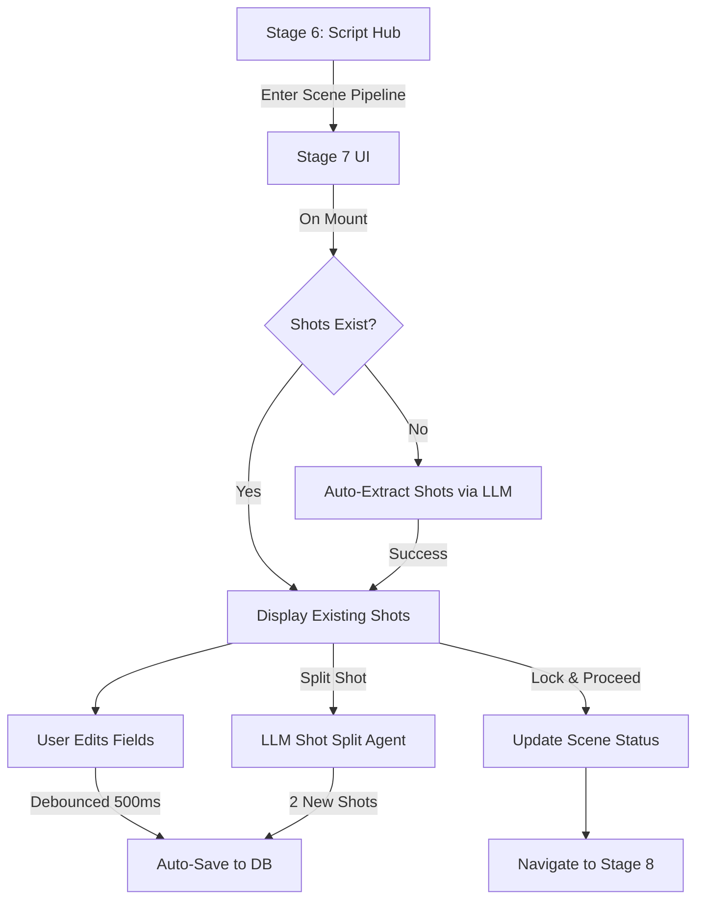

# Feature 4.3: Stage 7 - Shot List Generator Implementation Plan

## Overview

This feature implements the complete Stage 7 Shot List functionality, transforming scene scripts into technical, time-bounded shots with full LLM integration for extraction, splitting, and merging operations. The implementation follows established patterns from Feature 4.1 and 4.2, ensuring consistency with the existing codebase.

### Phase 10 Alignment (Immutability)

**Intentional scope for 4.3:** In-place updates to the `shots` table (PUT for auto-save, delete-and-insert for split) are acceptable for this phase. Full versioning, branching, and immutability ("completed stages are never mutated in place") will be addressed in **Phase 10: Version Control & Branching** (Story Timelines). No shot-level versioning or `stage_states`-style snapshots are required for 4.3; the "Lock & Proceed" behavior and any rollback/version history will be ironed out when implementing Phase 10.

---

## Architecture Overview



---

## Database Schema (Already Exists)

The `shots` table from migration 006 provides:

```sql
CREATE TABLE shots (
    id UUID PRIMARY KEY,
    scene_id UUID REFERENCES scenes(id),
    shot_id TEXT NOT NULL,
    duration INTEGER DEFAULT 8,
    dialogue TEXT DEFAULT '',
    action TEXT NOT NULL,
    characters_foreground TEXT[] DEFAULT '{}',
    characters_background TEXT[] DEFAULT '{}',
    setting TEXT NOT NULL,
    camera TEXT NOT NULL,
    continuity_flags TEXT[] DEFAULT '{}',
    beat_reference TEXT,
    created_at TIMESTAMPTZ,
    updated_at TIMESTAMPTZ,
    UNIQUE(scene_id, shot_id)
);
```

**Key Constraints:**

- Shot IDs must be unique per scene (e.g., `1A`, `1B` resets for each scene)
- All fields required except `dialogue`, `continuity_flags`, `beat_reference`
- **shot_order:** If the table does not have a `shot_order INTEGER` column, add a migration; it is required for ordered fetch and for split re-indexing.

---

## Task 1: Shot Extraction Service (Backend)

### File: `backend/src/services/shotExtractionService.ts` (NEW)

**Purpose:** LLM-based service to extract shots from scene script content

**Implementation Pattern:** Follow `sceneDependencyExtraction.ts` structure

**Key Components:**

1. **ShotExtractionService Class**

            - Main method: `extractShots(sceneId: string, scriptExcerpt: string): Promise<Shot[]>`
            - Uses LLM client with structured output schema
            - Implements timeout (20 seconds for full scene extraction)
            - Error handling with fallback to empty array

2. **LLM Prompt Construction**

            - System prompt from AI-agent-registry-context-flow-architecture.md (lines 500-577)
            - Includes global context (beat sheet, master script summary)
            - Includes prior scene end-state from database
            - Enforces 8-second shot duration rule
            - Requires atomic action per shot

3. **Shot ID Generation**

            - Format: `{sceneNumber}{Letter}` (e.g., `1A`, `1B`, `1C`)
            - Letters reset per scene (A, B, C... AA, AB if >26 shots)
            - Algorithm:
     ```typescript
     function generateShotId(sceneNumber: number, shotIndex: number): string {
       const letters = 'ABCDEFGHIJKLMNOPQRSTUVWXYZ';
       let id = '';
       let index = shotIndex;
       while (index >= 0) {
         id = letters[index % 26] + id;
         index = Math.floor(index / 26) - 1;
       }
       return `${sceneNumber}${id}`;
     }
     ```


4. **Output Schema**
   ```typescript
   interface ExtractedShot {
     shotId: string;          // '1A', '1B', etc.
     shotOrder: number;       // 0, 1, 2...
     duration: number;        // Default 8
     dialogue: string;        // Empty string if no dialogue
     action: string;          // Required, atomic description
     charactersForeground: string[];
     charactersBackground: string[];
     setting: string;         // Required
     camera: string;          // Required, technical spec
     continuityFlags: string[];
     beatReference?: string;  // Optional link to beat sheet
   }
   ```

5. **Validation Before Insert**

            - Validate each extracted shot has required fields: `action`, `setting`, `camera`, `duration` (and non-empty strings where required). Discard or skip invalid items before database insert; log and optionally flag for user review if any were discarded.

6. **Error Handling Strategy**

            - LLM timeout (20s) → Return empty array, log warning
            - Rate limit → Return empty array, show user message
            - Malformed JSON → Retry once with simpler prompt, then fail gracefully
            - Partial success → Accept incomplete shots (after validation), flag for user review

**Integration Points:**

- Uses existing `llm-client.ts` for LLM calls with LangSmith tracing
- Fetches prior scene data from `scenes` table (`end_state_summary` or `script_excerpt`)
- Fetches global context (beat sheet) from `stage_states` table

---

## Task 2: Shot CRUD API Endpoints (Backend)

### File: `backend/src/routes/projects.ts` (MODIFY)

Add four new endpoints following existing RESTful patterns:

### 2.1: GET /api/projects/:id/scenes/:sceneId/shots

**Purpose:** Fetch all shots for a scene (ordered by shot_order)

**Implementation:**

```typescript
router.get('/:id/scenes/:sceneId/shots', async (req, res) => {
  const { id: projectId, sceneId } = req.params;
  const userId = req.user!.id;
  
  // 1. Verify project ownership
  const { data: project } = await supabase
    .from('projects')
    .select('id, active_branch_id')
    .eq('id', projectId)
    .eq('user_id', userId)
    .single();
    
  if (!project) return res.status(404).json({ error: 'Project not found' });
  
  // 2. Verify scene belongs to active branch
  const { data: scene } = await supabase
    .from('scenes')
    .select('id, scene_number')
    .eq('id', sceneId)
    .eq('branch_id', project.active_branch_id)
    .single();
    
  if (!scene) return res.status(404).json({ error: 'Scene not found' });
  
  // 3. Fetch shots ordered by shot_order
  const { data: shots, error } = await supabase
    .from('shots')
    .select('*')
    .eq('scene_id', sceneId)
    .order('shot_order', { ascending: true });
    
  if (error) return res.status(500).json({ error: 'Failed to fetch shots' });
  
  // 4. Transform to frontend format
  const transformedShots = shots.map(shot => ({
    id: shot.id,
    sceneId: shot.scene_id,
    shotId: shot.shot_id,
    duration: shot.duration,
    dialogue: shot.dialogue || '',
    action: shot.action,
    charactersForeground: shot.characters_foreground,
    charactersBackground: shot.characters_background,
    setting: shot.setting,
    camera: shot.camera,
    continuityFlags: shot.continuity_flags || [],
    beatReference: shot.beat_reference
  }));
  
  res.json({ shots: transformedShots });
});
```

### 2.2: POST /api/projects/:id/scenes/:sceneId/shots/extract

**Purpose:** Auto-extract shots from scene using LLM

**Implementation:**

```typescript
router.post('/:id/scenes/:sceneId/shots/extract', async (req, res) => {
  const { id: projectId, sceneId } = req.params;
  const userId = req.user!.id;
  
  // 1. Verify ownership and fetch scene data
  const { data: project } = await supabase
    .from('projects')
    .select('id, active_branch_id')
    .eq('id', projectId)
    .eq('user_id', userId)
    .single();
    
  if (!project) return res.status(404).json({ error: 'Project not found' });
  
  const { data: scene } = await supabase
    .from('scenes')
    .select('id, scene_number, script_excerpt')
    .eq('id', sceneId)
    .eq('branch_id', project.active_branch_id)
    .single();
    
  if (!scene) return res.status(404).json({ error: 'Scene not found' });
  
  // 2. Call shot extraction service
  const shotExtractionService = new ShotExtractionService();
  const extractedShots = await shotExtractionService.extractShots(
    sceneId,
    scene.script_excerpt,
    scene.scene_number
  );
  
  // 3. Persist shots to database (batch insert)
  const shotsToInsert = extractedShots.map((shot, index) => ({
    scene_id: sceneId,
    shot_id: shot.shotId,
    shot_order: index,
    duration: shot.duration,
    dialogue: shot.dialogue,
    action: shot.action,
    characters_foreground: shot.charactersForeground,
    characters_background: shot.charactersBackground,
    setting: shot.setting,
    camera: shot.camera,
    continuity_flags: shot.continuityFlags,
    beat_reference: shot.beatReference
  }));
  
  const { data: insertedShots, error } = await supabase
    .from('shots')
    .insert(shotsToInsert)
    .select('*');
    
  if (error) return res.status(500).json({ error: 'Failed to persist shots' });
  
  res.json({ 
    success: true, 
    shotCount: insertedShots.length,
    shots: insertedShots 
  });
});
```

### 2.3: PUT /api/projects/:id/scenes/:sceneId/shots/:shotId

**Purpose:** Update a single shot field (auto-save endpoint)

**Implementation:**

```typescript
router.put('/:id/scenes/:sceneId/shots/:shotId', async (req, res) => {
  const { id: projectId, sceneId, shotId } = req.params;
  const updates = req.body; // { field: value }
  const userId = req.user!.id;
  
  // 1. Verify ownership
  // (Similar to GET endpoint)
  
  // 2. Validate field names (whitelist)
  const allowedFields = [
    'duration', 'dialogue', 'action', 
    'characters_foreground', 'characters_background', 
    'setting', 'camera', 'continuity_flags', 'beat_reference'
  ];
  
  const invalidFields = Object.keys(updates).filter(
    field => !allowedFields.includes(field)
  );
  
  if (invalidFields.length > 0) {
    return res.status(400).json({ 
      error: `Invalid fields: ${invalidFields.join(', ')}` 
    });
  }
  
  // 3. (Optional) Optimistic locking: reject if client's updated_at is older than DB
  // If request body includes updated_at, verify shot.updated_at <= updates.updated_at before applying

  // 4. Update shot
  const { data: updatedShot, error } = await supabase
    .from('shots')
    .update({
      ...updates,
      updated_at: new Date().toISOString()
    })
    .eq('id', shotId)
    .eq('scene_id', sceneId)
    .select()
    .single();
    
  if (error) return res.status(500).json({ error: 'Failed to update shot' });
  
  res.json({ success: true, shot: updatedShot });
});
```

**Race-condition mitigation:** To avoid out-of-order overwrites when auto-save requests arrive out of order: (a) **optional optimistic locking**—client sends `updated_at` with the request; backend rejects PUT if the shot's current `updated_at` is newer than the client's; or (b) ensure only **one in-flight PUT per shot** in the UI (e.g. queue or disable further edits until save completes).

### 2.4: POST /api/projects/:id/scenes/:sceneId/shots/:shotId/split

**Purpose:** LLM-based intelligent shot splitting

**Implementation:**

```typescript
router.post('/:id/scenes/:sceneId/shots/:shotId/split', async (req, res) => {
  const { id: projectId, sceneId, shotId } = req.params;
  const { userGuidance } = req.body; // Optional: "Split at the moment John stands up"
  const userId = req.user!.id;
  
  // 1. Verify ownership and fetch original shot
  const { data: originalShot } = await supabase
    .from('shots')
    .select('*')
    .eq('id', shotId)
    .eq('scene_id', sceneId)
    .single();
    
  if (!originalShot) return res.status(404).json({ error: 'Shot not found' });
  
  // 2. Call LLM Shot Split Agent
  const shotSplitService = new ShotSplitService();
  const newShots = await shotSplitService.splitShot(
    originalShot,
    userGuidance
  );
  
  // 3. Delete original shot
  const { error: deleteError } = await supabase
    .from('shots')
    .delete()
    .eq('id', shotId);
    
  if (deleteError) return res.status(500).json({ error: 'Failed to delete original shot' });
  
  // 4. Re-index shot_order: increment order for all shots in scene that had order > originalShot.shot_order
  const { error: reorderError } = await supabase.rpc(/* or raw update */);
  // e.g. UPDATE shots SET shot_order = shot_order + 1 WHERE scene_id = ? AND shot_order > originalShot.shot_order
  
  // 5. Insert two new shots with server-generated shot_id (e.g. originalShotId-1, originalShotId-2)
  //    and shot_order = originalShot.shot_order, originalShot.shot_order + 1
  const { data: insertedShots, error: insertError } = await supabase
    .from('shots')
    .insert(newShots)
    .select('*');
    
  if (insertError) return res.status(500).json({ error: 'Failed to insert split shots' });
  
  res.json({ 
    success: true, 
    newShots: insertedShots 
  });
});
```

**Split ID and re-indexing:** Split shot IDs are **always generated server-side** as `{originalShotId}-1` and `{originalShotId}-2` (never from LLM) to satisfy `UNIQUE(scene_id, shot_id)` and avoid collisions. After deleting the original, re-index `shot_order` for all shots in the scene that had `shot_order > originalShot.shot_order` (increment by 1), then insert the two new shots at the freed positions.

### 2.5: DELETE /api/projects/:id/scenes/:sceneId/shots/:shotId

**Purpose:** Remove a shot (e.g. redundant or incorrect LLM-generated shot). Caller is responsible for reordering if needed; use the reorder endpoint after delete to compact `shot_order`.

**Implementation:** Verify project/scene ownership, then `DELETE FROM shots WHERE id = shotId AND scene_id = sceneId`. Return 204 or `{ success: true }`.

### 2.6: PUT /api/projects/:id/scenes/:sceneId/shots/reorder

**Purpose:** Batch update `shot_order` for the scene. More efficient and atomic than multiple PUTs; prevents partial state if reorder is interrupted.

**Implementation:** Body: `{ orderedShotIds: string[] }` (array of shot `id`s in desired order). Verify project/scene ownership and that all IDs belong to the scene; then in a transaction (or sequential updates), set `shot_order = index` for each id. Return `{ success: true, shots: [...] }` with updated rows.

---

**Key Design Decisions:**

- All endpoints verify project ownership and scene-branch relationship
- Shot IDs are immutable once assigned (extraction or split); split always uses server-generated suffixes (`-1`, `-2`) to avoid unique-constraint violations
- Reorder via dedicated **reorder** endpoint (batch) rather than multiple single-shot PUTs
- DELETE endpoint included for manual removal; reorder after delete to keep `shot_order` contiguous

---

## Task 3: Shot Service (Frontend)

### File: `src/lib/services/shotService.ts` (NEW)

**Purpose:** Centralized service for shot operations from frontend

**Implementation:**

```typescript
import { supabase } from '@/lib/supabase';
import type { Shot } from '@/types/scene';

export class ShotService {
  /**
         * Fetch all shots for a scene (ordered by shot_order)
   */
  async fetchShots(projectId: string, sceneId: string): Promise<Shot[]> {
    const response = await fetch(
      `/api/projects/${projectId}/scenes/${sceneId}/shots`,
      {
        headers: {
          'Authorization': `Bearer ${(await supabase.auth.getSession()).data.session?.access_token}`
        }
      }
    );
    
    if (!response.ok) {
      throw new Error(`Failed to fetch shots: ${response.statusText}`);
    }
    
    const result = await response.json();
    return result.shots || [];
  }
  
  /**
         * Auto-extract shots from scene using LLM
         * Called automatically on Stage 7 mount if no shots exist
   */
  async extractShots(projectId: string, sceneId: string): Promise<Shot[]> {
    const response = await fetch(
      `/api/projects/${projectId}/scenes/${sceneId}/shots/extract`,
      {
        method: 'POST',
        headers: {
          'Authorization': `Bearer ${(await supabase.auth.getSession()).data.session?.access_token}`,
          'Content-Type': 'application/json'
        }
      }
    );
    
    if (!response.ok) {
      throw new Error(`Failed to extract shots: ${response.statusText}`);
    }
    
    const result = await response.json();
    return result.shots || [];
  }
  
  /**
         * Update a single shot field (debounced auto-save)
   */
  async updateShot(
    projectId: string,
    sceneId: string,
    shotId: string,
    updates: Partial<Shot>
  ): Promise<void> {
    const response = await fetch(
      `/api/projects/${projectId}/scenes/${sceneId}/shots/${shotId}`,
      {
        method: 'PUT',
        headers: {
          'Authorization': `Bearer ${(await supabase.auth.getSession()).data.session?.access_token}`,
          'Content-Type': 'application/json'
        },
        body: JSON.stringify(updates)
      }
    );
    
    if (!response.ok) {
      throw new Error(`Failed to update shot: ${response.statusText}`);
    }
  }
  
  /**
         * Split shot into two using LLM agent
   */
  async splitShot(
    projectId: string,
    sceneId: string,
    shotId: string,
    userGuidance?: string
  ): Promise<Shot[]> {
    const response = await fetch(
      `/api/projects/${projectId}/scenes/${sceneId}/shots/${shotId}/split`,
      {
        method: 'POST',
        headers: {
          'Authorization': `Bearer ${(await supabase.auth.getSession()).data.session?.access_token}`,
          'Content-Type': 'application/json'
        },
        body: JSON.stringify({ userGuidance })
      }
    );
    
    if (!response.ok) {
      throw new Error(`Failed to split shot: ${response.statusText}`);
    }
    
    const result = await response.json();
    return result.newShots || [];
  }
  
  /**
         * Delete a shot (removes from database). Use reorder after if needed.
   */
  async deleteShot(
    projectId: string,
    sceneId: string,
    shotId: string
  ): Promise<void> {
    const response = await fetch(
      `/api/projects/${projectId}/scenes/${sceneId}/shots/${shotId}`,
      { method: 'DELETE', headers: { 'Authorization': `Bearer ${(await supabase.auth.getSession()).data.session?.access_token}` } }
    );
    if (!response.ok) throw new Error(`Failed to delete shot: ${response.statusText}`);
  }

  /**
         * Batch reorder shots by ordered list of shot ids.
   */
  async reorderShots(
    projectId: string,
    sceneId: string,
    orderedShotIds: string[]
  ): Promise<Shot[]> {
    const response = await fetch(
      `/api/projects/${projectId}/scenes/${sceneId}/shots/reorder`,
      {
        method: 'PUT',
        headers: {
          'Authorization': `Bearer ${(await supabase.auth.getSession()).data.session?.access_token}`,
          'Content-Type': 'application/json'
        },
        body: JSON.stringify({ orderedShotIds })
      }
    );
    if (!response.ok) throw new Error(`Failed to reorder shots: ${response.statusText}`);
    const result = await response.json();
    return result.shots || [];
  }
}

export const shotService = new ShotService();
```

**Key Features:**

- Type-safe Shot operations (fetchShots, extractShots, updateShot, splitShot, deleteShot, reorderShots)
- Automatic authentication header injection
- Error handling with descriptive messages
- Matches backend API contract exactly (including DELETE and reorder)

---

## Task 4: Stage 7 UI Integration

### File: `src/components/pipeline/Stage7ShotList.tsx` (MODIFY)

**Current State:** Has complete UI skeleton with mock data (381 lines)

**Changes Required:**

### 4.1: Replace Mock Data with Real Data Fetching

```typescript
// REPLACE mock data with state management
const [shots, setShots] = useState<Shot[]>([]);
const [isLoading, setIsLoading] = useState(true);
const [isExtracting, setIsExtracting] = useState(false);
const [error, setError] = useState<string | null>(null);
const [selectedShot, setSelectedShot] = useState<Shot | null>(null);
const projectId = useParams<{ id: string }>().id!;

// Add useEffect for data fetching
useEffect(() => {
  const fetchOrExtractShots = async () => {
    try {
      setIsLoading(true);
      setError(null);
      
      // 1. Try to fetch existing shots
      const existingShots = await shotService.fetchShots(projectId, sceneId);
      
      if (existingShots.length > 0) {
        // Shots already exist, display them
        setShots(existingShots);
        setSelectedShot(existingShots[0]);
      } else {
        // No shots exist, auto-extract
        setIsExtracting(true);
        toast.info('Extracting shots from scene...', { duration: 2000 });
        
        const extractedShots = await shotService.extractShots(projectId, sceneId);
        
        if (extractedShots.length === 0) {
          throw new Error('Shot extraction returned no shots');
        }
        
        setShots(extractedShots);
        setSelectedShot(extractedShots[0]);
        toast.success(`Extracted ${extractedShots.length} shots successfully`);
      }
    } catch (err) {
      const errorMessage = err instanceof Error ? err.message : 'Failed to load shots';
      setError(errorMessage);
      toast.error(errorMessage);
    } finally {
      setIsLoading(false);
      setIsExtracting(false);
    }
  };
  
  fetchOrExtractShots();
}, [projectId, sceneId]);
```

### 4.2: Implement Debounced Auto-Save

```typescript
// Add debounce utility hook
function useDebounce<T>(value: T, delay: number): T {
  const [debouncedValue, setDebouncedValue] = useState(value);
  
  useEffect(() => {
    const handler = setTimeout(() => {
      setDebouncedValue(value);
    }, delay);
    
    return () => clearTimeout(handler);
  }, [value, delay]);
  
  return debouncedValue;
}

// Track pending changes
const [pendingUpdates, setPendingUpdates] = useState<Map<string, Partial<Shot>>>(new Map());
const debouncedUpdates = useDebounce(pendingUpdates, 500);

// Auto-save effect
useEffect(() => {
  const saveUpdates = async () => {
    for (const [shotId, updates] of debouncedUpdates.entries()) {
      try {
        await shotService.updateShot(projectId, sceneId, shotId, updates);
        toast.success('Saved', { duration: 1000 });
      } catch (error) {
        toast.error('Failed to save changes');
      }
    }
    setPendingUpdates(new Map()); // Clear after save
  };
  
  if (debouncedUpdates.size > 0) {
    saveUpdates();
  }
}, [debouncedUpdates]);

// Update handleShotUpdate to track pending changes
const handleShotUpdate = (shotId: string, field: keyof Shot, value: any) => {
  // Update local state immediately for responsive UI
  setShots(prev => prev.map(shot => 
    shot.id === shotId ? { ...shot, [field]: value } : shot
  ));
  
  if (selectedShot?.id === shotId) {
    setSelectedShot(prev => prev ? { ...prev, [field]: value } : null);
  }
  
  // Track pending update for debounced save
  setPendingUpdates(prev => {
    const updated = new Map(prev);
    const existing = updated.get(shotId) || {};
    updated.set(shotId, { ...existing, [field]: value });
    return updated;
  });
};
```

### 4.3: Implement LLM-Based Shot Splitting

```typescript
const [isSplitting, setIsSplitting] = useState(false);
const [splitGuidance, setSplitGuidance] = useState('');
const [showSplitDialog, setShowSplitDialog] = useState(false);

const handleSplitShot = async (shotId: string) => {
  // Show guidance dialog
  setShowSplitDialog(true);
  // Dialog provides optional guidance input
};

const performSplit = async (shotId: string) => {
  try {
    setIsSplitting(true);
    toast.info('Splitting shot using AI...', { duration: 2000 });
    
    const newShots = await shotService.splitShot(
      projectId, 
      sceneId, 
      shotId, 
      splitGuidance || undefined
    );
    
    // Replace original shot with two new shots
    setShots(prev => {
      const index = prev.findIndex(s => s.id === shotId);
      if (index === -1) return prev;
      
      const updated = [...prev];
      updated.splice(index, 1, ...newShots);
      return updated;
    });
    
    setSelectedShot(newShots[0]);
    toast.success('Shot split successfully');
    setShowSplitDialog(false);
    setSplitGuidance('');
  } catch (error) {
    toast.error('Failed to split shot');
  } finally {
    setIsSplitting(false);
  }
};
```

### 4.4: Enhance RearviewMirror Integration

```typescript
// Add state for prior scene data
const [priorSceneData, setPriorSceneData] = useState<{
  endState?: string;
  scriptExcerpt?: string;
} | null>(null);

// Fetch prior scene data
useEffect(() => {
  const fetchPriorScene = async () => {
    try {
      const scenes = await sceneService.fetchScenes(projectId);
      const currentSceneIndex = scenes.findIndex(s => s.id === sceneId);
      
      if (currentSceneIndex > 0) {
        const priorScene = scenes[currentSceneIndex - 1];
        setPriorSceneData({
          endState: priorScene.priorSceneEndState,
          scriptExcerpt: priorScene.scriptExcerpt
        });
      }
    } catch (error) {
      console.error('Failed to fetch prior scene:', error);
    }
  };
  
  fetchPriorScene();
}, [projectId, sceneId]);

// Update RearviewMirror component usage
<RearviewMirror
  mode="text"
  priorSceneEndState={
    priorSceneData?.endState || 
    (priorSceneData?.scriptExcerpt ? 
      priorSceneData.scriptExcerpt.split('\n').slice(-3).join('\n') : 
      'No prior scene available'
    )
  }
  priorSceneName={`Scene ${currentSceneNumber - 1}`}
/>
```

### 4.5: UI Loading States

```typescript
// Loading state during initial fetch/extraction
{isLoading || isExtracting ? (
  <div className="flex-1 flex items-center justify-center">
    <div className="text-center">
      <Loader2 className="w-8 h-8 animate-spin mx-auto mb-4 text-primary" />
      <p className="text-foreground">
        {isExtracting ? 'Extracting shots from scene...' : 'Loading shots...'}
      </p>
    </div>
  </div>
) : error ? (
  <div className="flex-1 flex items-center justify-center">
    <div className="text-center">
      <AlertTriangle className="w-8 h-8 mx-auto mb-4 text-destructive" />
      <p className="text-foreground mb-4">{error}</p>
      <Button onClick={() => window.location.reload()}>
        Retry
      </Button>
    </div>
  </div>
) : shots.length === 0 ? (
  <div className="flex-1 flex items-center justify-center">
    <p className="text-muted-foreground">No shots available</p>
  </div>
) : (
  // Existing shot table UI
  <ShotTableAndInspector />
)}
```

---

## Task 5: Shot Split Agent Service (Backend)

### File: `backend/src/services/shotSplitService.ts` (NEW)

**Purpose:** LLM agent for intelligent shot splitting

**Implementation:**

```typescript
import { llmClient, type LLMRequest } from './llm-client.js';

export interface ShotToSplit {
  shot_id: string;
  shot_order: number;
  duration: number;
  dialogue: string;
  action: string;
  characters_foreground: string[];
  characters_background: string[];
  setting: string;
  camera: string;
  continuity_flags: string[];
}

export interface SplitShots {
  shot1: ShotToSplit;
  shot2: ShotToSplit;
  splitRationale: string;
}

export class ShotSplitService {
  /**
         * Split a shot into two using LLM agent
         * Follows Shot Split Agent spec from AI-agent-registry (lines 581-598)
   */
  async splitShot(
    originalShot: ShotToSplit,
    userGuidance?: string
  ): Promise<ShotToSplit[]> {
    const systemPrompt = `You are a shot segmentation specialist. Your role is to divide a single shot into two coherent shots while preserving narrative content.

SPLIT REQUIREMENTS:
1. The two new shots must collectively cover the same narrative content as the original
2. Duration must sum to the original (typically 4s + 4s or 5s + 3s)
3. The split point must be a natural action or dialogue break
4. Camera specs must be adjusted appropriately for each new shot
5. Continuity flags must be preserved or refined

${userGuidance ? `USER GUIDANCE: ${userGuidance}` : ''}

OUTPUT FORMAT:
Return JSON with two shot objects that replace the original.`;

    const userPrompt = `ORIGINAL SHOT:
${JSON.stringify(originalShot, null, 2)}

Split this shot into two new shots that collectively tell the same story.`;

    const request: LLMRequest = {
      systemPrompt,
      userPrompt,
      model: 'gemini-2.5-flash-lite',
      temperature: 0.7,
      maxTokens: 2048,
      metadata: {
        operation: 'shot_split',
        original_shot_id: originalShot.shot_id
      }
    };

    const response = await llmClient.generateText(request);
    
    // Parse JSON response
    const parsed = JSON.parse(response.content);
    
    // Generate new shot IDs (append -1 and -2)
    const shot1 = {
      ...parsed.new_shots[0],
      shot_id: `${originalShot.shot_id}-1`,
      shot_order: originalShot.shot_order
    };
    
    const shot2 = {
      ...parsed.new_shots[1],
      shot_id: `${originalShot.shot_id}-2`,
      shot_order: originalShot.shot_order + 1
    };
    
    // Validate required fields before returning (action, setting, camera, duration)
    const required = (s: ShotToSplit) => s.action && s.setting && s.camera && s.duration != null;
    if (!required(shot1) || !required(shot2)) {
      throw new Error('LLM split output missing required shot fields');
    }
    
    return [shot1, shot2];
  }
}
```

---

## Testing Strategy

### Unit Tests

1. **Shot ID Generation** (shotExtractionService.ts)

            - Test scene number + letter format
            - Test >26 shots (AA, AB, etc.)
            - Test uniqueness per scene

2. **Debounced Auto-Save** (Stage7ShotList.tsx)

            - Test save triggered after 500ms
            - Test multiple rapid edits coalesce into single save
            - Test save cancellation on unmount

3. **Shot Splitting** (shotSplitService.ts)

            - Test duration sum validation
            - Test shot_order adjustment
            - Test error handling for malformed LLM output

### Integration Tests

1. **Full Extraction Flow**

            - Enter Stage 7 with no shots → Auto-extract → Display shots
            - Verify LangSmith trace created
            - Verify shots persisted to database

2. **Auto-Save Flow**

            - Edit dialogue field → Wait 500ms → Verify database updated
            - Edit multiple fields rapidly → Verify batched save

3. **Shot Split Flow**

            - Split shot with guidance → Verify 2 new shots created
            - Verify original shot deleted
            - Verify shot_order adjusted for subsequent shots

---

## Success Criteria

✅ **Task 1:** Shot extraction service creates 5-15 shots per scene with proper shot IDs

✅ **Task 2:** All six API endpoints (GET, POST extract, PUT update, POST split, DELETE, PUT reorder) return correct data with proper auth/validation

✅ **Task 3:** Shot service handles all CRUD operations with type safety

✅ **Task 4:** Stage 7 UI displays real shots with loading/error states

✅ **Task 5:** Shot splitting creates two coherent shots preserving narrative

## Performance Targets

- Shot extraction: < 20 seconds for 10-shot scene
- Auto-save debounce: 500ms from last keystroke
- Shot split: < 10 seconds for single split operation
- Stage 7 mount: < 2 seconds when shots already exist

## Edge Cases Handled

1. **Empty scene script** → Show error, prevent extraction
2. **LLM timeout** → Show retry option, log warning
3. **Duplicate shot IDs** → Split always uses server-generated `-1`/`-2` suffixes; extraction uses scene-unique lettering. DB constraint backs this.
4. **Shot split with 1-second shot** → Validate min duration, show warning
5. **User exits during extraction** → Extraction completes in background, state persists
6. **Auto-save out-of-order** → Optional optimistic locking or one in-flight PUT per shot
7. **Delete shot** → DELETE endpoint; caller should call reorder afterward to compact `shot_order`
8. **Invalid LLM output (extract/split)** → Validate required fields before insert; discard or throw with clear message

---

## Dependencies

### Prerequisites

- ✅ Migration 006 (shots table) - Already exists
- ✅ LLM client service - Already exists
- ✅ Scene fetching API - Already implemented (Feature 4.1)

### New Dependencies

- None - Uses existing tech stack in tech-stack.md

---

## Rollout Plan

### Phase 1: Backend Foundation (Tasks 1-2)

1. Create shot extraction service
2. Add API endpoints
3. Test with Postman/curl

### Phase 2: Frontend Service Layer (Task 3)

1. Create shot service
2. Add type definitions
3. Test API integration

### Phase 3: UI Integration (Task 4)

1. Replace mock data
2. Add auto-save
3. Integrate RearviewMirror
4. Add loading states

### Phase 4: Shot Splitting (Task 5)

1. Create shot split service
2. Add split API endpoint
3. Integrate UI dialog

### Phase 5: Testing & Polish

1. Run integration tests
2. Test with real project data
3. Verify performance targets
4. Fix edge cases

---

## Notes

- **Phase 10:** Full versioning and immutability ("completed stages never mutated") are deferred to Phase 10 (Version Control & Branching). For 4.3, in-place updates and delete/split are acceptable.
- Shot IDs are immutable once assigned; split always uses server-generated suffixes (`-1`, `-2`) to satisfy `UNIQUE(scene_id, shot_id)`.
- Auto-save only persists field changes; structural changes (split, delete, reorder) use dedicated endpoints.
- Optional optimistic locking or one in-flight PUT per shot reduces auto-save race conditions.
- Extraction and split services validate required fields (action, setting, camera, duration) before insert.
- LLM calls are traced via LangSmith for debugging.
- Shot splitting preserves narrative content but may adjust camera angles.
- Prior scene data uses `script_excerpt` fallback if `end_state_summary` unavailable.

---

## Related Documentation

- **PRD:** `._docs/project-overview.md` (Section 9.2, lines 551-586)
- **Agent Specs:** `._docs/AI-agent-registry-context-flow-architecture.md` (lines 500-650)
- **Database Schema:** `._docs/database-schema-state-transition-matrix.md` (lines 316-352)

---

# Implementation-Summaries:

## Phase 1: Backend Foundation (Tasks 1-2)

### Task 1: Shot Extraction Service

**New file: `backend/src/services/shotExtractionService.ts`**

- **`ShotExtractionService`** with `extractShots(sceneId, scriptExcerpt, sceneNumber, context?)`:
  - Uses `llm-client` with a system prompt aligned to the AI-agent doc (global context, previous scene end-state, 8-second atomic shots, continuity).
  - **Shot IDs:** `generateShotId(sceneNumber, shotIndex)` → e.g. `1A`, `1B`, … `1AA` for index ≥ 26.
  - **Output:** `ExtractedShot` with `shotId`, `shotOrder`, `duration`, `dialogue`, `action`, `charactersForeground` / `charactersBackground`, `setting`, `camera`, `continuityFlags`, `beatReference`.
  - **Validation:** Required `action`, `setting`, `camera`, sane `duration`; invalid shots are dropped and logged.
  - **Errors:** 20s timeout → empty array; rate limit → rethrow (caller returns 429); malformed JSON → one retry with a simpler prompt, then empty array.

### Task 2: Shot CRUD API Endpoints

**Updated: `backend/src/routes/projects.ts`**

| Endpoint | Purpose |
|----------|--------|
| **GET** `/:id/scenes/:sceneId/shots` | List shots for scene (by `shot_order`), response in camelCase for frontend. |
| **POST** `/:id/scenes/:sceneId/shots/extract` | Run shot extraction: loads prior scene `end_state_summary`, beat sheet (stage 3), master script summary (stage 4), calls `ShotExtractionService`, batch-inserts shots. Returns 429 on rate limit. |
| **PUT** `/:id/scenes/:sceneId/shots/reorder` | Body `{ orderedShotIds: string[] }`. Validates IDs belong to scene, then sets `shot_order` by index. |
| **PUT** `/:id/scenes/:sceneId/shots/:shotId` | Update one shot; body limited to allowed fields (snake_case). |
| **POST** `/:id/scenes/:sceneId/shots/:shotId/split` | Load shot, call `ShotSplitService`, delete original, bump `shot_order` for later shots, insert two with `shot_id` `{original}-1` and `{original}-2`. |
| **DELETE** `/:id/scenes/:sceneId/shots/:shotId` | Delete shot after project/scene ownership check. |

All shot routes check project ownership and that the scene belongs to the project’s active branch.

### Task 2.4 support: Shot Split Service

**New file: `backend/src/services/shotSplitService.ts`**

- **`ShotSplitService.splitShot(originalShot, userGuidance?)`**  
  Uses the Shot Split Agent prompt: one shot → two shots, durations sum to original, natural split point. Returns two `ShotForInsert` objects with server-assigned `shot_id` suffixes `-1` and `-2`.

---

**Note:** `npm run build` still reports existing TypeScript errors in other files (e.g. `llm.ts`, `projects.ts` GET scenes, `seed.ts`, `assetExtractionService.ts`, `ImageGenerationService.ts`). Those are unchanged by this work. The only fix applied for the new code was in `shotSplitService.ts` (use `beat_reference: null` for split shots).


## 1. **Unit tests (Jest)**

A dedicated test file runs with the LLM **mocked** (no API keys or real calls):

```bash
cd "C:\Users\Daniel Lopez\Desktop\Aiuteur\wizardirector\backend"
npx jest src/tests/shotExtraction.test.ts --testTimeout=10000 --forceExit
```

- **`--forceExit`** avoids Jest hanging when the run finishes.
- **7 tests** cover:
  - **generateShotId**: 1A/1B/1C, 3A/3B, and >26 shots (1AA, 1AB).
  - **ShotExtractionService**: parses LLM JSON, assigns shot IDs, validates (invalid shots discarded), timeout → empty array.
  - **ShotSplitService**: returns two shots with IDs `{originalId}-1` and `{originalId}-2`.

---

## 2. **Manual API testing (curl)**

You need:

- Backend running: `npm run dev` in `backend`.
- A **Supabase JWT** (e.g. from frontend login or Supabase Auth).
- Real **project ID** and **scene ID** from your DB.

Examples (replace `YOUR_PROJECT_ID`, `YOUR_SCENE_ID`, `SHOT_UUID`, and `%TOKEN%` or `$TOKEN`):

| Action | Command |
|--------|--------|
| **GET shots** | `curl -H "Authorization: Bearer %TOKEN%" "http://localhost:3001/api/projects/YOUR_PROJECT_ID/scenes/YOUR_SCENE_ID/shots"` |
| **POST extract** (real LLM) | `curl -X POST -H "Authorization: Bearer %TOKEN%" "http://localhost:3001/api/projects/.../scenes/.../shots/extract"` |
| **PUT update shot** | `curl -X PUT -H "Authorization: Bearer %TOKEN%" -H "Content-Type: application/json" -d "{\"action\":\"New action\"}" "http://localhost:3001/api/projects/.../scenes/.../shots/SHOT_UUID"` |
| **POST split** | `curl -X POST -H "Authorization: Bearer %TOKEN%" -H "Content-Type: application/json" -d "{\"userGuidance\":\"Split when he sits\"}" "http://localhost:3001/api/projects/.../scenes/.../shots/SHOT_UUID/split"` |
| **PUT reorder** | `curl -X PUT -H "Authorization: Bearer %TOKEN%" -H "Content-Type: application/json" -d "{\"orderedShotIds\":[\"uuid1\",\"uuid2\"]}" "http://localhost:3001/api/projects/.../scenes/.../shots/reorder"` |
| **DELETE shot** | `curl -X DELETE -H "Authorization: Bearer %TOKEN%" "http://localhost:3001/api/projects/.../scenes/.../shots/SHOT_UUID"` |

Note: in the URL, **shot ID is the row UUID** (`id`), not the human-readable `shot_id` (e.g. "1A").

---

## 3. **Full testing guide**

A longer guide with the same commands and a short checklist is in:

**`backend/docs/TESTING-SHOT-API.md`**

It also describes testing from the Stage 7 UI once the frontend is wired to these endpoints.