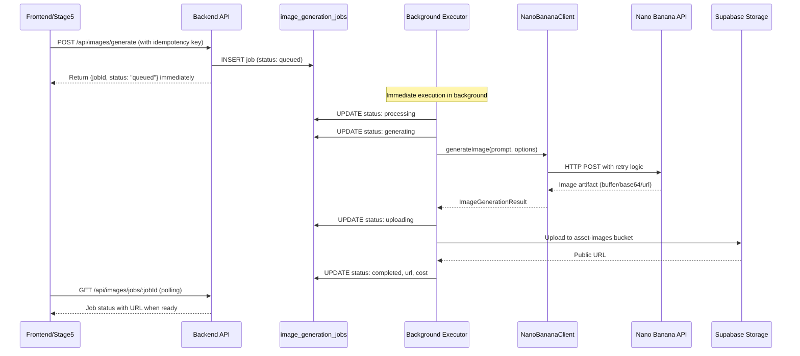

# Feature 3.1: Image Generation Service Implementation (Revised)

## Overview

Integrate Nano Banana API for generating asset image keys with a job-tracked architecture explicitly designed for async migration without requiring rewrites. This revised plan addresses critical architectural risks identified in the initial design while maintaining MVP simplicity.

## Architecture Principles

- **Deferred execution**: HTTP requests create jobs and return immediately; execution happens in background
- **Job persistence**: All generation requests tracked in database with comprehensive state transitions
- **Provider isolation**: Nano Banana-specific logic contained in dedicated client module with flexible response handling
- **Async-ready design**: Job model and status tracking supports future webhook/worker migration
- **Storage separation**: Dedicated `asset-images` bucket distinct from `style-capsule-images`
- **Idempotency**: Duplicate requests handled gracefully via idempotency keys

## Key Architectural Improvements

This revised plan addresses the following critical issues from the original design:

1. **Decoupled execution from HTTP response** - Eliminates timeout risks and event loop starvation
2. **Refined job state machine** - Tracks generation pipeline checkpoints for better observability
3. **Separated attempt tracking** - Distinguishes provider retries from job-level retries
4. **Provider-agnostic artifact handling** - Supports buffer/base64/URL responses from providers
5. **Backend-only storage uploads** - Simplified security model and RLS policies
6. **Idempotency key support** - Prevents duplicate job creation from network retries

## Data Flow



## Implementation Tasks

### Task 1: Database Migration - Image Generation Jobs Table (Revised)

**File**: `backend/migrations/006_image_generation_jobs.sql`

Enhanced job tracking table with granular state tracking and attempt history:

```sql
CREATE TABLE image_generation_jobs (
    id UUID PRIMARY KEY DEFAULT gen_random_uuid(),
    
    -- Idempotency
    idempotency_key TEXT,
    
    -- Job Context
    project_id UUID NOT NULL REFERENCES projects(id) ON DELETE CASCADE,
    branch_id UUID REFERENCES branches(id) ON DELETE CASCADE,
    scene_id UUID REFERENCES scenes(id) ON DELETE CASCADE,
    shot_id UUID REFERENCES shots(id) ON DELETE CASCADE,
    asset_id UUID, -- No FK constraint (see documentation below)
    
    -- Job Type and Purpose
    job_type TEXT NOT NULL CHECK (job_type IN (
        'master_asset',      -- Stage 5 asset image keys
        'start_frame',       -- Stage 10 start frames
        'end_frame',         -- Stage 10 end frames
        'inpaint'           -- Continuity fixes
    )),
    
    -- Execution State (refined state machine)
    status TEXT NOT NULL DEFAULT 'queued' CHECK (status IN (
        'queued',           -- Waiting to be processed
        'processing',       -- Job picked up by executor
        'generating',       -- Provider API call in progress
        'uploading',        -- Uploading to storage
        'completed',        -- Successfully generated
        'failed'            -- Generation failed (see failure_stage)
    )),
    
    -- Failure tracking
    failure_stage TEXT CHECK (failure_stage IN (
        'generating',       -- Failed during provider call
        'uploading',        -- Failed during storage upload
        'persisting'        -- Failed during final DB update
    )),
    
    -- Retry and Attempt Tracking (separated concerns)
    attempt_count INTEGER DEFAULT 0,      -- Total execution attempts
    retry_count INTEGER DEFAULT 0,        -- User-initiated retries
    max_retries INTEGER DEFAULT 3,
    last_attempt_at TIMESTAMPTZ,
    
    -- Error Details
    error_code TEXT, -- TEMPORARY | PERMANENT | RATE_LIMIT | AUTH_ERROR
    error_message TEXT,
    
    -- Generation Parameters
    prompt TEXT NOT NULL,
    visual_style_capsule_id UUID REFERENCES style_capsules(id),
    width INTEGER DEFAULT 512,
    height INTEGER DEFAULT 512,
    
    -- Results
    storage_path TEXT, -- Path in Supabase Storage
    public_url TEXT,   -- Public URL of generated image
    
    -- Cost Tracking
    cost_credits NUMERIC(10,4),
    estimated_cost NUMERIC(10,4), -- Provider estimate vs actual
    
    -- Provider Metadata (raw response for debugging)
    provider_metadata JSONB,
    
    -- Timestamps
    created_at TIMESTAMPTZ DEFAULT NOW(),
    processing_started_at TIMESTAMPTZ,
    generating_started_at TIMESTAMPTZ,
    uploading_started_at TIMESTAMPTZ,
    completed_at TIMESTAMPTZ,
    updated_at TIMESTAMPTZ DEFAULT NOW()
);

-- Indexes for common queries
CREATE INDEX idx_image_jobs_project ON image_generation_jobs(project_id);
CREATE INDEX idx_image_jobs_status ON image_generation_jobs(status);
CREATE INDEX idx_image_jobs_branch ON image_generation_jobs(branch_id);
CREATE INDEX idx_image_jobs_created ON image_generation_jobs(created_at);
CREATE UNIQUE INDEX idx_image_jobs_idempotency ON image_generation_jobs(project_id, idempotency_key) 
    WHERE idempotency_key IS NOT NULL;

-- RLS Policies
ALTER TABLE image_generation_jobs ENABLE ROW LEVEL SECURITY;

CREATE POLICY "Users can view own image generation jobs" ON image_generation_jobs
    FOR SELECT USING (
        EXISTS (
            SELECT 1 FROM projects
            WHERE projects.id = image_generation_jobs.project_id
            AND projects.user_id = auth.uid()
        )
    );

-- Documentation comment on asset_id column
COMMENT ON COLUMN image_generation_jobs.asset_id IS 
    'Reference to asset, but no FK constraint to allow flexibility with project_assets and global_assets tables';
```

### Task 2: Supabase Storage Bucket Setup (Revised)

**File**: `backend/scripts/setup-asset-images-bucket.ts`

Backend-only upload configuration with public read access:

```typescript
import { createClient } from '@supabase/supabase-js';
import * as dotenv from 'dotenv';

dotenv.config();

const BUCKET_NAME = 'asset-images';
const MAX_FILE_SIZE_MB = 10;
const ALLOWED_FILE_TYPES = ['image/png', 'image/jpeg', 'image/webp'];

async function setupAssetImagesBucket() {
    const supabase = createClient(
        process.env.SUPABASE_URL!,
        process.env.SUPABASE_SERVICE_ROLE_KEY!
    );

    // Create bucket
    const { error: createError } = await supabase.storage.createBucket(BUCKET_NAME, {
        public: true,
        allowedMimeTypes: ALLOWED_FILE_TYPES,
        fileSizeLimit: MAX_FILE_SIZE_MB * 1024 * 1024
    });

    if (createError && createError.message !== 'Bucket already exists') {
        throw createError;
    }

    console.log('✅ Asset images bucket configured');
    console.log('📁 Folder structure:');
    console.log('   asset-images/');
    console.log('     project_{projectId}/');
    console.log('       branch_{branchId}/');
    console.log('         master-assets/');
    console.log('         scene_{sceneId}/');
    console.log('           shot_{shotId}/');
}
```

**Storage RLS Policies** (via Supabase Dashboard):

```sql
-- Upload: Backend service role only
CREATE POLICY "Service role can upload asset images"
ON storage.objects FOR INSERT
WITH CHECK (bucket_id = 'asset-images' AND auth.role() = 'service_role');

-- Read: Public access
CREATE POLICY "Public read access to asset images"
ON storage.objects FOR SELECT
USING (bucket_id = 'asset-images');

-- Update/Delete: Backend service role only
CREATE POLICY "Service role can update asset images"
ON storage.objects FOR UPDATE
USING (bucket_id = 'asset-images' AND auth.role() = 'service_role');

CREATE POLICY "Service role can delete asset images"
ON storage.objects FOR DELETE
USING (bucket_id = 'asset-images' AND auth.role() = 'service_role');
```

### Task 3: Provider-Agnostic Image Client Interface (Revised)

**File**: `backend/src/services/image-generation/ImageProviderInterface.ts`

Flexible artifact handling to avoid provider lock-in:

```typescript
export interface ImageGenerationOptions {
    prompt: string;
    width?: number;
    height?: number;
    visualStyleContext?: string;
    negativePrompt?: string;
    seed?: number;
}

export interface InpaintOptions extends ImageGenerationOptions {
    sourceImageUrl: string;
    maskDescription: string;
}

/**
 * Flexible artifact response - supports multiple provider output formats
 */
export interface ImageArtifact {
    type: 'buffer' | 'base64' | 'url';
    data: Buffer | string; // Buffer for binary, string for base64/url
    contentType?: string;
}

export interface ImageGenerationResult {
    artifact: ImageArtifact;
    metadata: {
        width: number;
        height: number;
        seed?: number;
        estimatedCost?: number; // Provider estimate
        actualCost?: number;    // Actual billed cost (if available)
        generationId?: string;
    };
    providerRawResponse?: any;
}

export interface ImageProvider {
    name: string;
    generateImage(options: ImageGenerationOptions): Promise<ImageGenerationResult>;
    inpaintImage(options: InpaintOptions): Promise<ImageGenerationResult>;
    supportsInpainting: boolean;
    estimateCost(options: ImageGenerationOptions): number;
}

export class ImageProviderError extends Error {
    constructor(
        message: string,
        public code: 'TEMPORARY' | 'PERMANENT' | 'RATE_LIMIT' | 'AUTH_ERROR' | 'UNKNOWN',
        public statusCode?: number,
        public retryable: boolean = false
    ) {
        super(message);
        this.name = 'ImageProviderError';
    }
}
```

### Task 4: Nano Banana Client Implementation (Revised)

**File**: `backend/src/services/image-generation/NanoBananaClient.ts`

Provider implementation with flexible response handling and separate attempt tracking:

```typescript
import axios, { AxiosInstance } from 'axios';
import { ImageProvider, ImageGenerationOptions, ImageGenerationResult, ImageArtifact, ImageProviderError } from './ImageProviderInterface.js';

export class NanoBananaClient implements ImageProvider {
    name = 'nano-banana';
    supportsInpainting = true;
    
    private client: AxiosInstance;
    private maxRetries = 3;
    private baseDelay = 1000;

    constructor() {
        const apiKey = process.env.NANO_BANANA_API_KEY;
        if (!apiKey || apiKey === 'placeholder') {
            throw new Error('NANO_BANANA_API_KEY not configured');
        }

        this.client = axios.create({
            baseURL: process.env.NANO_BANANA_API_URL || 'https://api.nanobanana.ai/v1',
            headers: {
                'Authorization': `Bearer ${apiKey}`,
                'Content-Type': 'application/json'
            },
            timeout: 60000
        });
    }

    async generateImage(options: ImageGenerationOptions): Promise<ImageGenerationResult> {
        const requestBody = {
            prompt: options.prompt,
            width: options.width || 512,
            height: options.height || 512,
            negative_prompt: options.negativePrompt,
            seed: options.seed,
            ...(options.visualStyleContext && {
                style_reference: options.visualStyleContext
            })
        };

        return this.executeWithRetry(async (attemptNumber) => {
            console.log(`[NanoBanana] Generating image (attempt ${attemptNumber})...`);
            
            const response = await this.client.post('/generate', requestBody);
            
            // Normalize provider response to ImageArtifact
            const artifact = await this.normalizeResponseToArtifact(response.data);

            return {
                artifact,
                metadata: {
                    width: options.width || 512,
                    height: options.height || 512,
                    seed: response.data.seed,
                    estimatedCost: this.estimateCost(options),
                    actualCost: response.data.cost,
                    generationId: response.data.id
                },
                providerRawResponse: response.data
            };
        });
    }

    async inpaintImage(options: InpaintOptions): Promise<ImageGenerationResult> {
        // Inpainting implementation - similar structure
        throw new Error('Inpainting not yet implemented');
    }

    estimateCost(options: ImageGenerationOptions): number {
        const pixels = (options.width || 512) * (options.height || 512);
        const baseCredits = 0.01;
        const pixelMultiplier = pixels / (512 * 512);
        return baseCredits * pixelMultiplier;
    }

    /**
     * Normalize various provider response formats to unified ImageArtifact
     */
    private async normalizeResponseToArtifact(responseData: any): Promise<ImageArtifact> {
        // Case 1: Direct URL provided
        if (responseData.image_url || responseData.url) {
            const imageUrl = responseData.image_url || responseData.url;
            
            // Download the image
            const imageResponse = await axios.get(imageUrl, {
                responseType: 'arraybuffer'
            });

            return {
                type: 'buffer',
                data: Buffer.from(imageResponse.data),
                contentType: imageResponse.headers['content-type'] || 'image/png'
            };
        }
        
        // Case 2: Base64 encoded data
        if (responseData.image_data || responseData.base64) {
            const base64Data = responseData.image_data || responseData.base64;
            return {
                type: 'base64',
                data: base64Data,
                contentType: responseData.content_type || 'image/png'
            };
        }
        
        // Case 3: Job ID (async provider)
        if (responseData.job_id && !responseData.image_url) {
            throw new ImageProviderError(
                'Provider returned job ID - async generation not yet supported',
                'PERMANENT',
                undefined,
                false
            );
        }

        throw new ImageProviderError(
            'Unknown provider response format',
            'PERMANENT',
            undefined,
            false
        );
    }

    /**
     * Execute with retry logic, tracking attempt numbers
     */
    private async executeWithRetry<T>(
        operation: (attemptNumber: number) => Promise<T>
    ): Promise<T> {
        let lastError: Error;

        for (let attempt = 1; attempt <= this.maxRetries + 1; attempt++) {
            try {
                return await operation(attempt);
            } catch (error: any) {
                lastError = error;
                
                const classifiedError = this.classifyError(error);
                
                if (attempt > this.maxRetries || !classifiedError.retryable) {
                    throw classifiedError;
                }

                const delay = Math.min(
                    this.baseDelay * Math.pow(2, attempt - 1),
                    10000
                );

                console.log(`[NanoBanana] Retry ${attempt}/${this.maxRetries} after ${delay}ms`);
                await this.sleep(delay);
            }
        }

        throw lastError!;
    }

    private classifyError(error: any): ImageProviderError {
        const message = error.message || 'Unknown error';
        const status = error.response?.status;

        if (status === 429 || message.includes('rate limit')) {
            return new ImageProviderError(
                `Rate limit exceeded: ${message}`,
                'RATE_LIMIT',
                429,
                true
            );
        }

        if (status === 401 || status === 403) {
            return new ImageProviderError(
                `Authentication error: ${message}`,
                'AUTH_ERROR',
                status,
                false
            );
        }

        if (status >= 500) {
            return new ImageProviderError(
                `Server error: ${message}`,
                'TEMPORARY',
                status,
                true
            );
        }

        if (error.code === 'ECONNRESET' || error.code === 'ETIMEDOUT') {
            return new ImageProviderError(
                `Network error: ${message}`,
                'TEMPORARY',
                undefined,
                true
            );
        }

        if (status >= 400 && status < 500) {
            return new ImageProviderError(
                `Invalid request: ${message}`,
                'PERMANENT',
                status,
                false
            );
        }

        return new ImageProviderError(
            `Unknown error: ${message}`,
            'UNKNOWN',
            undefined,
            false
        );
    }

    private sleep(ms: number): Promise<void> {
        return new Promise(resolve => setTimeout(resolve, ms));
    }
}
```

### Task 5: Image Generation Orchestration Service (Revised)

**File**: `backend/src/services/image-generation/ImageGenerationService.ts`

Decoupled orchestration with granular state tracking and idempotency:

```typescript
import { supabase } from '../../config/supabase.js';
import { NanoBananaClient } from './NanoBananaClient.js';
import { ImageProvider, ImageGenerationOptions, ImageArtifact } from './ImageProviderInterface.js';
import { v4 as uuidv4 } from 'uuid';

export interface CreateImageJobRequest {
    projectId: string;
    branchId: string;
    jobType: 'master_asset' | 'start_frame' | 'end_frame' | 'inpaint';
    prompt: string;
    visualStyleCapsuleId?: string;
    width?: number;
    height?: number;
    assetId?: string;
    sceneId?: string;
    shotId?: string;
    idempotencyKey?: string;
}

export interface ImageJobResult {
    jobId: string;
    status: 'queued' | 'processing' | 'generating' | 'uploading' | 'completed' | 'failed';
    publicUrl?: string;
    storagePath?: string;
    error?: {
        code: string;
        message: string;
        failureStage?: string;
    };
}

export class ImageGenerationService {
    private provider: ImageProvider;

    constructor() {
        this.provider = new NanoBananaClient();
    }

    /**
     * Create image generation job and execute in background
     * Returns immediately with job ID for polling
     */
    async createImageJob(request: CreateImageJobRequest): Promise<ImageJobResult> {
        // Check for existing job with same idempotency key
        if (request.idempotencyKey) {
            const existingJob = await this.findJobByIdempotencyKey(
                request.projectId,
                request.idempotencyKey
            );
            
            if (existingJob) {
                console.log(`[ImageService] Returning existing job ${existingJob.id} for idempotency key`);
                return this.formatJobResult(existingJob);
            }
        }

        const jobId = uuidv4();

        // Step 1: Persist job record (status: queued)
        const { data: job, error: insertError } = await supabase
            .from('image_generation_jobs')
            .insert({
                id: jobId,
                idempotency_key: request.idempotencyKey,
                project_id: request.projectId,
                branch_id: request.branchId,
                scene_id: request.sceneId,
                shot_id: request.shotId,
                asset_id: request.assetId,
                job_type: request.jobType,
                status: 'queued',
                prompt: request.prompt,
                visual_style_capsule_id: request.visualStyleCapsuleId,
                width: request.width || 512,
                height: request.height || 512,
                estimated_cost: this.provider.estimateCost({
                    prompt: request.prompt,
                    width: request.width,
                    height: request.height
                })
            })
            .select()
            .single();

        if (insertError || !job) {
            throw new Error(`Failed to create job: ${insertError?.message}`);
        }

        console.log(`[ImageService] Created job ${jobId}, queued for execution`);

        // Step 2: Execute in background (don't await)
        this.executeJobInBackground(jobId, request).catch(error => {
            console.error(`[ImageService] Background execution failed for job ${jobId}:`, error);
        });

        // Step 3: Return immediately
        return {
            jobId,
            status: 'queued'
        };
    }

    /**
     * Execute job asynchronously with granular state tracking
     */
    private async executeJobInBackground(jobId: string, request: CreateImageJobRequest): Promise<void> {
        try {
            // Update to processing
            await this.updateJobState(jobId, 'processing', {
                processing_started_at: new Date().toISOString(),
                attempt_count: 1,
                last_attempt_at: new Date().toISOString()
            });

            // Get visual style context if provided
            let visualStyleContext = '';
            if (request.visualStyleCapsuleId) {
                visualStyleContext = await this.getVisualStyleContext(request.visualStyleCapsuleId);
            }

            // Update to generating
            await this.updateJobState(jobId, 'generating', {
                generating_started_at: new Date().toISOString()
            });

            // Execute generation
            const result = await this.provider.generateImage({
                prompt: request.prompt,
                width: request.width,
                height: request.height,
                visualStyleContext
            });

            // Update to uploading
            await this.updateJobState(jobId, 'uploading', {
                uploading_started_at: new Date().toISOString()
            });

            // Convert artifact to buffer for upload
            const imageBuffer = await this.artifactToBuffer(result.artifact);

            // Upload to Supabase Storage
            const storagePath = this.buildStoragePath(request);
            const { error: uploadError } = await supabase.storage
                .from('asset-images')
                .upload(storagePath, imageBuffer, {
                    contentType: result.artifact.contentType || 'image/png',
                    upsert: false
                });

            if (uploadError) {
                throw new Error(`Storage upload failed: ${uploadError.message}`);
            }

            // Get public URL
            const { data: urlData } = supabase.storage
                .from('asset-images')
                .getPublicUrl(storagePath);

            // Update job with success
            await this.updateJobState(jobId, 'completed', {
                storage_path: storagePath,
                public_url: urlData.publicUrl,
                cost_credits: result.metadata.actualCost || result.metadata.estimatedCost,
                provider_metadata: result.providerRawResponse,
                completed_at: new Date().toISOString()
            });

            console.log(`[ImageService] Job ${jobId} completed successfully`);

        } catch (error: any) {
            console.error(`[ImageService] Job ${jobId} failed:`, error);

            // Determine failure stage from current status
            const { data: currentJob } = await supabase
                .from('image_generation_jobs')
                .select('status')
                .eq('id', jobId)
                .single();

            const failureStage = currentJob?.status === 'uploading' 
                ? 'uploading' 
                : currentJob?.status === 'generating'
                ? 'generating'
                : 'persisting';

            const errorCode = error.code || 'UNKNOWN';
            const errorMessage = error.message || 'Unknown error';

            await this.updateJobState(jobId, 'failed', {
                error_code: errorCode,
                error_message: errorMessage,
                failure_stage: failureStage
            });
        }
    }

    /**
     * Convert ImageArtifact to Buffer for storage upload
     */
    private async artifactToBuffer(artifact: ImageArtifact): Promise<Buffer> {
        if (artifact.type === 'buffer') {
            return artifact.data as Buffer;
        }
        
        if (artifact.type === 'base64') {
            return Buffer.from(artifact.data as string, 'base64');
        }
        
        if (artifact.type === 'url') {
            const response = await fetch(artifact.data as string);
            const arrayBuffer = await response.arrayBuffer();
            return Buffer.from(arrayBuffer);
        }

        throw new Error(`Unknown artifact type: ${artifact.type}`);
    }

    private buildStoragePath(request: CreateImageJobRequest): string {
        const timestamp = Date.now();
        const random = Math.random().toString(36).substring(2, 9);
        
        if (request.jobType === 'master_asset') {
            return `project_${request.projectId}/branch_${request.branchId}/master-assets/${request.assetId}_${timestamp}_${random}.png`;
        } else if (request.shotId) {
            return `project_${request.projectId}/branch_${request.branchId}/scene_${request.sceneId}/shot_${request.shotId}/${request.jobType}_${timestamp}_${random}.png`;
        }
        
        return `project_${request.projectId}/branch_${request.branchId}/misc/${timestamp}_${random}.png`;
    }

    private async updateJobState(jobId: string, status: string, additionalFields: Record<string, any> = {}) {
        await supabase
            .from('image_generation_jobs')
            .update({ 
                status,
                updated_at: new Date().toISOString(),
                ...additionalFields
            })
            .eq('id', jobId);
    }

    private async getVisualStyleContext(capsuleId: string): Promise<string> {
        const { data: capsule } = await supabase
            .from('style_capsules')
            .select('descriptors, design_pillars')
            .eq('id', capsuleId)
            .single();

        if (!capsule) return '';

        const descriptors = capsule.descriptors?.join(', ') || '';
        const pillars = capsule.design_pillars 
            ? Object.entries(capsule.design_pillars).map(([k, v]) => `${k}: ${v}`).join('; ')
            : '';

        return [descriptors, pillars].filter(Boolean).join('. ');
    }

    private async findJobByIdempotencyKey(projectId: string, idempotencyKey: string) {
        const { data } = await supabase
            .from('image_generation_jobs')
            .select('*')
            .eq('project_id', projectId)
            .eq('idempotency_key', idempotencyKey)
            .single();

        return data;
    }

    private formatJobResult(job: any): ImageJobResult {
        return {
            jobId: job.id,
            status: job.status,
            publicUrl: job.public_url,
            storagePath: job.storage_path,
            error: job.error_code ? {
                code: job.error_code,
                message: job.error_message,
                failureStage: job.failure_stage
            } : undefined
        };
    }

    /**
     * Get job status for polling
     */
    async getJobStatus(jobId: string): Promise<ImageJobResult> {
        const { data: job, error } = await supabase
            .from('image_generation_jobs')
            .select('*')
            .eq('id', jobId)
            .single();

        if (error || !job) {
            throw new Error('Job not found');
        }

        return this.formatJobResult(job);
    }
}
```

### Task 6: Backend API Endpoints (Revised)

**File**: `backend/src/routes/images.ts`

Immediate return with polling support:

```typescript
import { Router } from 'express';
import { ImageGenerationService } from '../services/image-generation/ImageGenerationService.js';
import { supabase } from '../config/supabase.js';

const router = Router();
const imageService = new ImageGenerationService();

// POST /api/images/generate - Create image generation job
router.post('/generate', async (req, res) => {
    try {
        const userId = req.user!.id;
        const {
            projectId,
            branchId,
            jobType,
            prompt,
            visualStyleCapsuleId,
            width,
            height,
            assetId,
            sceneId,
            shotId,
            idempotencyKey
        } = req.body;

        // Validate project ownership
        const { data: project, error: projectError } = await supabase
            .from('projects')
            .select('id')
            .eq('id', projectId)
            .eq('user_id', userId)
            .single();

        if (projectError || !project) {
            return res.status(404).json({ error: 'Project not found' });
        }

        // Validate required fields
        if (!prompt || !jobType || !branchId) {
            return res.status(400).json({ 
                error: 'Missing required fields: prompt, jobType, branchId' 
            });
        }

        console.log(`[API] Image generation requested for project ${projectId}`);

        // Create job (returns immediately)
        const result = await imageService.createImageJob({
            projectId,
            branchId,
            jobType,
            prompt,
            visualStyleCapsuleId,
            width,
            height,
            assetId,
            sceneId,
            shotId,
            idempotencyKey
        });

        // Return job ID for polling
        res.json(result);
    } catch (error) {
        console.error('[API] Image generation error:', error);
        res.status(500).json({ error: 'Internal server error' });
    }
});

// GET /api/images/jobs/:jobId - Get job status (for polling)
router.get('/jobs/:jobId', async (req, res) => {
    try {
        const userId = req.user!.id;
        const { jobId } = req.params;

        const { data: job, error } = await supabase
            .from('image_generation_jobs')
            .select(`
                id,
                project_id,
                job_type,
                status,
                public_url,
                error_code,
                error_message,
                failure_stage,
                cost_credits,
                estimated_cost,
                created_at,
                completed_at,
                projects!inner (
                    user_id
                )
            `)
            .eq('id', jobId)
            .single();

        if (error || !job) {
            return res.status(404).json({ error: 'Job not found' });
        }

        // Verify ownership
        if (job.projects.user_id !== userId) {
            return res.status(403).json({ error: 'Access denied' });
        }

        res.json({
            jobId: job.id,
            status: job.status,
            publicUrl: job.public_url,
            error: job.error_code ? {
                code: job.error_code,
                message: job.error_message,
                failureStage: job.failure_stage
            } : undefined,
            cost: {
                estimated: job.estimated_cost,
                actual: job.cost_credits
            },
            createdAt: job.created_at,
            completedAt: job.completed_at
        });
    } catch (error) {
        console.error('[API] Job status error:', error);
        res.status(500).json({ error: 'Internal server error' });
    }
});

export { router as imagesRouter };
```

**Register routes in** `backend/src/index.ts`:

```typescript
import { imagesRouter } from './routes/images.js';
app.use('/api/images', requireAuth, imagesRouter);
```

### Task 7: Frontend Integration - Update Image Service (Revised)

**File**: `src/lib/services/imageService.ts`

Polling-based implementation for job status:

```typescript
async generateImage(request: ImageGenerationRequest): Promise<ImageGenerationResponse> {
    const { data: { session } } = await supabase.auth.getSession();

    if (!session?.access_token) {
        throw new Error('User not authenticated');
    }

    console.log('🎨 [ImageService] Creating image generation job...');

    // Generate idempotency key for this request
    const idempotencyKey = `${request.assetId || 'misc'}_${Date.now()}_${Math.random().toString(36).substring(7)}`;

    // Step 1: Create job (returns immediately)
    const createResponse = await fetch('/api/images/generate', {
        method: 'POST',
        headers: {
            'Content-Type': 'application/json',
            'Authorization': `Bearer ${session.access_token}`
        },
        body: JSON.stringify({
            projectId: request.projectId,
            branchId: await this.getActiveBranchId(request.projectId),
            jobType: this.mapStageToJobType(request.stageNumber),
            prompt: request.prompt,
            visualStyleCapsuleId: request.visualStyleCapsuleId,
            width: request.width,
            height: request.height,
            assetId: request.assetId,
            idempotencyKey
        })
    });

    if (!createResponse.ok) {
        const error = await createResponse.json();
        throw new Error(error.error || 'Failed to create image generation job');
    }

    const { jobId } = await createResponse.json();

    console.log(`🎨 [ImageService] Job ${jobId} created, polling for completion...`);

    // Step 2: Poll for completion
    const result = await this.pollJobStatus(jobId, session.access_token);

    // Step 3: Log style capsule application
    if (request.visualStyleCapsuleId) {
        try {
            await styleCapsuleService.recordApplication({
                stage_state_id: `${request.projectId}_stage_${request.stageNumber}`,
                style_capsule_id: request.visualStyleCapsuleId,
                injection_context: {
                    prompt: request.prompt,
                    jobId: jobId
                }
            });
        } catch (error) {
            console.warn('Failed to record style capsule application:', error);
        }
    }

    return {
        imageUrl: result.publicUrl!,
        generationId: jobId,
        prompt: request.prompt
    };
}

private async pollJobStatus(
    jobId: string, 
    accessToken: string,
    maxAttempts: number = 60, // 60 attempts = 60 seconds max
    intervalMs: number = 1000  // Poll every second
): Promise<any> {
    for (let attempt = 0; attempt < maxAttempts; attempt++) {
        const response = await fetch(`/api/images/jobs/${jobId}`, {
            headers: {
                'Authorization': `Bearer ${accessToken}`
            }
        });

        if (!response.ok) {
            throw new Error('Failed to fetch job status');
        }

        const job = await response.json();

        // Check terminal states
        if (job.status === 'completed') {
            console.log(`✅ [ImageService] Job ${jobId} completed`);
            return job;
        }

        if (job.status === 'failed') {
            throw new Error(`Image generation failed: ${job.error?.message || 'Unknown error'}`);
        }

        // Still processing, wait and retry
        console.log(`⏳ [ImageService] Job ${jobId} status: ${job.status}`);
        await this.sleep(intervalMs);
    }

    throw new Error('Image generation timed out');
}

private sleep(ms: number): Promise<void> {
    return new Promise(resolve => setTimeout(resolve, ms));
}

private mapStageToJobType(stageNumber: number): string {
    if (stageNumber === 5) return 'master_asset';
    if (stageNumber === 10) return 'start_frame';
    return 'master_asset';
}

private async getActiveBranchId(projectId: string): Promise<string> {
    const { data: project } = await supabase
        .from('projects')
        .select('active_branch_id')
        .eq('id', projectId)
        .single();
    
    if (!project?.active_branch_id) {
        throw new Error('Project has no active branch');
    }
    
    return project.active_branch_id;
}
```

### Task 8: Environment Configuration

**Update**: `backend/env.example`

```env
# Nano Banana Configuration
NANO_BANANA_API_KEY=your_api_key_here
NANO_BANANA_API_URL=https://api.nanobanana.ai/v1
```

### Task 9: Testing & Validation (Revised)

**File**: `backend/src/tests/image-generation.test.ts`

Test coverage for improved architecture:

```typescript
import { describe, it, expect, beforeEach } from 'vitest';
import { ImageGenerationService } from '../services/image-generation/ImageGenerationService.js';
import { supabase } from '../config/supabase.js';

describe('ImageGenerationService - Revised Architecture', () => {
    let imageService: ImageGenerationService;
    let testProjectId: string;
    let testBranchId: string;

    beforeEach(() => {
        imageService = new ImageGenerationService();
        // Setup test project and branch
    });

    it('should create job and return immediately without blocking', async () => {
        const startTime = Date.now();
        
        const result = await imageService.createImageJob({
            projectId: testProjectId,
            branchId: testBranchId,
            jobType: 'master_asset',
            prompt: 'A medieval knight in shining armor'
        });

        const responseTime = Date.now() - startTime;

        expect(result.jobId).toBeDefined();
        expect(result.status).toBe('queued');
        expect(responseTime).toBeLessThan(500); // Should return in < 500ms
    });

    it('should track job through all state transitions', async () => {
        const result = await imageService.createImageJob({
            projectId: testProjectId,
            branchId: testBranchId,
            jobType: 'master_asset',
            prompt: 'A futuristic spaceship'
        });

        // Wait and check state transitions
        await new Promise(resolve => setTimeout(resolve, 1000));
        let job = await imageService.getJobStatus(result.jobId);
        expect(['processing', 'generating', 'uploading', 'completed']).toContain(job.status);

        // Wait for completion
        await new Promise(resolve => setTimeout(resolve, 10000));
        job = await imageService.getJobStatus(result.jobId);
        expect(job.status).toBe('completed');
        expect(job.publicUrl).toBeDefined();
    });

    it('should handle idempotency correctly', async () => {
        const idempotencyKey = 'test-key-123';

        const result1 = await imageService.createImageJob({
            projectId: testProjectId,
            branchId: testBranchId,
            jobType: 'master_asset',
            prompt: 'A dragon',
            idempotencyKey
        });

        const result2 = await imageService.createImageJob({
            projectId: testProjectId,
            branchId: testBranchId,
            jobType: 'master_asset',
            prompt: 'A dragon',
            idempotencyKey
        });

        expect(result1.jobId).toBe(result2.jobId);
    });

    it('should track attempt count separately from retry count', async () => {
        // Force provider error to trigger retries
        process.env.NANO_BANANA_API_KEY = 'invalid';

        const result = await imageService.createImageJob({
            projectId: testProjectId,
            branchId: testBranchId,
            jobType: 'master_asset',
            prompt: 'Test prompt'
        });

        await new Promise(resolve => setTimeout(resolve, 5000));

        const { data: job } = await supabase
            .from('image_generation_jobs')
            .select('attempt_count, retry_count')
            .eq('id', result.jobId)
            .single();

        expect(job.attempt_count).toBeGreaterThan(0);
        expect(job.retry_count).toBe(0); // No user retries yet
    });

    it('should record failure stage when upload fails', async () => {
        // Mock storage failure
        // Test implementation...
        
        const { data: job } = await supabase
            .from('image_generation_jobs')
            .select('status, failure_stage')
            .eq('id', result.jobId)
            .single();

        expect(job.status).toBe('failed');
        expect(job.failure_stage).toBe('uploading');
    });
});
```

## Migration Path to Async Execution

The architecture is now **fully prepared** for async migration:

### Current State (MVP)
- HTTP request creates job → returns immediately
- Background execution happens in same Node.js process
- Polling-based status updates

### Future State (Production Scale)
1. **Add webhook endpoint**: `POST /api/webhooks/nano-banana` for async providers
2. **Deploy background worker**: Separate process polls `status='queued'` jobs
3. **Add message queue** (optional): Bull/BullMQ for distributed execution
4. **No schema changes needed**: Job table already supports all states
5. **No frontend changes needed**: Polling mechanism already in place

The only change required is moving job execution from `executeJobInBackground()` to a separate worker process.

## Architectural Improvements Summary

This revised plan addresses the following critical issues:

### ✅ Fixed: Synchronous Execution Risk
- **Before**: Entire pipeline in HTTP handler (timeout risk)
- **After**: Immediate return with background execution

### ✅ Fixed: Job Retry Semantics
- **Before**: Conflicting retry systems, ambiguous attempt tracking
- **After**: Separated `attempt_count` (provider retries) and `retry_count` (user retries)

### ✅ Fixed: Underspecified State Machine
- **Before**: Only `queued → processing → completed|failed`
- **After**: Granular states including `generating`, `uploading`, `failure_stage`

### ✅ Fixed: Provider Assumptions
- **Before**: Assumed URL-based responses only
- **After**: Flexible `ImageArtifact` supporting buffer/base64/URL

### ✅ Fixed: Storage Security
- **Before**: Client upload permissions (complex RLS)
- **After**: Backend-only uploads via service role

### ✅ Added: Idempotency Support
- Prevents duplicate jobs from network retries or double-clicks

### ✅ Added: Cost Tracking Distinction
- Tracks both `estimated_cost` (from estimator) and `actual_cost` (from provider)

## Success Criteria

- [ ] Database migration applied with refined state machine
- [ ] `asset-images` storage bucket created with backend-only upload RLS
- [ ] Nano Banana client handles buffer/base64/URL responses
- [ ] Backend API returns job ID immediately (< 500ms response time)
- [ ] Frontend polls job status until completion
- [ ] Error handling records failure stage and attempt count
- [ ] Idempotency prevents duplicate job creation
- [ ] Cost tracking distinguishes estimated vs actual
- [ ] All tests pass including state transition and retry tests

## Operational Benefits

1. **No timeout risk**: HTTP responses return in milliseconds
2. **Better observability**: Granular state tracking shows where failures occur
3. **Easier debugging**: Attempt count and failure stage recorded
4. **Clean async migration**: Worker can replace background executor without schema changes
5. **Production-ready error handling**: Retries and idempotency built-in