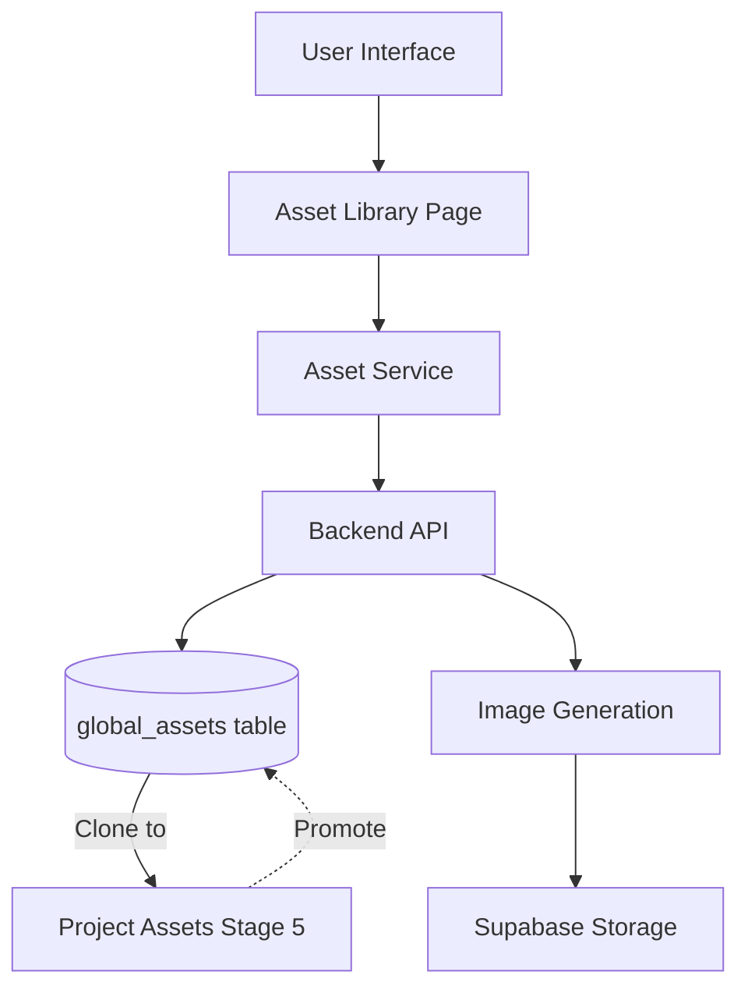

# Feature 3.2: Global Asset Library Implementation

## Architecture Overview

The Global Asset Library enables users to create, manage, and reuse visual assets (characters, props, locations) across multiple projects. Assets can be created directly in the library or "promoted" from project-specific assets defined in Stage 5.



## Phase 1: Database Foundation

### 1.1 Create Migration File

**File**: `backend/migrations/008_global_assets.sql`

Create the `global_assets` table with full schema per architecture docs:

```sql
CREATE TABLE global_assets (
    id UUID PRIMARY KEY DEFAULT gen_random_uuid(),
    user_id UUID NOT NULL REFERENCES auth.users(id) ON DELETE CASCADE,
    
    -- Asset Identity
    name TEXT NOT NULL,
    asset_type TEXT NOT NULL CHECK (asset_type IN ('character', 'prop', 'location')),
    
    -- Visual Definition
    description TEXT NOT NULL,
    image_key_url TEXT,
    visual_style_capsule_id UUID REFERENCES style_capsules(id),
    
    -- Voice Profile (Stretch Goal - nullable for now)
    voice_profile_id TEXT,
    
    -- Metadata
    created_at TIMESTAMPTZ DEFAULT NOW(),
    updated_at TIMESTAMPTZ DEFAULT NOW(),
    promoted_from_project_id UUID REFERENCES projects(id) -- NULL if created directly
);

CREATE INDEX idx_global_assets_user ON global_assets(user_id);
CREATE INDEX idx_global_assets_type ON global_assets(asset_type);
CREATE INDEX idx_global_assets_created ON global_assets(created_at DESC);
```

Add RLS policies:

- Users can only access their own assets
- Standard CRUD operations with user_id check

### 1.2 Create project_assets Table

**File**: Same migration

Per PRD, project_assets track Stage 5 asset definitions:

```sql
CREATE TABLE project_assets (
    id UUID PRIMARY KEY DEFAULT gen_random_uuid(),
    project_id UUID NOT NULL REFERENCES projects(id) ON DELETE CASCADE,
    branch_id UUID NOT NULL REFERENCES branches(id) ON DELETE CASCADE,
    
    -- Source Tracking
    global_asset_id UUID REFERENCES global_assets(id), -- NULL if created fresh
    
    -- Asset Identity
    name TEXT NOT NULL,
    asset_type TEXT NOT NULL CHECK (asset_type IN ('character', 'prop', 'location')),
    
    -- Visual Definition
    description TEXT NOT NULL,
    image_key_url TEXT,
    visual_style_capsule_id UUID REFERENCES style_capsules(id),
    
    -- Status
    locked BOOLEAN DEFAULT FALSE, -- Stage 5 gatekeeper
    
    created_at TIMESTAMPTZ DEFAULT NOW(),
    updated_at TIMESTAMPTZ DEFAULT NOW()
);
```

Add indexes and RLS policies for project_assets.

## Phase 2: Backend API Implementation

### 2.1 Create Assets Router

**File**: `backend/src/routes/assets.ts`

Following the pattern from `projects.ts` and `images.ts`:

**Endpoints**:

- `GET /api/assets` - List all global assets for authenticated user
- `GET /api/assets/:id` - Get specific asset
- `POST /api/assets` - Create new global asset
- `PUT /api/assets/:id` - Update asset (name, description, type)
- `DELETE /api/assets/:id` - Delete asset with dependency checking
- `POST /api/assets/:id/generate-image` - Generate/regenerate image key

**Key implementation details**:

- Validate asset_type enum
- Check for project dependencies before deletion
- Integrate with `ImageGenerationService` from Feature 3.1
- Return image generation job ID for polling

### 2.2 Dependency Checking Logic

Before deleting, check if asset is used in any project:

```typescript
// Check project_assets table for references
const { data: usage } = await supabase
  .from('project_assets')
  .select('project_id, projects(title)')
  .eq('global_asset_id', assetId);

if (usage && usage.length > 0) {
  return res.status(409).json({
    error: 'Asset in use',
    projects: usage.map(u => u.projects.title)
  });
}
```

### 2.3 Register Router

**File**: `backend/src/server.ts`

Add assets router alongside existing routes:

```typescript
import { assetsRouter } from './routes/assets.js';
app.use('/api/assets', authenticate, assetsRouter);
```

## Phase 3: Frontend Service Layer

### 3.1 TypeScript Types

**File**: `src/types/asset.ts`

Define complete type system:

```typescript
export type AssetType = 'character' | 'prop' | 'location';

export interface GlobalAsset {
  id: string;
  userId: string;
  name: string;
  assetType: AssetType;
  description: string;
  imageKeyUrl?: string;
  visualStyleCapsuleId?: string;
  voiceProfileId?: string;
  createdAt: string;
  updatedAt: string;
  promotedFromProjectId?: string;
}

export interface CreateAssetRequest {
  name: string;
  assetType: AssetType;
  description: string;
  visualStyleCapsuleId?: string;
}

export interface UpdateAssetRequest {
  name?: string;
  description?: string;
  assetType?: AssetType;
}

export interface AssetFilter {
  type?: AssetType;
  hasImage?: boolean;
  searchQuery?: string;
}
```

### 3.2 Asset Service

**File**: `src/lib/services/assetService.ts`

Following `projectService.ts` pattern:

```typescript
class AssetService {
  async listAssets(filter?: AssetFilter): Promise<GlobalAsset[]>
  async getAsset(id: string): Promise<GlobalAsset>
  async createAsset(request: CreateAssetRequest): Promise<GlobalAsset>
  async updateAsset(id: string, request: UpdateAssetRequest): Promise<GlobalAsset>
  async deleteAsset(id: string): Promise<void>
  async generateImageKey(assetId: string, prompt: string): Promise<ImageJobResponse>
  async checkImageJobStatus(jobId: string): Promise<ImageJobStatus>
}
```

Use same auth pattern as existing services (Bearer token from Supabase session).

### 3.3 Image Service Integration

**File**: `src/lib/services/imageService.ts` (extend existing)

Add method for asset image generation:

```typescript
async generateAssetImageKey(
  assetId: string,
  prompt: string,
  visualStyleCapsuleId?: string
): Promise<ImageJobResponse>
```

## Phase 4: Asset Library UI

### 4.1 Main Asset Library Page

**File**: `src/pages/AssetLibrary.tsx`

Pattern after `StyleCapsuleLibrary.tsx`:

**Layout**:

```
┌─────────────────────────────────────────┐
│ Header: "Asset Library"                 │
│ Search bar + Type filter + View toggle  │
├─────────────────────────────────────────┤
│ Tabs: All | Characters | Props | Loc... │
├─────────────────────────────────────────┤
│ ┌─────┐ ┌─────┐ ┌─────┐ [+ New Asset]  │
│ │Asset│ │Asset│ │Asset│                 │
│ └─────┘ └─────┘ └─────┘                 │
└─────────────────────────────────────────┘
```

**Key features**:

- Tab navigation for asset types
- Grid/list view toggle
- Search and filter
- Create asset button
- Async loading with skeleton states

### 4.2 Asset Card Component

**File**: `src/components/assets/AssetCard.tsx`

Display:

- Asset thumbnail (image_key_url or placeholder)
- Asset name and type badge
- Description preview
- Actions menu (Edit, Delete, Generate Image)

### 4.3 Create/Edit Asset Dialog

**File**: `src/components/assets/AssetDialog.tsx`

Form fields:

- Name (text input, required)
- Type (dropdown: character/prop/location, required)
- Description (textarea, required, min 10 chars)
- Visual Style Capsule (optional selector)

**Image Generation Flow**:

1. User saves asset without image
2. "Generate Image" button appears
3. Clicking triggers image job creation
4. Poll job status with loading indicator
5. Display generated image when complete

### 4.4 Asset Gallery Grid

**File**: `src/components/assets/AssetGallery.tsx`

Responsive grid with:

- Masonry/grid layout
- Empty state ("No assets yet")
- Loading skeletons
- Pagination (if asset count grows large)

### 4.5 Delete Confirmation Dialog

**File**: `src/components/assets/DeleteAssetDialog.tsx`

Show:

- Asset name and type
- Warning if asset is used in projects
- List of affected projects
- Confirm/Cancel buttons

## Phase 5: Search and Filter Functionality

### 5.1 Client-Side Filtering

**File**: `src/pages/AssetLibrary.tsx`

Filter logic:

```typescript
const filteredAssets = assets.filter(asset => {
  // Search query
  if (searchQuery && !asset.name.toLowerCase().includes(searchQuery.toLowerCase())) {
    return false;
  }
  
  // Type filter
  if (typeFilter && asset.assetType !== typeFilter) {
    return false;
  }
  
  // Has image filter
  if (hasImageFilter !== undefined) {
    const hasImage = Boolean(asset.imageKeyUrl);
    if (hasImage !== hasImageFilter) return false;
  }
  
  return true;
});
```

### 5.2 Backend Search Support (Optional Enhancement)

Add query params to `GET /api/assets`:

- `?type=character`
- `?search=detective`
- `?has_image=true`

## Phase 6: Integration Points

### 6.1 Update GlobalSidebar

**File**: `src/components/layout/GlobalSidebar.tsx`

Already has `/assets` route - no changes needed.

### 6.2 Update Index Routing

**File**: `src/pages/Index.tsx`

Replace placeholder with actual component:

```typescript
import AssetLibrary from '@/pages/AssetLibrary';

// In render logic:
currentPath === '/assets' ? (
  <AssetLibrary />
) : ...
```

### 6.3 Stage 5 Integration (Future Work)

Add "Import from Library" button in Stage 5 asset definition UI.

## Testing Checklist

### Backend Tests

- [ ] Create asset with valid data
- [ ] Reject invalid asset type
- [ ] Delete asset (no dependencies)
- [ ] Prevent delete if asset in use
- [ ] Image generation integration
- [ ] RLS policy enforcement

### Frontend Tests

- [ ] Load and display assets
- [ ] Create new asset
- [ ] Update asset details
- [ ] Delete asset with confirmation
- [ ] Filter by type
- [ ] Search functionality
- [ ] Image generation job polling
- [ ] Empty state display

## Migration Strategy

1. Run migration: `npm run migrate` (from backend directory)
2. Verify tables created in Supabase dashboard
3. Test RLS policies
4. Deploy backend with new routes
5. Deploy frontend with Asset Library page
6. Monitor for errors in production logs

## Future Enhancements (Out of Scope for 3.2)

- Bulk import from CSV
- Asset tagging system
- Asset version history
- Shared public asset marketplace
- AI-powered asset suggestions
- Asset usage analytics


---------------------------------- V2 --------------------------------------------

# Feature 3.2: Global Asset Library Implementation

## Architecture Overview

The Global Asset Library enables users to create, manage, and reuse visual assets (characters, props, locations) across multiple projects. Assets can be created directly in the library or "promoted" from project-specific assets defined in Stage 5.


## Phase 1: Database Foundation

### 1.1 Create Migration File

**File**: `backend/migrations/008_global_assets.sql`

Create the `global_assets` table with full schema per architecture docs:

```sql
CREATE TABLE global_assets (
    id UUID PRIMARY KEY DEFAULT gen_random_uuid(),
    user_id UUID NOT NULL REFERENCES auth.users(id) ON DELETE CASCADE,
    
    -- Asset Identity
    name TEXT NOT NULL,
    asset_type TEXT NOT NULL CHECK (asset_type IN ('character', 'prop', 'location')),
    
    -- Visual Definition
    description TEXT NOT NULL, -- User-facing narrative description
    image_prompt TEXT, -- AI-optimized prompt for image generation (optional, falls back to description)
    image_key_url TEXT,
    visual_style_capsule_id UUID REFERENCES style_capsules(id) ON DELETE SET NULL,
    
    -- Voice Profile (Stretch Goal - nullable for now)
    voice_profile_id TEXT,
    
    -- Version Tracking (for future sync/update workflows)
    version INTEGER DEFAULT 1,
    
    -- Metadata
    created_at TIMESTAMPTZ DEFAULT NOW(),
    updated_at TIMESTAMPTZ DEFAULT NOW(),
    promoted_from_project_id UUID REFERENCES projects(id) -- NULL if created directly
);

CREATE INDEX idx_global_assets_user ON global_assets(user_id);
CREATE INDEX idx_global_assets_type ON global_assets(asset_type);
CREATE INDEX idx_global_assets_created ON global_assets(created_at DESC);
```

**Key Schema Improvements**:

- Added `image_prompt` field separate from `description` for better AI generation quality
- Added `version` for passive tracking (enables future sync workflows without migration)
- Changed style_capsule constraint to `ON DELETE SET NULL` (prevents cascade deletion)

Add RLS policies:

- Users can only access their own assets
- Standard CRUD operations with user_id check

### 1.2 Create project_assets Table

**File**: Same migration

Per PRD, project_assets track Stage 5 asset definitions:

```sql
CREATE TABLE project_assets (
    id UUID PRIMARY KEY DEFAULT gen_random_uuid(),
    project_id UUID NOT NULL REFERENCES projects(id) ON DELETE CASCADE,
    branch_id UUID NOT NULL REFERENCES branches(id) ON DELETE CASCADE,
    
    -- Source Tracking
    global_asset_id UUID REFERENCES global_assets(id), -- NULL if created fresh
    
    -- Asset Identity
    name TEXT NOT NULL,
    asset_type TEXT NOT NULL CHECK (asset_type IN ('character', 'prop', 'location')),
    
    -- Visual Definition
    description TEXT NOT NULL,
    image_key_url TEXT,
    visual_style_capsule_id UUID REFERENCES style_capsules(id),
    
    -- Status
    locked BOOLEAN DEFAULT FALSE, -- Stage 5 gatekeeper
    
    created_at TIMESTAMPTZ DEFAULT NOW(),
    updated_at TIMESTAMPTZ DEFAULT NOW()
);
```

Add indexes and RLS policies for project_assets.

## Phase 2: Backend API Implementation

### 2.1 Create Assets Router

**File**: `backend/src/routes/assets.ts`

Following the pattern from `projects.ts` and `images.ts`:

**Endpoints**:

- `GET /api/assets` - List all global assets for authenticated user
- `GET /api/assets/:id` - Get specific asset
- `POST /api/assets` - Create new global asset
- `PUT /api/assets/:id` - Update asset (name, description, type)
- `DELETE /api/assets/:id` - Delete asset with dependency checking
- `POST /api/assets/:id/generate-image` - Generate/regenerate image key

**Key implementation details**:

- Validate asset_type enum
- Check for project dependencies before deletion
- Integrate with `ImageGenerationService` from Feature 3.1
- Return image generation job ID for polling

### 2.2 Dependency Checking Logic

Before deleting, check if asset is used in any project:

```typescript
// Check project_assets table for references
const { data: usage } = await supabase
  .from('project_assets')
  .select('project_id, projects(title)')
  .eq('global_asset_id', assetId);

if (usage && usage.length > 0) {
  return res.status(409).json({
    error: 'Asset in use',
    projects: usage.map(u => u.projects.title)
  });
}
```

### 2.3 Register Router

**File**: `backend/src/server.ts`

Add assets router alongside existing routes:

```typescript
import { assetsRouter } from './routes/assets.js';
app.use('/api/assets', authenticate, assetsRouter);
```

## Phase 3: Frontend Service Layer

### 3.1 TypeScript Types

**File**: `src/types/asset.ts`

Define complete type system:

```typescript
export type AssetType = 'character' | 'prop' | 'location';

export interface GlobalAsset {
  id: string;
  userId: string;
  name: string;
  assetType: AssetType;
  description: string;
  imageKeyUrl?: string;
  visualStyleCapsuleId?: string;
  voiceProfileId?: string;
  createdAt: string;
  updatedAt: string;
  promotedFromProjectId?: string;
}

export interface CreateAssetRequest {
  name: string;
  assetType: AssetType;
  description: string;
  visualStyleCapsuleId?: string;
}

export interface UpdateAssetRequest {
  name?: string;
  description?: string;
  assetType?: AssetType;
}

export interface AssetFilter {
  type?: AssetType;
  hasImage?: boolean;
  searchQuery?: string;
}
```

### 3.2 Asset Service

**File**: `src/lib/services/assetService.ts`

Following `projectService.ts` pattern:

```typescript
class AssetService {
  async listAssets(filter?: AssetFilter): Promise<GlobalAsset[]>
  async getAsset(id: string): Promise<GlobalAsset>
  async createAsset(request: CreateAssetRequest): Promise<GlobalAsset>
  async updateAsset(id: string, request: UpdateAssetRequest): Promise<GlobalAsset>
  async deleteAsset(id: string): Promise<void>
  async generateImageKey(assetId: string, prompt: string): Promise<ImageJobResponse>
  async checkImageJobStatus(jobId: string): Promise<ImageJobStatus>
}
```

Use same auth pattern as existing services (Bearer token from Supabase session).

### 3.3 Image Service Integration

**File**: `src/lib/services/imageService.ts` (extend existing)

Add method for asset image generation:

```typescript
async generateAssetImageKey(
  assetId: string,
  prompt: string,
  visualStyleCapsuleId?: string
): Promise<ImageJobResponse>
```

## Phase 4: Asset Library UI

### 4.1 Main Asset Library Page

**File**: `src/pages/AssetLibrary.tsx`

Pattern after `StyleCapsuleLibrary.tsx`:

**Layout**:

```
┌─────────────────────────────────────────┐
│ Header: "Asset Library"                 │
│ Search bar + Type filter + View toggle  │
├─────────────────────────────────────────┤
│ Tabs: All | Characters | Props | Loc... │
├─────────────────────────────────────────┤
│ ┌─────┐ ┌─────┐ ┌─────┐ [+ New Asset]  │
│ │Asset│ │Asset│ │Asset│                 │
│ └─────┘ └─────┘ └─────┘                 │
└─────────────────────────────────────────┘
```

**Key features**:

- Tab navigation for asset types
- Grid/list view toggle
- Search and filter
- Create asset button
- Async loading with skeleton states

### 4.2 Asset Card Component

**File**: `src/components/assets/AssetCard.tsx`

Display:

- Asset thumbnail (image_key_url or placeholder)
- Asset name and type badge
- Description preview
- Actions menu (Edit, Delete, Generate Image)

### 4.3 Create/Edit Asset Dialog

**File**: `src/components/assets/AssetDialog.tsx`

Form fields:

- Name (text input, required)
- Type (dropdown: character/prop/location, required)
- Description (textarea, required, min 10 chars)
- Visual Style Capsule (optional selector)

**Image Generation Flow**:

1. User saves asset without image
2. "Generate Image" button appears
3. Clicking triggers image job creation
4. Poll job status with loading indicator
5. Display generated image when complete

### 4.4 Asset Gallery Grid

**File**: `src/components/assets/AssetGallery.tsx`

Responsive grid with:

- Masonry/grid layout
- Empty state ("No assets yet")
- Loading skeletons
- Pagination (if asset count grows large)

### 4.5 Delete Confirmation Dialog

**File**: `src/components/assets/DeleteAssetDialog.tsx`

Show:

- Asset name and type
- Warning if asset is used in projects
- List of affected projects
- Confirm/Cancel buttons

## Phase 5: Search and Filter Functionality

### 5.1 Client-Side Filtering

**File**: `src/pages/AssetLibrary.tsx`

Filter logic:

```typescript
const filteredAssets = assets.filter(asset => {
  // Search query
  if (searchQuery && !asset.name.toLowerCase().includes(searchQuery.toLowerCase())) {
    return false;
  }
  
  // Type filter
  if (typeFilter && asset.assetType !== typeFilter) {
    return false;
  }
  
  // Has image filter
  if (hasImageFilter !== undefined) {
    const hasImage = Boolean(asset.imageKeyUrl);
    if (hasImage !== hasImageFilter) return false;
  }
  
  return true;
});
```

### 5.2 Backend Search Support (Optional Enhancement)

Add query params to `GET /api/assets`:

- `?type=character`
- `?search=detective`
- `?has_image=true`

## Phase 6: Integration Points

### 6.1 Update GlobalSidebar

**File**: `src/components/layout/GlobalSidebar.tsx`

Already has `/assets` route - no changes needed.

### 6.2 Update Index Routing

**File**: `src/pages/Index.tsx`

Replace placeholder with actual component:

```typescript
import AssetLibrary from '@/pages/AssetLibrary';

// In render logic:
currentPath === '/assets' ? (
  <AssetLibrary />
) : ...
```

### 6.3 Stage 5 Integration (Future Work)

Add "Import from Library" button in Stage 5 asset definition UI.

## Testing Checklist

### Backend Tests

- [ ] Create asset with valid data
- [ ] Reject invalid asset type
- [ ] Delete asset (no dependencies)
- [ ] Prevent delete if asset in use
- [ ] Image generation integration
- [ ] RLS policy enforcement

### Frontend Tests

- [ ] Load and display assets
- [ ] Create new asset
- [ ] Update asset details
- [ ] Delete asset with confirmation
- [ ] Filter by type
- [ ] Search functionality
- [ ] Image generation job polling
- [ ] Empty state display

## Migration Strategy

1. Run migration: `npm run migrate` (from backend directory)
2. Verify tables created in Supabase dashboard
3. Test RLS policies
4. Deploy backend with new routes
5. Deploy frontend with Asset Library page
6. Monitor for errors in production logs

## Future Enhancements (Out of Scope for 3.2)

- Bulk import from CSV
- Asset tagging system
- Asset version history
- Shared public asset marketplace
- AI-powered asset suggestions
- Asset usage analytics