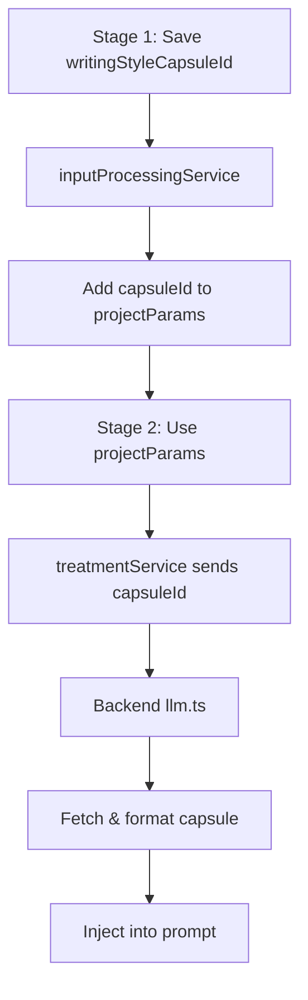

# Fix Style Capsule System Issues

## Problem Analysis

Based on testing, four critical issues were identified:

1. **Prompt Injection Fails** - `writing_style_capsule_id` arrives as empty string at backend
2. **Search Broken in Stage 1 Dropdown** - Typing letters shows "none" when capsules exist
3. **Cards Show Empty Data** - Opening capsule cards displays no content
4. **Update Fails & Delete Hidden** - Update returns error, delete buried in menu

## Root Causes

### Issue 1: Empty Capsule ID

- Stage 1 correctly saves `writingStyleCapsuleId` to content
- But `processedInput.projectParams` doesn't include it
- Subsequent stages get it from Stage 1 content, not from processedInput
- Backend never receives the ID

### Issue 2: Search Filtering

- Dropdown search query doesn't filter results properly
- Command component may have conflicting internal filtering
- Ordering is wrong (should be: Favorites → Custom → Presets)

### Issue 3: Empty Card Data

- List API (`GET /api/style-capsules`) returns minimal fields only
- Full capsule details (exampleTextExcerpts, styleLabels, etc.) not included
- Dialog tries to display fields that weren't loaded

### Issue 4: Update & Delete

- Update service sends camelCase but backend may expect snake_case transformations
- Delete functionality exists but is hidden in dropdown menu (poor UX)

## Solution Architecture



## Implementation Plan

### Fix 1: Prompt Injection - Ensure capsuleId Flows Through Pipeline

**File: `src/lib/services/inputProcessingService.ts`**

- Locate the function that creates `ProcessedInput` from Stage 1 content
- Ensure `projectParams.writingStyleCapsuleId` is extracted from Stage 1 content
- Add it to the returned `processedInput.projectParams` object

**File: `src/components/pipeline/Stage2Treatment.tsx`**

- Verify Stage 1 state retrieval includes `writingStyleCapsuleId`
- Log the processedInput to confirm capsuleId is present before calling treatmentService

**File: `src/components/pipeline/Stage3BeatSheet.tsx` (line ~322)**

- Change from:
```typescript
projectParams: stage2State.content.processedInput?.projectParams || {...}
```

- To:
```typescript
projectParams: {
  ...stage2State.content.processedInput?.projectParams,
  writingStyleCapsuleId: stage2State.content.writingStyleCapsuleId || 
                          stage2State.content.processedInput?.projectParams?.writingStyleCapsuleId
}
```


**File: `src/components/pipeline/Stage4MasterScript.tsx`**

- Similar fix as Stage 3 - ensure writingStyleCapsuleId is passed from Stage 2 state

### Fix 2A: Search Filtering in Dropdown

**File: `src/components/styleCapsules/StyleCapsuleSelector.tsx`**

- Command component has built-in filtering that conflicts with our manual filter
- Change approach: Use Command's `value` prop for search, not our manual `filteredCapsules`
- Update `CommandItem` to use `value={capsule.name}` instead of `value={capsule.id}`
- Let Command handle the filtering automatically
- Alternatively: Disable Command's built-in search and use our own custom filter with a regular input

### Fix 2B: Reorder Capsules (Favorites → Custom → Presets)

**File: `src/components/styleCapsules/StyleCapsuleSelector.tsx` (lines 81-86)**

- Replace current grouping logic:
```typescript
const groupedCapsules = useMemo(() => {
  const favorites = filteredCapsules.filter(c => c.isFavorite);
  const customNonFavorite = filteredCapsules.filter(c => !c.isPreset && !c.isFavorite);
  const presets = filteredCapsules.filter(c => c.isPreset && !c.isFavorite);

  return { favorites, custom: customNonFavorite, presets };
}, [filteredCapsules]);
```

- Update render section (lines 303-318) to show three groups:

  1. "Favorites" (if any)
  2. "Custom Capsules" (non-favorite custom)
  3. "Preset Capsules" (non-favorite presets)

**Apply same ordering to `src/pages/StyleCapsuleLibrary.tsx`**

- Add sorting logic before rendering cards

### Fix 3: Load Full Capsule Data When Card Clicked

**Option A: Fetch on Click (Recommended)**

**File: `src/pages/StyleCapsuleLibrary.tsx`**

- Replace direct `setSelectedCapsule(capsule)` calls
- Create new function:
```typescript
const handleCapsuleClick = async (capsule: StyleCapsule) => {
  try {
    // Fetch full capsule details
    const fullCapsule = await styleCapsuleService.getCapsule(capsule.id);
    setSelectedCapsule(fullCapsule);
  } catch (error) {
    console.error('Failed to load capsule details:', error);
    toast({
      title: 'Error',
      description: 'Failed to load capsule details.',
      variant: 'destructive',
    });
  }
};
```

- Update card `onClick` to use `handleCapsuleClick`

**Option B: Load Full Data Upfront**

- Modify `loadData()` to fetch full details for all capsules
- More expensive but simpler

### Fix 4A: Fix Update Operation

**File: `src/lib/services/styleCapsuleService.ts` (line ~109)**

- The update method sends data as-is (camelCase)
- Backend expects camelCase (transformer converts to snake_case for DB)
- Issue might be in what data is passed
- Debug by logging the `updates` object being sent
- Verify backend route transformation is applied

**File: `backend/src/routes/styleCapsules.ts` (line ~187)**

- Ensure the update route properly transforms incoming camelCase to snake_case before DB update:
```typescript
const { data: capsule, error } = await supabase
  .from('style_capsules')
  .update({
    name: updates.name,
    example_text_excerpts: updates.exampleTextExcerpts,
    style_labels: updates.styleLabels,
    negative_constraints: updates.negativeConstraints,
    freeform_notes: updates.freeformNotes,
    design_pillars: updates.designPillars,
    reference_image_urls: updates.referenceImageUrls,
    descriptor_strings: updates.descriptorStrings,
    library_id: updates.libraryId,
    // Don't allow updating: type, is_preset, user_id
  })
  .eq('id', capsuleId)
  .select()
  .single();
```


### Fix 4B: Add Delete Button to Dialog

**File: `src/components/styleCapsules/WritingStyleCapsuleEditor.tsx`**

- Add prop: `onDelete?: () => void`
- Add delete button in footer (only if not readOnly and not creating):
```typescript
{!readOnly && isEditMode && (
  <Button
    variant="destructive"
    onClick={handleDelete}
    disabled={loading}
  >
    <Trash2 className="w-4 h-4 mr-2" />
    Delete Capsule
  </Button>
)}
```


**File: `src/components/styleCapsules/VisualStyleCapsuleEditor.tsx`**

- Same changes as WritingStyleCapsuleEditor

**File: `src/pages/StyleCapsuleLibrary.tsx` (line ~567-592)**

- Add delete handler to editor props:
```typescript
onDelete={async () => {
  if (selectedCapsule) {
    setCapsuleToDelete(selectedCapsule);
    setDeleteDialogOpen(true);
    setSelectedCapsule(null);
  }
}}
```


### Fix 4C: Add Duplicate Button for Presets

**File: `src/components/styleCapsules/WritingStyleCapsuleEditor.tsx`**

- Add prop: `onDuplicate?: () => void`
- Add duplicate button in footer when readOnly:
```typescript
{readOnly && (
  <Button
    variant="outline"
    onClick={onDuplicate}
  >
    <Copy className="w-4 h-4 mr-2" />
    Duplicate to Customize
  </Button>
)}
```


**File: `src/pages/StyleCapsuleLibrary.tsx`**

- Pass `onDuplicate` handler to editors

## Testing Checklist

After implementation, verify:

- [ ] **Prompt Injection**: Create project with style capsule, check network tab shows non-empty `writing_style_capsule_id` and backend logs show capsule being fetched
- [ ] **Search**: Type "A" in Stage 1 dropdown, should find "Airplane!" capsule
- [ ] **Ordering**: Favorites appear first, then custom, then presets (both in dropdown and library page)
- [ ] **Card Data**: Click capsule card, dialog shows all fields populated
- [ ] **Update**: Edit capsule, click Update, should save without error
- [ ] **Delete**: Delete button visible in edit dialog (not presets), works correctly
- [ ] **Duplicate**: Preset capsules show "Duplicate" button, creates editable copy

## Key Files Modified

1. `src/lib/services/inputProcessingService.ts` - Add capsuleId to processedInput
2. `src/components/pipeline/Stage3BeatSheet.tsx` - Pass capsuleId from Stage 2
3. `src/components/pipeline/Stage4MasterScript.tsx` - Pass capsuleId from Stage 2
4. `src/components/styleCapsules/StyleCapsuleSelector.tsx` - Fix search & ordering
5. `src/pages/StyleCapsuleLibrary.tsx` - Fetch full data on click, add handlers
6. `src/components/styleCapsules/WritingStyleCapsuleEditor.tsx` - Add delete/duplicate buttons
7. `src/components/styleCapsules/VisualStyleCapsuleEditor.tsx` - Add delete/duplicate buttons
8. `backend/src/routes/styleCapsules.ts` - Fix update transformation