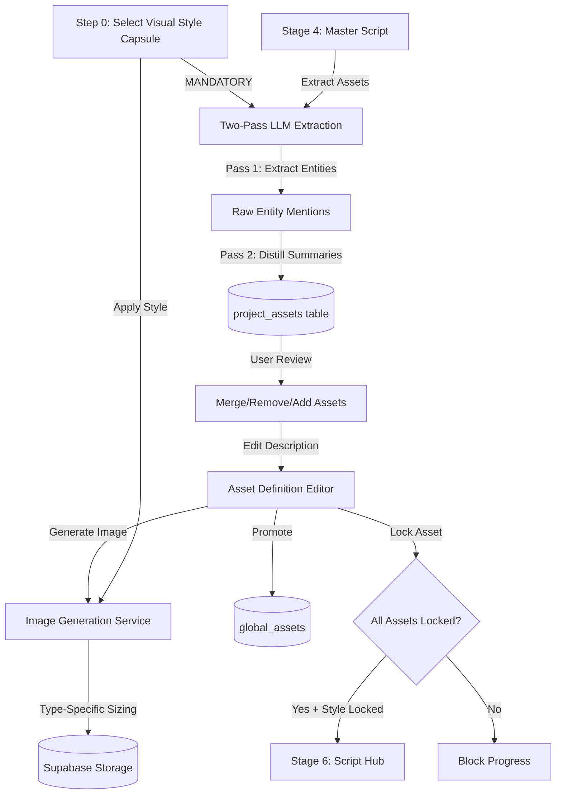

<!-- 72dc1360-3fc9-4cf4-9ed9-3df2e7daac38 f61c193e-ff01-4d8f-a764-3a4c3416124f -->
# Stage 5: Asset Extraction & Definition Implementation Plan (REVISED)

## Architecture Overview



## Phase 0: Visual Style Lock (HIGHEST PRIORITY)

### 0.1 Mandatory Style Selection Before Extraction

**Critical Design Decision**: Visual Style Capsule selection is **NOT optional** and must happen **BEFORE** any asset operations.

**Why This Matters:**
- PRD requirement: "locked as a Global Context Constraint"
- Prevents style drift across assets
- Ensures deterministic visual consistency
- Backend can enforce style injection in all image generation

**UI Flow:**

1. User enters Stage 5
2. **FIRST UI ELEMENT**: Large, prominent style capsule selector at top
3. Until style is selected:
   - "Extract Assets" button is disabled
   - Show tooltip: "Please select a Visual Style Capsule to ensure consistent asset generation"
   - All other UI is grayed out
4. Once style is selected:
   - Store in Stage 5 state (`locked_visual_style_capsule_id`)
   - Unlock extraction and asset operations
   - Style selector becomes locked (can only change by branching)

**Implementation in `Stage5Assets.tsx`:**

```typescript
const [lockedStyleId, setLockedStyleId] = useState<string | null>(null);
const [isStyleLocked, setIsStyleLocked] = useState(false);

// Check if style is already locked from previous session
useEffect(() => {
  if (stageState?.content?.locked_visual_style_capsule_id) {
    setLockedStyleId(stageState.content.locked_visual_style_capsule_id);
    setIsStyleLocked(true);
  }
}, [stageState]);

const handleStyleSelect = async (styleId: string) => {
  setLockedStyleId(styleId);
  setIsStyleLocked(true);
  
  // Save to Stage 5 state immediately
  await updateStageState({
    locked_visual_style_capsule_id: styleId,
    style_locked_at: new Date().toISOString()
  });
};

// Disable all operations if style not selected
const canPerformOperations = isStyleLocked && lockedStyleId;
```

**Backend Validation:**

In `ImageGenerationService.ts`, add mandatory check:

```typescript
async generateMasterAssetImage(assetId: string, styleId?: string) {
  if (!styleId) {
    throw new Error('Visual Style Capsule is required for Stage 5 asset generation');
  }
  
  // Validate style exists
  const style = await this.validateStyleCapsule(styleId);
  
  // Force-inject style into prompt
  const enhancedPrompt = this.mergeStyleWithAssetPrompt(style, assetPrompt);
  // ... continue generation
}
```

## Phase 1: Backend - Asset Extraction Service

### 1.1 Two-Pass LLM Extraction Service (REVISED)

**File**: `backend/src/services/assetExtractionService.ts`

**Critical Change**: Replace single-pass concatenation with two-pass distillation to avoid token limits and hallucinations.

**Problem Solved:**
- Main character with 200+ mentions would exceed token limits
- Concatenated text is too noisy for image generation
- Contradictory descriptions (e.g., "blue coat" then "red coat") need resolution

**Implementation Pattern:**

```typescript
// Raw entity from Pass 1
interface RawEntity {
  name: string;
  aliases: string[]; // ["John", "John Doe", "Mr. Doe"]
  type: 'character' | 'prop' | 'location';
  mentions: Array<{
    sceneNumber: number;
    text: string;
    context: string;
  }>;
}

// Final extracted asset from Pass 2
export interface ExtractedAsset {
  name: string; // Canonical name
  type: 'character' | 'prop' | 'location';
  description: string; // DISTILLED 3-5 sentence visual summary
  mentions: string[]; // Preserved for reference
  confidenceScore: number; // 0-1, LLM's confidence in extraction
  isPriority: boolean; // true for main characters/key props
  hasVisualConflicts: boolean; // true if LLM detects contradictions
  conflictDetails?: string; // e.g., "Coat color changes from blue to red"
}

export class AssetExtractionService {
  private llmClient: LLMClient;
  
  constructor() {
    this.llmClient = llmClient.instance;
  }

  /**
   * Main orchestrator: Two-pass extraction
   */
  async extractAssets(
    masterScript: string, 
    branchId: string, 
    visualStyleId: string
  ): Promise<ExtractedAsset[]> {
    console.log('[AssetExtraction] Starting two-pass extraction...');
    
    // Pass 1: Extract raw entities with all mentions
    const rawEntities = await this.extractEntityMentions(masterScript);
    console.log(`[AssetExtraction] Pass 1 complete: ${rawEntities.length} entities found`);
    
    // Pass 2: Distill each entity into visual summary
    const distilledAssets: ExtractedAsset[] = [];
    for (const entity of rawEntities) {
      const asset = await this.distillVisualSummary(entity, visualStyleId);
      distilledAssets.push(asset);
    }
    
    console.log(`[AssetExtraction] Pass 2 complete: ${distilledAssets.length} assets distilled`);
    
    // Sort by priority (main characters first)
    return distilledAssets.sort((a, b) => 
      (b.isPriority ? 1 : 0) - (a.isPriority ? 1 : 0)
    );
  }

  /**
   * Pass 1: Extract all entity names and their mentions from script
   */
  private async extractEntityMentions(masterScript: string): Promise<RawEntity[]> {
    const systemPrompt = `You are a screenplay analyst. Extract all unique characters, props, and locations from this script.

CRITICAL RULES:
1. DEDUPLICATE: "John", "John Doe", and "Mr. Doe" are the SAME character
2. FOCUS ON VISUALS: Only extract physical objects/people/places
3. EXCLUDE ABSTRACTS: No "atmosphere", "tension", "mood" - only tangible assets
4. KEY ASSETS ONLY: Main characters, important props, primary locations
5. SCENE REFERENCES: Include which scenes each asset appears in

OUTPUT FORMAT: JSON array of entities with their mentions`;

    const userPrompt = `Analyze this screenplay and extract all key visual assets:

${masterScript}

Return JSON array with this structure:
[{
  "name": "canonical name",
  "aliases": ["alternate names"],
  "type": "character|prop|location",
  "mentions": [{"sceneNumber": 1, "text": "excerpt with visual details", "context": "brief scene context"}]
}]`;

    const response = await this.llmClient.generate({
      systemPrompt,
      userPrompt,
      temperature: 0.3, // Low temperature for consistency
      metadata: { stage: 5, pass: 1 }
    });

    return JSON.parse(response.content);
  }

  /**
   * Pass 2: Distill entity mentions into concise visual summary
   */
  private async distillVisualSummary(
    entity: RawEntity, 
    visualStyleId: string
  ): Promise<ExtractedAsset> {
    // Get visual style context for consistency
    const styleContext = await this.getStyleContext(visualStyleId);
    
    const systemPrompt = `You are a visual description specialist. Create a concise, vivid 3-5 sentence description suitable for AI image generation.

CRITICAL RULES:
1. PHYSICAL ONLY: Focus on appearance, clothing, colors, textures
2. CONSISTENCY: If descriptions conflict, note it clearly
3. ACTIONABLE: Use concrete details image AI can render
4. STYLE-ALIGNED: Consider the ${styleContext.name} visual style
5. PRIORITY: Assess if this is a main character/key prop vs background element`;

    const mentionsText = entity.mentions
      .map(m => `Scene ${m.sceneNumber}: ${m.text}`)
      .join('\n\n');

    const userPrompt = `Asset: ${entity.name} (${entity.type})
Style Context: ${styleContext.description}

All script mentions:
${mentionsText}

Create:
1. A 3-5 sentence visual description for image generation
2. Confidence score (0-1) in the consistency of descriptions
3. Priority assessment (is this a main character/key prop?)
4. Flag any visual contradictions

Return JSON:
{
  "description": "vivid visual summary",
  "confidenceScore": 0.95,
  "isPriority": true,
  "hasVisualConflicts": false,
  "conflictDetails": null
}`;

    const response = await this.llmClient.generate({
      systemPrompt,
      userPrompt,
      temperature: 0.4,
      metadata: { stage: 5, pass: 2, entityName: entity.name }
    });

    const distilled = JSON.parse(response.content);

    return {
      name: entity.name,
      type: entity.type,
      description: distilled.description,
      mentions: entity.mentions.map(m => m.text),
      confidenceScore: distilled.confidenceScore,
      isPriority: distilled.isPriority,
      hasVisualConflicts: distilled.hasVisualConflicts,
      conflictDetails: distilled.conflictDetails
    };
  }

  private async getStyleContext(styleId: string) {
    // Fetch visual style capsule details
    // Returns { name, description } for prompt injection
  }
}
```

### 1.2 Create Project Assets API Endpoints (REVISED)

**File**: `backend/src/routes/projectAssets.ts`

**Key Changes:**
- Add merge endpoint
- Add aspect ratio logic
- Add promotion endpoint
- Enforce style lock validation

**Endpoints to implement:**

```typescript
// Core CRUD
POST   /api/projects/:projectId/assets/extract        // Two-pass extraction
GET    /api/projects/:projectId/assets                // List all
GET    /api/projects/:projectId/assets/:assetId       // Get one
PUT    /api/projects/:projectId/assets/:assetId       // Update description
DELETE /api/projects/:projectId/assets/:assetId       // Delete asset

// NEW: Asset Review Operations
POST   /api/projects/:projectId/assets/merge          // Merge two assets
POST   /api/projects/:projectId/assets                // Manually create asset

// Image Generation
POST   /api/projects/:projectId/assets/:assetId/generate-image  // With aspect ratio
POST   /api/projects/:projectId/assets/:assetId/regenerate-description // Targeted LLM edit

// Locking
POST   /api/projects/:projectId/assets/:assetId/lock  // Lock individual
POST   /api/projects/:projectId/assets/lock-all       // Lock all (gatekeeper)

// NEW: Promotion to Global Library
POST   /api/projects/:projectId/assets/:assetId/promote  // Copy to global_assets
```

**Implementation Highlights:**

```typescript
// Extract with two-pass
router.post('/:projectId/assets/extract', async (req, res) => {
  const { projectId } = req.params;
  const userId = req.user!.id;
  
  // Get Stage 5 state to retrieve locked visual style
  const stage5State = await getStageState(projectId, 5);
  const visualStyleId = stage5State?.content?.locked_visual_style_capsule_id;
  
  if (!visualStyleId) {
    return res.status(400).json({ 
      error: 'Visual Style Capsule must be selected before extraction' 
    });
  }
  
  // Get Stage 4 script
  const stage4State = await getStageState(projectId, 4);
  const masterScript = stage4State?.content?.formatted_script;
  
  if (!masterScript) {
    return res.status(400).json({ error: 'Stage 4 must be completed first' });
  }
  
  // Run two-pass extraction
  const extractionService = new AssetExtractionService();
  const extractedAssets = await extractionService.extractAssets(
    masterScript,
    stage5State.branch_id,
    visualStyleId
  );
  
  // Save to database
  const branch = await getActiveBranch(projectId);
  const savedAssets = await Promise.all(
    extractedAssets.map(asset => 
      supabase.from('project_assets').insert({
        project_id: projectId,
        branch_id: branch.id,
        name: asset.name,
        asset_type: asset.type,
        description: asset.description,
        visual_style_capsule_id: visualStyleId,
        locked: false,
        metadata: {
          confidence_score: asset.confidenceScore,
          is_priority: asset.isPriority,
          has_conflicts: asset.hasVisualConflicts,
          conflict_details: asset.conflictDetails,
          source_mentions: asset.mentions
        }
      })
    )
  );
  
  res.json(savedAssets);
});

// NEW: Merge two assets
router.post('/:projectId/assets/merge', async (req, res) => {
  const { sourceAssetId, targetAssetId, mergedDescription } = req.body;
  
  // Validate ownership
  // Update target asset with merged description
  // Delete source asset
  // Return updated target
});

// NEW: Promote to global library
router.post('/:projectId/assets/:assetId/promote', async (req, res) => {
  const { assetId } = req.params;
  const userId = req.user!.id;
  
  // Get project asset
  const projectAsset = await getProjectAsset(assetId, userId);
  
  // Validate: must have locked image
  if (!projectAsset.image_key_url) {
    return res.status(400).json({ 
      error: 'Asset must have a generated image before promotion' 
    });
  }
  
  // Create in global_assets table
  const globalAsset = await supabase.from('global_assets').insert({
    user_id: userId,
    name: projectAsset.name,
    asset_type: projectAsset.asset_type,
    description: projectAsset.description,
    image_prompt: projectAsset.image_prompt,
    image_key_url: projectAsset.image_key_url,
    visual_style_capsule_id: projectAsset.visual_style_capsule_id,
    voice_profile_id: projectAsset.voice_profile_id,
    promoted_from_project_id: projectAsset.project_id
  });
  
  res.json(globalAsset);
});
```

### 1.3 Integrate with Image Generation Service (REVISED)

**File**: `backend/src/services/image-generation/ImageGenerationService.ts` (modify)

**Critical Addition: Type-Specific Aspect Ratios**

```typescript
// Add to ImageGenerationService class
private readonly ASPECT_RATIOS = {
  character: { width: 512, height: 768 },   // 2:3 portrait for full-body
  prop: { width: 512, height: 512 },        // 1:1 square for product-style
  location: { width: 1024, height: 576 }    // 16:9 cinematic landscape
};

async createJob(request: CreateImageJobRequest): Promise<string> {
  // ... existing validation ...
  
  // NEW: Auto-determine aspect ratio for master_asset job type
  if (request.jobType === 'master_asset' && request.assetId) {
    const asset = await this.getAssetDetails(request.assetId);
    const dimensions = this.ASPECT_RATIOS[asset.asset_type];
    
    request.width = dimensions.width;
    request.height = dimensions.height;
    
    console.log(`[ImageGen] Auto-sizing ${asset.asset_type}: ${dimensions.width}x${dimensions.height}`);
  }
  
  // NEW: Enforce visual style for Stage 5
  if (request.jobType === 'master_asset' && !request.visualStyleCapsuleId) {
    throw new Error('Visual Style Capsule is required for master asset generation');
  }
  
  // ... continue with job creation ...
}

private async getAssetDetails(assetId: string) {
  // Fetch from project_assets or global_assets
  // Return { asset_type, name, description }
}
```

### 1.4 Update Context Manager for Asset Context

**File**: `backend/src/services/contextManager.ts` (modify)

Add method to fetch locked project assets for Phase B:

```typescript
async fetchProjectAssets(branchId: string): Promise<ProjectAsset[]> {
  const { data: assets } = await this.db.supabase
    .from('project_assets')
    .select('*')
    .eq('branch_id', branchId)
    .eq('locked', true)
    .order('asset_type', { ascending: true });
  
  return assets || [];
}

// Add to GlobalContext interface
export interface GlobalContext {
  // ... existing fields ...
  lockedAssets?: ProjectAsset[]; // Available in Phase B
}
```

## Phase 2: Frontend - UI Components

### 2.1 Visual Style First Workflow (NEW)

**File**: `src/components/pipeline/Stage5Assets.tsx` (major refactor)

**Critical UX Change**: Style selection is the first interaction, not optional.

```typescript
export function Stage5Assets({ projectId, onComplete, onBack }: Stage5AssetsProps) {
  const { stageState, updateStageState, isLoading } = useStageState(projectId, 5);
  
  const [lockedStyleId, setLockedStyleId] = useState<string | null>(null);
  const [isStyleLocked, setIsStyleLocked] = useState(false);
  const [assets, setAssets] = useState<Asset[]>([]);
  const [hasExtracted, setHasExtracted] = useState(false);
  
  // Initialize from saved state
  useEffect(() => {
    if (stageState?.content) {
      const styleId = stageState.content.locked_visual_style_capsule_id;
      if (styleId) {
        setLockedStyleId(styleId);
        setIsStyleLocked(true);
      }
      
      // Check if assets already exist
      loadExistingAssets();
    }
  }, [stageState]);
  
  const loadExistingAssets = async () => {
    const response = await fetch(`/api/projects/${projectId}/assets`);
    const existingAssets = await response.json();
    
    if (existingAssets.length > 0) {
      setAssets(existingAssets);
      setHasExtracted(true);
    }
  };
  
  const handleStyleLock = async (styleId: string) => {
    setLockedStyleId(styleId);
    setIsStyleLocked(true);
    
    await updateStageState({
      locked_visual_style_capsule_id: styleId,
      style_locked_at: new Date().toISOString()
    });
    
    toast.success('Visual style locked! You can now extract assets.');
  };
  
  const handleExtractAssets = async () => {
    if (!lockedStyleId) {
      toast.error('Please select a visual style first');
      return;
    }
    
    try {
      setIsExtracting(true);
      toast.info('Extracting assets from script... This may take 30-60 seconds.');
      
      const response = await fetch(`/api/projects/${projectId}/assets/extract`, {
        method: 'POST',
        headers: { 'Content-Type': 'application/json' }
      });
      
      const extractedAssets = await response.json();
      setAssets(extractedAssets);
      setHasExtracted(true);
      
      toast.success(`Extracted ${extractedAssets.length} assets!`);
    } catch (error) {
      toast.error('Failed to extract assets. Please try again.');
    } finally {
      setIsExtracting(false);
    }
  };
  
  return (
    <div className="flex-1 flex flex-col overflow-hidden">
      {/* Header */}
      <div className="px-6 py-4 border-b">
        <h2>Stage 5: Global Assets & Style Lock</h2>
      </div>
      
      <div className="flex-1 overflow-auto p-6">
        <div className="max-w-4xl mx-auto space-y-8">
          
          {/* STEP 0: Visual Style Selection (MANDATORY FIRST STEP) */}
          <section className="space-y-4">
            <div className="flex items-center gap-3">
              <div className={cn(
                "w-8 h-8 rounded-full flex items-center justify-center text-sm font-bold",
                isStyleLocked ? "bg-success text-white" : "bg-primary text-white"
              )}>
                {isStyleLocked ? '✓' : '1'}
              </div>
              <h3 className="font-display text-xl font-semibold">
                Select Visual Style Capsule
              </h3>
              {isStyleLocked && (
                <Badge variant="success">LOCKED</Badge>
              )}
            </div>
            
            <Alert className={isStyleLocked ? "border-success" : "border-primary"}>
              <AlertDescription>
                {isStyleLocked 
                  ? "Visual style is locked. All assets will use this style."
                  : "⚠️ You must select a visual style before extracting assets. This ensures all generated images are consistent."}
              </AlertDescription>
            </Alert>
            
            <StyleCapsuleSelector
              type="visual"
              value={lockedStyleId || ''}
              onChange={handleStyleLock}
              required={true}
              disabled={isStyleLocked}
              showPreview={true}
            />
          </section>
          
          {/* STEP 1: Asset Extraction (Disabled until style locked) */}
          <section className="space-y-4">
            <div className="flex items-center gap-3">
              <div className={cn(
                "w-8 h-8 rounded-full flex items-center justify-center text-sm font-bold",
                !isStyleLocked ? "bg-muted text-muted-foreground" : 
                hasExtracted ? "bg-success text-white" : "bg-primary text-white"
              )}>
                {hasExtracted ? '✓' : '2'}
              </div>
              <h3 className={cn(
                "font-display text-xl font-semibold",
                !isStyleLocked && "text-muted-foreground"
              )}>
                Extract Assets from Script
              </h3>
            </div>
            
            {!hasExtracted && (
              <Button
                onClick={handleExtractAssets}
                disabled={!isStyleLocked || isExtracting}
                size="lg"
                className="w-full"
              >
                {isExtracting ? (
                  <>
                    <Loader2 className="w-4 h-4 animate-spin mr-2" />
                    Analyzing Script...
                  </>
                ) : (
                  <>
                    <Sparkles className="w-4 h-4 mr-2" />
                    Extract Characters, Props & Locations
                  </>
                )}
              </Button>
            )}
            
            {hasExtracted && (
              <Alert variant="success">
                <Check className="w-4 h-4" />
                <AlertDescription>
                  {assets.length} assets extracted successfully
                </AlertDescription>
              </Alert>
            )}
          </section>
          
          {/* STEP 2: Review & Manage Assets */}
          {hasExtracted && (
            <AssetManagementSection
              assets={assets}
              projectId={projectId}
              lockedStyleId={lockedStyleId!}
              onAssetsChange={setAssets}
            />
          )}
          
        </div>
      </div>
    </div>
  );
}
```

### 2.2 Asset Management Section (NEW)

**New Component**: `src/components/pipeline/Stage5AssetManagement.tsx`

Handles the review, merge, and manual creation flow.

```typescript
interface AssetManagementSectionProps {
  assets: Asset[];
  projectId: string;
  lockedStyleId: string;
  onAssetsChange: (assets: Asset[]) => void;
}

export function AssetManagementSection({ 
  assets, 
  projectId, 
  lockedStyleId,
  onAssetsChange 
}: AssetManagementSectionProps) {
  const [selectedAssetIds, setSelectedAssetIds] = useState<string[]>([]);
  const [expandedAssetId, setExpandedAssetId] = useState<string | null>(null);
  
  const groupedAssets = {
    characters: assets.filter(a => a.type === 'character'),
    locations: assets.filter(a => a.type === 'location'),
    props: assets.filter(a => a.type === 'prop')
  };
  
  const handleMergeAssets = async () => {
    if (selectedAssetIds.length !== 2) {
      toast.error('Select exactly 2 assets to merge');
      return;
    }
    
    // Open merge dialog
    // Let user choose target and edit merged description
    // Call merge endpoint
  };
  
  const handleRemoveAsset = async (assetId: string) => {
    if (!confirm('Remove this asset? This cannot be undone.')) return;
    
    await fetch(`/api/projects/${projectId}/assets/${assetId}`, {
      method: 'DELETE'
    });
    
    onAssetsChange(assets.filter(a => a.id !== assetId));
    toast.success('Asset removed');
  };
  
  const handleAddCustomAsset = async (assetData: CustomAssetData) => {
    const response = await fetch(`/api/projects/${projectId}/assets`, {
      method: 'POST',
      headers: { 'Content-Type': 'application/json' },
      body: JSON.stringify({
        ...assetData,
        visual_style_capsule_id: lockedStyleId
      })
    });
    
    const newAsset = await response.json();
    onAssetsChange([...assets, newAsset]);
  };
  
  return (
    <section className="space-y-6">
      <div className="flex items-center justify-between">
        <div className="flex items-center gap-3">
          <div className="w-8 h-8 rounded-full bg-primary text-white flex items-center justify-center">
            3
          </div>
          <h3 className="font-display text-xl font-semibold">
            Review & Generate Visual Keys
          </h3>
        </div>
        
        {/* Action Buttons */}
        <div className="flex gap-2">
          {selectedAssetIds.length === 2 && (
            <Button variant="outline" size="sm" onClick={handleMergeAssets}>
              <Merge className="w-4 h-4 mr-2" />
              Merge Selected
            </Button>
          )}
          
          <AddCustomAssetDialog onAdd={handleAddCustomAsset} />
        </div>
      </div>
      
      {/* Asset Type Groups */}
      {Object.entries(groupedAssets).map(([type, typeAssets]) => (
        <div key={type} className="space-y-3">
          <h4 className="font-semibold capitalize flex items-center gap-2">
            {getTypeIcon(type)}
            {type} ({typeAssets.length})
          </h4>
          
          <div className="space-y-2">
            {typeAssets.map(asset => (
              <AssetCard
                key={asset.id}
                asset={asset}
                projectId={projectId}
                lockedStyleId={lockedStyleId}
                isSelected={selectedAssetIds.includes(asset.id)}
                isExpanded={expandedAssetId === asset.id}
                onSelect={(id) => {
                  setSelectedAssetIds(prev =>
                    prev.includes(id) 
                      ? prev.filter(x => x !== id)
                      : [...prev, id]
                  );
                }}
                onExpand={() => setExpandedAssetId(
                  expandedAssetId === asset.id ? null : asset.id
                )}
                onRemove={handleRemoveAsset}
                onUpdate={(updated) => {
                  onAssetsChange(assets.map(a => 
                    a.id === updated.id ? updated : a
                  ));
                }}
              />
            ))}
          </div>
        </div>
      ))}
      
      {/* Progress Summary */}
      <AssetProgressSummary assets={assets} />
    </section>
  );
}
```

### 2.3 Enhanced Asset Card with Promotion (REVISED)

**File**: `src/components/pipeline/Stage5AssetCard.tsx`

```typescript
export function AssetCard({ 
  asset, 
  projectId, 
  lockedStyleId,
  onUpdate,
  onRemove 
}: AssetCardProps) {
  const [isGenerating, setIsGenerating] = useState(false);
  const [description, setDescription] = useState(asset.description);
  
  const handleGenerateImage = async () => {
    // Auto-save description first
    await saveDescription();
    
    setIsGenerating(true);
    toast.info('Generating image key...');
    
    try {
      const response = await fetch(
        `/api/projects/${projectId}/assets/${asset.id}/generate-image`,
        { method: 'POST', headers: { 'Content-Type': 'application/json' } }
      );
      
      const { jobId } = await response.json();
      
      // Poll for completion
      const result = await pollJobStatus(jobId);
      
      onUpdate({
        ...asset,
        hasImageKey: true,
        imageUrl: result.public_url
      });
      
      toast.success('Image key generated!');
    } catch (error) {
      toast.error('Failed to generate image');
    } finally {
      setIsGenerating(false);
    }
  };
  
  const handlePromoteToGlobal = async () => {
    if (!asset.hasImageKey) {
      toast.error('Generate image key first before promotion');
      return;
    }
    
    try {
      await fetch(`/api/projects/${projectId}/assets/${asset.id}/promote`, {
        method: 'POST'
      });
      
      toast.success('Asset promoted to Global Library!');
    } catch (error) {
      toast.error('Failed to promote asset');
    }
  };
  
  return (
    <Card className={cn(asset.hasImageKey && 'border-success')}>
      <CardHeader>
        <div className="flex items-center justify-between">
          <div className="flex items-center gap-3">
            <Checkbox
              checked={isSelected}
              onCheckedChange={() => onSelect(asset.id)}
            />
            <div>
              <CardTitle className="text-lg">{asset.name}</CardTitle>
              <div className="flex gap-2 mt-1">
                <Badge variant="outline">{asset.type}</Badge>
                {asset.isPriority && (
                  <Badge variant="default">Priority</Badge>
                )}
                {asset.hasVisualConflicts && (
                  <Badge variant="destructive">
                    <AlertTriangle className="w-3 h-3 mr-1" />
                    Conflicts
                  </Badge>
                )}
              </div>
            </div>
          </div>
          
          <DropdownMenu>
            <DropdownMenuTrigger asChild>
              <Button variant="ghost" size="icon">
                <MoreVertical className="w-4 h-4" />
              </Button>
            </DropdownMenuTrigger>
            <DropdownMenuContent align="end">
              <DropdownMenuItem onClick={onExpand}>
                <Edit className="w-4 h-4 mr-2" />
                Edit Details
              </DropdownMenuItem>
              {asset.hasImageKey && (
                <DropdownMenuItem onClick={handlePromoteToGlobal}>
                  <Upload className="w-4 h-4 mr-2" />
                  Promote to Global Library
                </DropdownMenuItem>
              )}
              <DropdownMenuSeparator />
              <DropdownMenuItem 
                onClick={() => onRemove(asset.id)}
                className="text-destructive"
              >
                <Trash2 className="w-4 h-4 mr-2" />
                Remove Asset
              </DropdownMenuItem>
            </DropdownMenuContent>
          </DropdownMenu>
        </div>
      </CardHeader>
      
      <CardContent>
        {/* Image Preview */}
        {asset.imageUrl ? (
          <div className="relative aspect-video bg-muted rounded-lg overflow-hidden mb-4">
            
            <Badge className="absolute top-2 right-2 bg-success">
              <Check className="w-3 h-3 mr-1" />
              Generated
            </Badge>
          </div>
        ) : (
          <div className="aspect-video bg-muted rounded-lg flex items-center justify-center mb-4">
            <ImageIcon className="w-12 h-12 text-muted-foreground" />
          </div>
        )}
        
        {/* Description */}
        <div className="space-y-2">
          <Label>Visual Description</Label>
          <Textarea
            value={description}
            onChange={(e) => setDescription(e.target.value)}
            onBlur={saveDescription}
            rows={4}
            className="resize-none"
          />
          
          {/* Aspect Ratio Info */}
          <div className="flex items-center gap-2 text-xs text-muted-foreground">
            <Info className="w-3 h-3" />
            Auto-sizing: {ASPECT_RATIOS[asset.type].width}x{ASPECT_RATIOS[asset.type].height}
            ({asset.type === 'character' ? '2:3 portrait' : 
              asset.type === 'location' ? '16:9 cinematic' : '1:1 square'})
          </div>
        </div>
        
        {/* Actions */}
        <div className="flex gap-2 mt-4">
          {!asset.hasImageKey ? (
            <Button
              onClick={handleGenerateImage}
              disabled={isGenerating || !lockedStyleId}
              className="flex-1"
            >
              {isGenerating ? (
                <>
                  <Loader2 className="w-4 h-4 animate-spin mr-2" />
                  Generating...
                </>
              ) : (
                <>
                  <Sparkles className="w-4 h-4 mr-2" />
                  Generate Image Key
                </>
              )}
            </Button>
          ) : (
            <Button
              variant="outline"
              onClick={handleGenerateImage}
              className="flex-1"
            >
              <RefreshCw className="w-4 h-4 mr-2" />
              Regenerate
            </Button>
          )}
          
          {asset.hasImageKey && (
            <Button
              variant="success"
              onClick={() => lockAsset(asset.id)}
              disabled={asset.locked}
            >
              {asset.locked ? (
                <>
                  <Lock className="w-4 h-4 mr-2" />
                  Locked
                </>
              ) : (
                <>
                  <Check className="w-4 h-4 mr-2" />
                  Lock Asset
                </>
              )}
            </Button>
          )}
        </div>
      </CardContent>
    </Card>
  );
}

const ASPECT_RATIOS = {
  character: { width: 512, height: 768 },
  location: { width: 1024, height: 576 },
  prop: { width: 512, height: 512 }
};
```

### 2.4 Gatekeeper Logic (REVISED)

**File**: `src/components/pipeline/Stage5Assets.tsx`

```typescript
const handleLockAllAssets = async () => {
  // Validate prerequisites
  if (!lockedStyleId) {
    toast.error('Visual style must be selected');
    return;
  }
  
  const unlockedAssets = assets.filter(a => !a.locked);
  if (unlockedAssets.length > 0) {
    toast.error(`${unlockedAssets.length} assets still need to be locked`);
    return;
  }
  
  const assetsWithoutImages = assets.filter(a => !a.hasImageKey);
  if (assetsWithoutImages.length > 0) {
    toast.error(`${assetsWithoutImages.length} assets need image keys`);
    return;
  }
  
  try {
    setIsLocking(true);
    
    // Lock all assets
    await fetch(`/api/projects/${projectId}/assets/lock-all`, {
      method: 'POST'
    });
    
    // Lock Stage 5
    await stageStateService.lockStage(projectId, 5);
    
    toast.success('Stage 5 completed! All assets locked.');
    onComplete();
  } catch (error) {
    toast.error('Failed to lock assets');
  } finally {
    setIsLocking(false);
  }
};

// Floating action bar
const allAssetsLocked = assets.every(a => a.locked && a.hasImageKey);
const canProceed = isStyleLocked && allAssetsLocked && assets.length > 0;

return (
  <>
    {/* ... main content ... */}
    
    {/* Floating Gatekeeper Bar */}
    <div className="fixed bottom-0 left-0 right-0 bg-card border-t p-4">
      <div className="max-w-4xl mx-auto flex items-center justify-between">
        <div className="text-sm">
          <div className="font-medium">Stage 5 Progress</div>
          <div className="text-muted-foreground">
            {assets.filter(a => a.locked).length}/{assets.length} assets locked
            {!isStyleLocked && ' • Style not locked'}
          </div>
        </div>
        
        <Button
          onClick={handleLockAllAssets}
          disabled={!canProceed || isLocking}
          size="lg"
          variant="gold"
        >
          {isLocking ? (
            <>
              <Loader2 className="w-4 h-4 animate-spin mr-2" />
              Locking...
            </>
          ) : (
            <>
              <Lock className="w-4 h-4 mr-2" />
              Lock All Assets & Begin Production
            </>
          )}
        </Button>
      </div>
    </div>
  </>
);
```

## Phase 3: Integration & Testing

### 3.1 Test Two-Pass Extraction

- Create test script with 50+ pages
- Verify Pass 1 correctly deduplicates entities
- Verify Pass 2 creates concise summaries (not token-overload)
- Test conflict detection (e.g., character appearance changes)
- Verify confidence scoring highlights questionable extractions

### 3.2 Test Visual Style Enforcement

- Attempt to extract without style selected (should fail)
- Attempt to generate image without style (should fail)
- Verify all generated images use locked style
- Test style lock persists across page refresh

### 3.3 Test Aspect Ratios

- Generate character image → verify 2:3 portrait
- Generate location image → verify 16:9 cinematic
- Generate prop image → verify 1:1 square
- Verify aspect ratio badge displays correctly in UI

### 3.4 Test Asset Review Operations

- Test merge: Combine two duplicate assets
- Test remove: Delete unwanted asset
- Test manual add: Create custom asset
- Verify all operations update database correctly

### 3.5 Test Promotion to Global

- Generate image for project asset
- Promote to global library
- Verify appears in Global Asset Library page
- Verify `promoted_from_project_id` is set correctly

### 3.6 Test Gatekeeper Logic

- Attempt to proceed without style locked → blocked
- Attempt to proceed with unlocked assets → blocked
- Attempt to proceed without image keys → blocked
- Lock all requirements → Stage 6 unlocks

## Phase 4: Polish & Edge Cases

### 4.1 Handle Empty or Invalid Scripts

- Detect if Stage 4 is not locked
- Handle scripts with no extractable assets
- Show helpful error messages with recovery options

### 4.2 Conflict Resolution UI

For assets with `hasVisualConflicts: true`, show:
- Warning badge on asset card
- Expandable section showing conflicting descriptions
- AI suggestion for resolution
- User can manually edit to resolve

### 4.3 Batch Operations

- "Generate All Images" button with cost estimate
- "Lock All Generated Assets" bulk action
- Progress indicators for batch operations

### 4.4 Auto-Save Implementation

- Debounced auto-save on description edits (1 second)
- Visual indicator when saving
- Error recovery if save fails

## Technical Notes

### Database Schema

Migration 008 already supports all required fields:

- `description`: LLM-distilled visual summary
- `image_prompt`: Optional override
- `image_key_url`: Generated image
- `locked`: Gatekeeper flag
- `visual_style_capsule_id`: Locked style reference
- `voice_profile_id`: Ready for stretch goal (VARCHAR)
- `metadata` (JSONB): Stores confidence scores, priority flags, conflicts

**No new migration needed!**

### API Authentication

All endpoints use existing auth middleware pattern.

### Error Handling

- LLM extraction failures: Retry with adjusted prompt, show user-friendly error
- Image generation failures: Logged in `image_generation_jobs`, allow per-asset retry
- Token limit errors: Two-pass approach prevents this
- Style validation errors: Clear messaging about requirement

### Performance Considerations

- **Two-pass extraction**: 30-60 seconds total (acceptable for one-time operation)
- **Parallel image generation**: Queue all jobs, poll in parallel
- **Auto-save**: Debounced to prevent excessive API calls
- **Large scripts**: Chunking strategy if needed (future enhancement)

## Success Criteria (REVISED)

- ✅ Visual style MUST be selected before any asset operations
- ✅ Two-pass extraction produces concise, usable descriptions
- ✅ Assets automatically extracted with confidence scoring
- ✅ Descriptions are editable with auto-save
- ✅ Image keys generated with type-specific aspect ratios
- ✅ Visual style enforced in all image generation
- ✅ Users can merge, remove, and manually add assets
- ✅ Assets can be promoted to Global Library
- ✅ All assets can be locked individually
- ✅ Gatekeeper prevents Stage 6 access until all requirements met
- ✅ Stage 5 status becomes 'locked' when complete
- ✅ Asset data persists correctly in project_assets table
- ✅ Zero "style drift" across generated images

## Implementation Priority Order

### Phase 1 (Critical - Week 1)
1. Visual Style Lock enforcement (UI + backend validation)
2. Two-pass LLM extraction service
3. Basic asset display and image generation
4. Aspect ratio logic

### Phase 2 (High Priority - Week 2)
5. Asset review operations (merge/remove/add)
6. Promotion to Global Library
7. Gatekeeper logic
8. Auto-save on description edits

### Phase 3 (Polish - Week 3)
9. Conflict detection UI
10. Batch operations
11. Cost awareness displays
12. Comprehensive testing

### To-dos

- [ ] **P0: Visual Style Lock** - Implement mandatory style selection before extraction
- [ ] **P0: Two-Pass Extraction** - Build AssetExtractionService with distillation
- [ ] **P0: Aspect Ratios** - Add type-specific sizing to ImageGenerationService
- [ ] **P1: Project Assets Routes** - Create all CRUD endpoints including merge
- [ ] **P1: Style Enforcement** - Add backend validation for style requirement
- [ ] **P1: Frontend Integration** - Replace mock data, implement style-first flow
- [ ] **P2: Asset Management UI** - Build review, merge, remove, add components
- [ ] **P2: Asset Card** - Implement enhanced card with promotion button
- [ ] **P2: Promotion Endpoint** - Integrate with Global Library from Feature 3.2
- [ ] **P2: Gatekeeper Logic** - Implement all validation and locking
- [ ] **P3: Auto-save** - Debounced description saving
- [ ] **P3: Conflict UI** - Show and resolve visual conflicts
- [ ] **P3: Batch Operations** - Generate all, lock all, cost estimates
- [ ] **P3: Testing** - Comprehensive workflow testing
- [ ] **P3: Edge Cases** - Empty scripts, error recovery, retry logic
