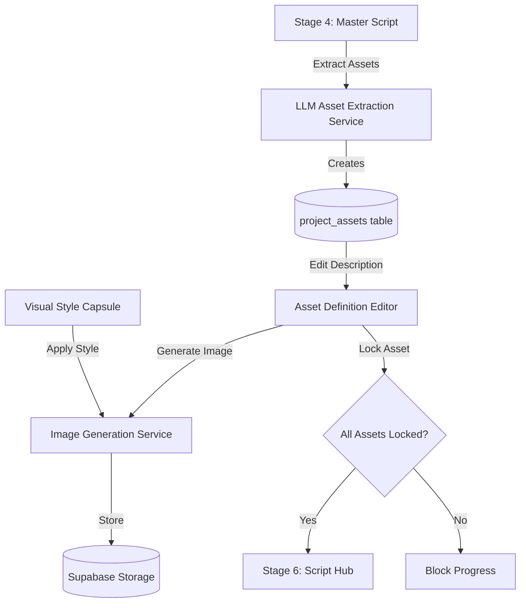

<!-- 72dc1360-3fc9-4cf4-9ed9-3df2e7daac38 f61c193e-ff01-4d8f-a764-3a4c3416124f -->
# Stage 5: Asset Extraction & Definition Implementation Plan

## Architecture Overview



## Phase 1: Backend - Asset Extraction Service

### 1.1 Create LLM-Based Asset Extraction Service

**File**: `backend/src/services/assetExtractionService.ts`

Create a service that parses the Stage 4 Master Script and extracts unique characters, props, and locations using structured LLM prompts.

**Key Requirements:**

- Use `llm-client.ts` for LLM calls with LangSmith tracing
- Extract assets deterministically (no hallucinations)
- Concatenate all mentions of each asset from the script
- Return structured asset data with type classification

**Implementation Pattern:**

```typescript
export interface ExtractedAsset {
  name: string;
  type: 'character' | 'prop' | 'location';
  description: string; // Concatenated from all script mentions
  mentions: string[]; // All script excerpts mentioning this asset
}

export class AssetExtractionService {
  async extractAssets(masterScript: string, branchId: string): Promise<ExtractedAsset[]>
}
```

**Prompt Strategy:**

- Use structured output format (JSON)
- Instruct LLM to identify and deduplicate assets
- Include examples of good asset extraction
- Emphasize visual descriptions over abstract concepts

### 1.2 Create Project Assets API Endpoints

**File**: `backend/src/routes/projectAssets.ts`

Create RESTful endpoints for managing project-level assets in Stage 5.

**Endpoints to implement:**

- `POST /api/projects/:projectId/assets/extract` - Extract assets from Stage 4 script
- `GET /api/projects/:projectId/assets` - List all project assets
- `GET /api/projects/:projectId/assets/:assetId` - Get specific asset
- `PUT /api/projects/:projectId/assets/:assetId` - Update asset description/prompt
- `POST /api/projects/:projectId/assets/:assetId/generate-image` - Generate image key
- `POST /api/projects/:projectId/assets/:assetId/lock` - Lock individual asset
- `POST /api/projects/:projectId/assets/lock-all` - Lock all assets (gatekeeper)
- `DELETE /api/projects/:projectId/assets/:assetId` - Delete asset

**Key Logic:**

- Extract endpoint calls `AssetExtractionService` and inserts into `project_assets` table
- Image generation endpoint integrates with existing `ImageGenerationService`
- Lock endpoints update `locked` boolean and check prerequisites
- All endpoints validate user ownership via RLS policies

### 1.3 Integrate with Image Generation Service

**File**: `backend/src/services/image-generation/ImageGenerationService.ts` (modify)

Ensure the existing image generation service properly handles `master_asset` job type for Stage 5.

**Required Changes:**

- Verify `master_asset` job type creates correct storage path
- Ensure visual style capsule injection works for project assets
- Update return format to include `public_url` for frontend display

### 1.4 Update Context Manager for Asset Context

**File**: `backend/src/services/contextManager.ts` (modify)

Add method to fetch locked project assets for inclusion in global context (Phase B preparation).

```typescript
async fetchProjectAssets(branchId: string): Promise<ProjectAsset[]>
```

## Phase 2: Frontend - UI Components

### 2.1 Replace Mock Data with Real API Integration

**File**: `src/components/pipeline/Stage5Assets.tsx` (major refactor)

Replace the `useEffect` mock data with API call to extraction endpoint.

**Changes:**

- Add `extractAssets` function calling `POST /api/projects/:projectId/assets/extract`
- Implement loading states during extraction
- Handle extraction errors with retry option
- Store extraction status in component state

### 2.2 Implement Asset List with Extraction Trigger

**Component**: Asset extraction flow in `Stage5Assets.tsx`

**UI Flow:**

1. On first load, check if assets exist for this branch
2. If no assets exist, show "Extract Assets from Script" button
3. On click, call extraction endpoint with loading state
4. Display extracted assets in expandable list/grid

**Design:**

- Group assets by type (Characters, Props, Locations)
- Show extraction progress indicator
- Display asset count and completion status

### 2.3 Create Asset Detail Editor Component

**New File**: `src/components/pipeline/Stage5AssetEditor.tsx`

Build a detailed editor for individual assets with:

**Components:**

1. **Asset Header**: Name, type badge, lock status
2. **Description Field**: 

   - Large textarea pre-filled with extracted description
   - "Edit Description" mode toggle
   - Character count indicator

3. **Targeted Regeneration**:

   - Text selection + context menu for LLM-based edits
   - Inline edit prompt input

4. **Image Key Section**:

   - "Generate Image Key" button (disabled if no visual style selected)
   - Image preview once generated
   - Regeneration guidance textarea
   - Loading states during generation

5. **Lock Asset Button**: 

   - Green checkmark when locked
   - Disabled if no image key exists

**State Management:**

- Track edited description locally
- Debounce auto-save to backend
- Handle image generation job polling

### 2.4 Implement Targeted Regeneration Agent

**New File**: `src/lib/services/assetDescriptionService.ts`

Create a frontend service for targeted LLM-based description editing.

**API Integration:**

- Call backend endpoint `POST /api/projects/:projectId/assets/:assetId/regenerate-description`
- Pass selected text + user instruction
- Update description with LLM response

**Backend Route** (add to `projectAssets.ts`):

```typescript
router.post('/:projectId/assets/:assetId/regenerate-description', async (req, res) => {
  // Use llmClient to regenerate selected portion with context
});
```

### 2.5 Integrate Image Key Generation Workflow

**File**: `src/components/pipeline/Stage5Assets.tsx` (update existing `generateImageKey`)

Update the existing image generation call to:

1. Use locked visual style capsule ID
2. Pass asset description + image prompt
3. Poll job status using existing polling mechanism
4. Update asset with `imageUrl` on completion
5. Handle failures with retry option

**UI Requirements:**

- Show generation progress (queued → processing → generating → uploading)
- Display estimated time remaining
- Allow cancellation if queued

### 2.6 Implement Asset Locking and Gatekeeper

**File**: `src/components/pipeline/Stage5Assets.tsx`

**Gatekeeper Logic:**

- Check all assets have `hasImageKey: true`
- Check visual style capsule is selected
- Disable "Lock Assets & Begin Production" button if requirements not met
- Show clear error messages for missing requirements

**Lock All Flow:**

1. Validate all prerequisites
2. Call `POST /api/projects/:projectId/assets/lock-all`
3. Lock Stage 5 in stage_states (`status: 'locked'`)
4. Trigger `onComplete()` to advance to Stage 6

## Phase 3: Integration & Testing

### 3.1 Test Asset Extraction

- Create test project with locked Stage 4 script
- Verify extraction identifies all characters, props, locations
- Verify descriptions are concatenated from multiple mentions
- Test with various script formats

### 3.2 Test Image Generation

- Generate image keys for all asset types
- Verify visual style capsule injection
- Test regeneration with guidance
- Verify storage paths and public URLs

### 3.3 Test Gatekeeper Logic

- Attempt to advance without locked assets (should fail)
- Attempt to advance without visual style (should fail)
- Lock all assets and verify Stage 6 unlocks
- Verify Stage 5 status becomes 'locked'

### 3.4 Test Asset Editing

- Edit descriptions and verify auto-save
- Test targeted regeneration
- Verify changes persist across page refresh

## Phase 4: Polish & Edge Cases

### 4.1 Handle Empty or Invalid Scripts

- Show clear error if Stage 4 is not locked
- Handle scripts with no extractable assets
- Allow manual asset creation if extraction misses items

### 4.2 Add Manual Asset Management

**Enhancement**: Allow users to manually add/remove assets

**UI Addition:**

- "Add Custom Asset" button
- "Remove Asset" button (with confirmation)
- Validation to prevent deletion of locked assets

### 4.3 Implement Cost Awareness

- Display estimated credits for image generation before batch generation
- Show per-asset generation cost
- Add "Generate All Images" batch action with cost confirmation

### 4.4 Add Asset Preview Gallery

**Enhancement**: Visual comparison view

- Grid view of all generated image keys
- Side-by-side comparison mode
- Quick regeneration from gallery view

## Technical Notes

### Database Schema

The `project_assets` table (migration 008) already supports all required fields:

- `description`: Extracted/edited description
- `image_prompt`: Optional AI-optimized prompt override
- `image_key_url`: Generated image URL
- `locked`: Boolean gatekeeper flag
- `visual_style_capsule_id`: Applied style reference

### API Authentication

All endpoints use existing auth middleware from `req.user!.id` pattern.

### Error Handling

- LLM extraction failures: Retry with adjusted prompt
- Image generation failures: Preserve partial progress, allow per-asset retry
- Storage upload failures: Logged via image_generation_jobs table

### Performance Considerations

- Asset extraction: Single LLM call for entire script (~5-10 seconds)
- Image generation: Parallel job creation, sequential polling
- Auto-save: Debounced to 1-second intervals

## Success Criteria

- ✅ Assets automatically extracted from Stage 4 script
- ✅ Descriptions are editable with manual and LLM-assisted editing
- ✅ Image keys generated using Nano Banana with visual style injection
- ✅ All assets can be locked individually
- ✅ Gatekeeper prevents Stage 6 access without locked assets
- ✅ Stage 5 status becomes 'locked' when all requirements met
- ✅ Asset data persists in project_assets table
- ✅ Visual style capsule selection integrated

### To-dos

- [ ] Create AssetExtractionService with LLM-based script parsing
- [ ] Create projectAssets.ts API routes for CRUD operations
- [ ] Verify ImageGenerationService handles master_asset job type
- [ ] Add regenerate-description endpoint for targeted LLM editing
- [ ] Replace mock data with API calls in Stage5Assets.tsx
- [ ] Implement extraction trigger button and loading states
- [ ] Create Stage5AssetEditor component with description editing
- [ ] Implement text selection and regeneration prompt UI
- [ ] Update generateImageKey with polling and status display
- [ ] Implement individual and bulk asset locking logic
- [ ] Implement Stage 5 gatekeeper preventing Stage 6 access
- [ ] Test full Stage 5 workflow from extraction to locking
- [ ] Handle empty scripts, manual asset management, cost awareness